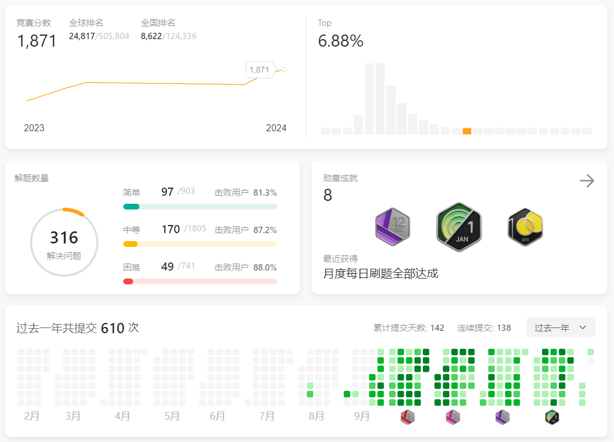

星期天，2024年2月4日

大概做了一个很长的梦中梦，十点钟醒了一次，但因为是周末又继续睡到了早上十二点半才醒。再醒的时候看到手机有几个北京的未接来电，电子邮箱里HR发来邮件:“同学收到邮件回复我一下，我电话联系同学哈”，BOSS里面也有人发消息让我接电话。于是我马上回复了邮件，半个小时之后等到了电话，告诉我三面通过开始谈Offer了。

因为之前是在星期三进行三面的，想着一般是三个工作日后通知，于是等着想星期一再问下HR，但是忘了这天这是春节前一周调休的工作日。不管怎么说，我下午开始填各种各样的个人信息、搞学信网认证、靠着家里的墙拍证件照。

当加上HR微信，询问得知后面已经没有流程了，绷了半年的神经终于能有点放松下来了。

---

## 历程

大三上学期开学之后，就一直在准备项目，刷LeetCode，背八股文，以及焦虑。

大概十月的时候杨总去小红书之前，出去吃了顿烧烤，顺便把我狠狠压力了一顿。从春熙路走回学校的路上，感觉自己真的是个沸物。又在改了很多次简历之后，在BOSS上面开始投了。那个时候我还想去DB厂，第一次投简历投了个海量数据，投了一家之后又开始继续背计网那些了。在等了一周之后，自然而然地就没有下文了。但是当时我还没悟到这些B小公司可能根本就没在招人，于是又狠狠地EMO，开始想怎么改简历。

之后在十一月，有一家北京的DB初创面了三次，每轮之前都拖一周，最后泡了一周池子淹死了。到了十二月份，开始面另外一家杭州的DB，一边复习自己的课程准备考试，一边准备面试。中间学校联系了一些企业，发现了有一开始我投的那家小公司，又在学校那里投了一遍。结果发了个笔试就没有下文了，估计又是在逗人。杭州的公司第二面是在元旦前最后一个工作日，于是那个时候又等了一周才告诉我二面过了。当时HR告诉我三面的面试官放年假了，后面流程会等一下。元旦后的第一周要靠马原和毛概，还要做我那个综合设计，所以我想的刚好没那么冲突，还挺爽🤗。考完之后又开始准备面试。

但是下一周当我问流程的时候悲剧了，告诉我那个组业务调整，冻结HC了。当时我就待在宿舍，具体在干什么忘了，大概是在改综合设计的WORD文档格式。

又过了一周，我想的反正躺着也是躺着，就收拾东西回家躺着了。在家里接到了之前投的一个研究所电话，说给我offer，好，我接了。我又随便拿了点东西回宿舍住了几天，准备搞自行联系实习的材料。我让HR提供材料，告诉我Offer审批。中间我还拒了其他几家的面试（包括我让别人内推我的），结果这个审批一等就是一周，当我再问HR进度怎么样，已经不理我了，评价为纯傻逼。这个时候我已经不知道还能投什么了，开始彻底疯狂，BOSS上面看到一个投一个，甚至投了几个量化。

还好在十二月底的时候，在BOSS上面投了百度一个岗位，在我迷茫的时候打电话叫我去面试。虽然很久没有刷八股和算法，还是硬着头皮面，所幸问的基础都还会，以及流程很快，在两周内面完三场拿到offer。终于在年前确定了去处。

总结：

- 不要对傻逼公司以及小公司的效率和诚信抱有期望。
- 不要轻信HR和面试官，即使说得再怎么好。
- 没拿到**正式**offer前，不要停止面试，即使有口头承诺。
- 早点海投，以及第二点：不要幻想自己稳进，就算不然就会像我一样单线程，从去年9月搞到2月。单线程被死妈公司搞了，一下就是一个月百搭。但如果你同时面三四家排满就不会那么焦虑了。

## 我的准备

先是在LeetCode上面做Hot100，以及每日一题。后面我意识到面试基本上HOT100里面的题就够了。就开始反复做Hot100。中间在学校的时候，打了两三场周赛，一直做不出来Hard题。

八股方面：

看[小林coding](https://xiaolincoding.com/)， 虽然讲的很细，但是里面的东西真是一个都没问到。最多就只问了一下三次握手四次挥手。

看[C/C++后台开发面试重点知识 | 编程指北 (csguide.cn)](https://csguide.cn/cpp/)，比较常规的C++八股，两天看完了。

因为当时想找DB，不知道我在发什么疯，把[高频 SQL 50 题（基础版）](https://leetcode.cn/studyplan/sql-free-50/)做完了（完全没有用，根本没人会问SQL🤣）,以及看完了MySQL实战45讲，这个对我感觉也没啥用，但是感觉讲的挺好的，比较推荐没接触过内核的同学看看。还看完了Redis源码和InnoDB的源码解析。中间又稍微看了下TiDB的源码和LevelDB源码。

在C++基础方面,看《Effective C++》,《 STL源码剖析》（挺有用），《深入探索C++对象模型》（纯看不懂，这个深度也没人问）。之后看《linux高性能服务器编程》复习网络编程的知识，会问到的主要就是socket，epoll那些。

说实话，感觉蹉跎了半年。自己的技能是完全没有提升。准备看完的书也没看。

---

面经放在下面链接里面了，感觉Notion还挺好用，就是创建View的时候分享权限做的不是很完善。 
