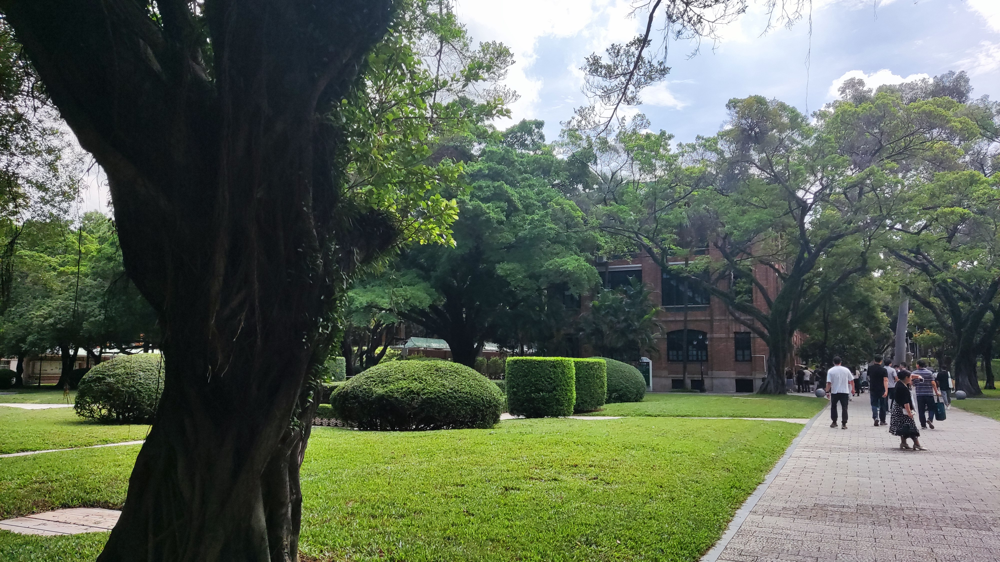

## 8.19
在酒店歇够了，出去逛。

问了下酒店前台，一般本地人晚上去哪里玩，告诉我附近有个太古仓，于是打车前往。

到了之后发现就是江旁边几个酒吧，以及几个不同风格的建筑。有点失望。

## 8.20

上午睡差不多起来，下午和晚上尝试调bug。Next-Key真的很折磨

## 8.21
中午起床，去旁边的商场吃了顿饭，然后去中山大学报道。

完了之后去旁边的珠江走路，走路

晚上朋友请吃了一顿烧烤，还送了个芒果

## 8.22
早上起来答辩，头昏

答完辩出校门，去了家茶餐厅，到了两点过艰难吃完，先回酒店洗澡歇下，然后去白云山爬山。

可能是因为走的小路，上山的路上没有什么人。

但是到了顶峰时，就走进大路了。终于看到了便利店，买了2L怡宝给我杯子里的茶续上。然后开爬摩星岭。

到了上面都是晚上了，没想到人还是很多。

到了最上面之后，看着下面的灯光，突然感觉很depressed。可能是因为一个人爬或者腿遭不住了，想发癫。总之就是不知道为啥心理防线突然被击垮了，感觉很难过。

下山的路真的很绕，百度导航真的很傻逼。绕了很久才走出去。

还有就是山上的猫真的很多

## 8.23

十一点才起床，然后同学给我说得了个国二。

得啥都无所谓了，坐地铁去啫八吃了顿饭。有点没胃口，吃不下东西

下午去了中山纪念堂和南越王墓博物馆

晚上不是很想吃饭，把芒果吃了

晚上瓦了两把，下了把刀塔的自走棋。
