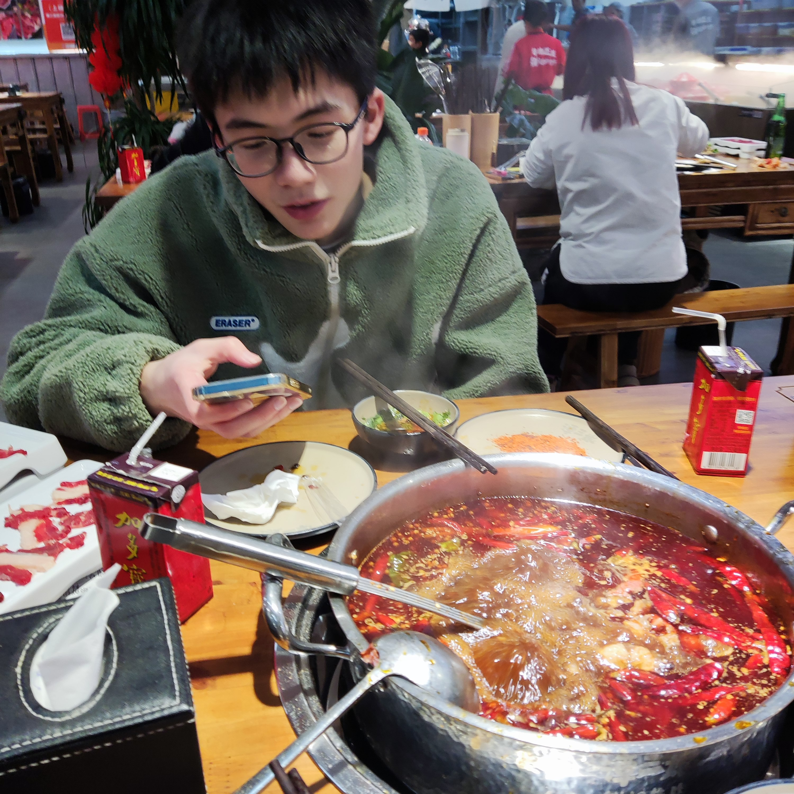
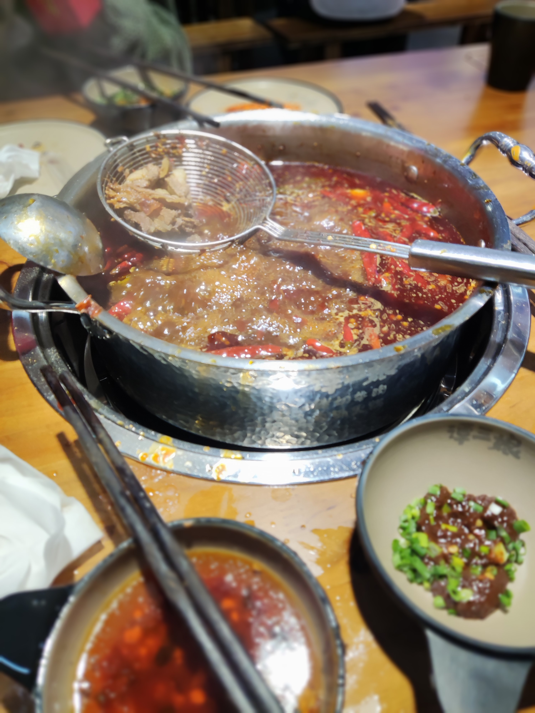
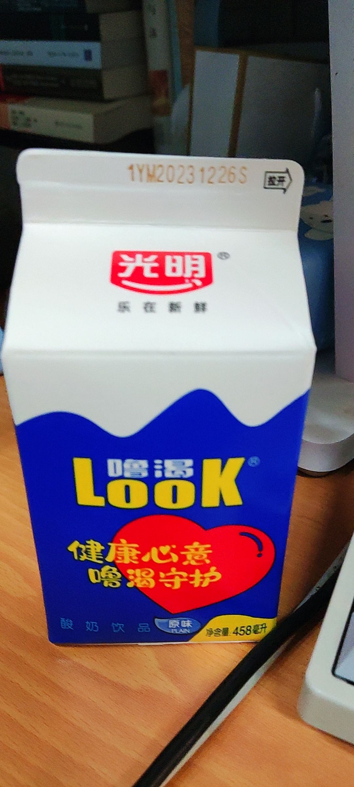
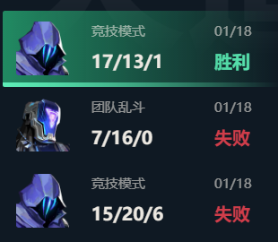

## GO
中午的时候阳阳在群里面问有没有吃子。我说出来，之前去川大就想吃青木烧肉结果没吃成。下午先随便找个地方耍。

两点过的我时候发了个人民公园的坐标，结果他四点才到，说在家里面打了两把英雄联盟。

接着去里面逛了一下，茶社和相亲角真是水泄不通🐶。走完一圈之后去旁边祠堂街走了一下，又是经典网红拍照专用，实际上啥也没有的地方。

---
## 到达
之后的错误决定：走去川大望江。感觉腿都要断了，虽然只有五公里。阳阳在路上一直吐口水，我问他为什么不自己吞了，他说不会。

---

走到目的地附近，一开始还没找到店面在哪里，结果走过了。走回去之后才发现招牌是灰底宋体没有任何修饰的“青木烧肉”，在我的刻板印象里面这种店一般都有木纹底的招牌与刻进去的日文。他们的铺面只有一户，找到的时候已经是六点半了，一个烤肉店大概只有六张桌子，于是我们顺利成章地拒绝排队，另寻他处。

一致意见：**今天必须吃牛肉**，在街对面看见一家牛肉火锅，就进去了。消费是80/人+50锅底+50押金。和潮汕牛肉火锅的区别就是可以选红汤底。

感觉没什么好说的，中规中矩吧，公式化牛肉。阳阳边看撸狗视频边吃两口再猛喝两盒加多宝就饱了。

 

感觉沙茶酱加红汤不太好，但是不加汤感觉跟吃盐巴差不了多少🧂。还是老老实实油碟。

## 走了
 

店家给好评，送了盒酸奶。看了一下现在天气是10℃，刚好在冷藏范围下，得趁明天日出前喝了😂。晚上回去又开黑打了几把枪。真是充充又实实啊，你们有这样的寒假吗？
