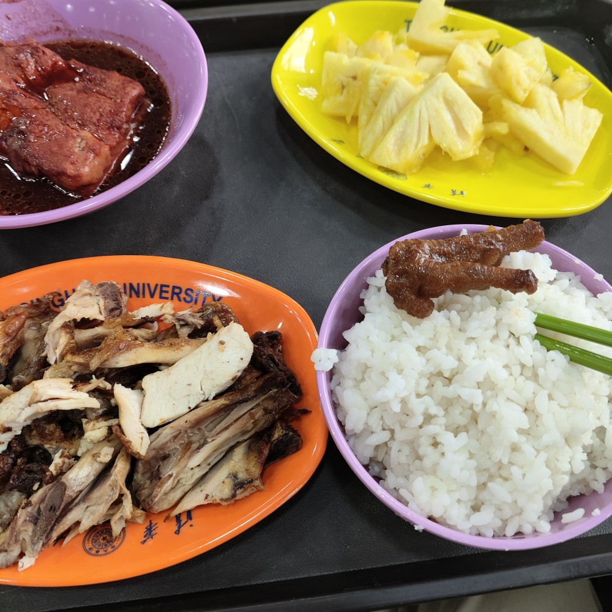
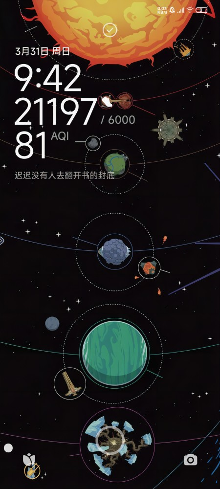

早上七点醒了，刚好看到G2图三11：12，接着突然暴毙。感觉有些东西就是命里无时莫强求。这个队永远在有一点希望的时候差一口气。

继续在床上躺到12点，出去吃了个饭。下午一个清华哥们约我去学校里面逛逛。

校园真的挺大的，在里面的时候看了眼地图，感觉能塞下两个隔壁北大。绿化做得很好，有个区域跟公园一样。

周末路上全是穿着统一颜色马甲的小孩，老师带着队过来研学之类的。还有很多人拍照。在草地上拍婚纱照、在教学楼牌子前面拍小红书、在校门口给小孩留念。就是感觉没啥学生，哥们说一般他们周末就在宿舍呆着。操场上也有很多小学生踢球。

晚上在食堂吃饭，感觉价格没有网上吹的那么神乎其技吧，但是味道挺好的。学校逛了一圈大概走了两万步，不敢想明天起不起得来。

 