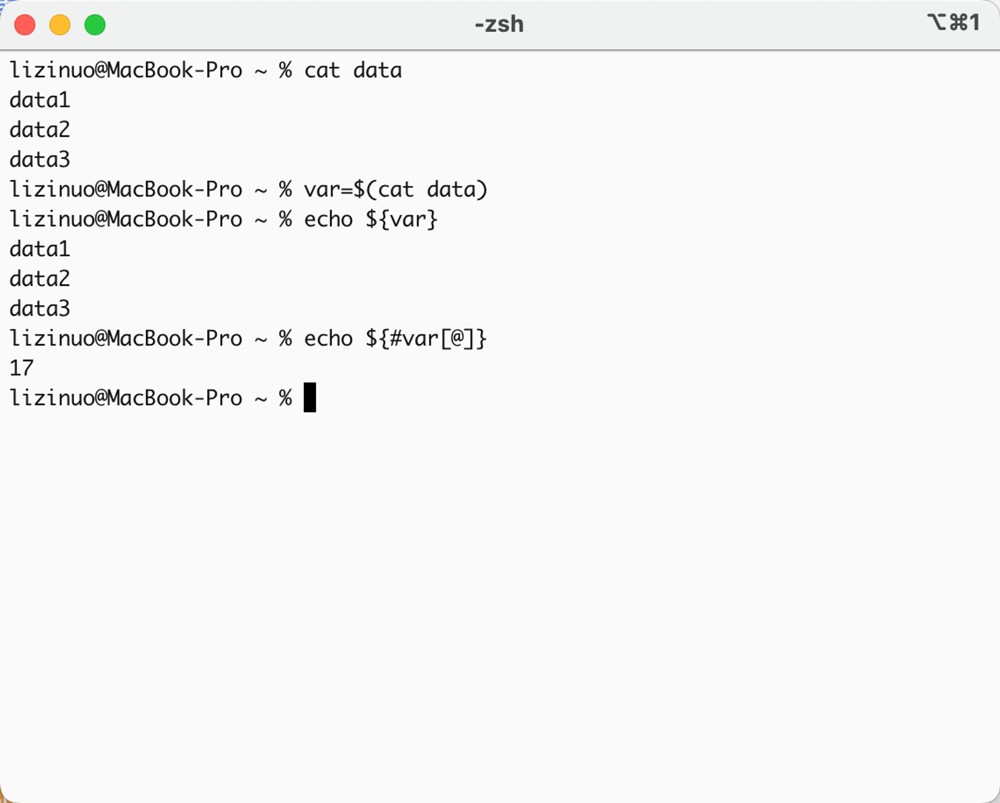
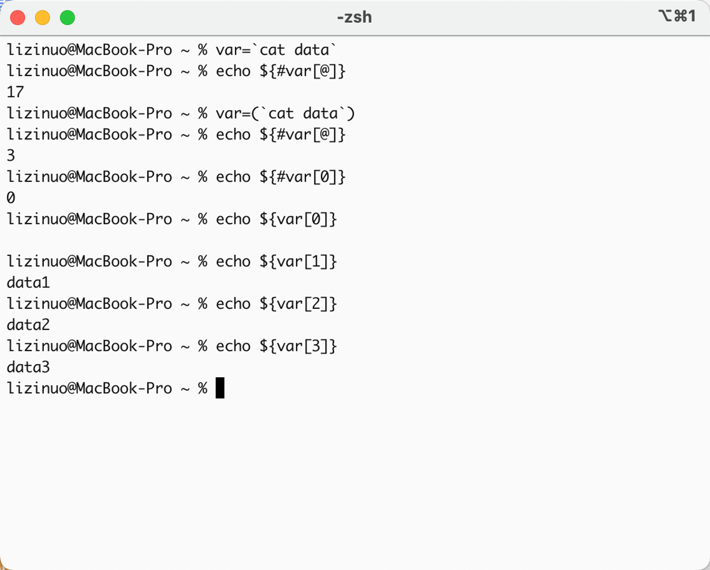
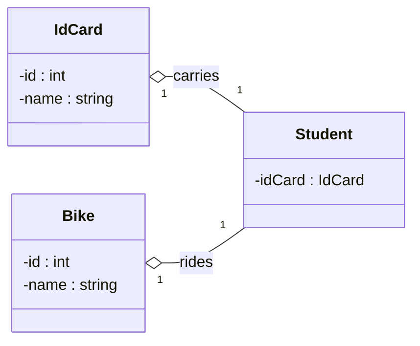

## shell使用相关

### local变量
在shell中，变量是在当前文件中的全局变量。要在其他文件中使用，要么使用`source script.sh`命令，要么`export var`。要隐藏这个变量，可以在`function` 中使用`local` 标识。
但是 `local` 会让 `export var` 失效。不知道啥原理。
```bash
lizinuo@MacBook-Pro ~ % function export1() { a=var; export a=0; } 
lizinuo@MacBook-Pro ~ % export1
lizinuo@MacBook-Pro ~ % echo $a
0
lizinuo@MacBook-Pro ~ % function export2() { local a=var; export a=1; } 
lizinuo@MacBook-Pro ~ % export2
lizinuo@MacBook-Pro ~ % echo $a
0
```

### 管道符
执行带管道符号的命令。会因为转义导致失败，需要使用eval来执行。
```bash
lizinuo@MacBook-Pro sh % PIPE_CMD="echo man | xargs echo"
lizinuo@MacBook-Pro sh % ${PIPE_CMD}
zsh: command not found: echo man|xargs echo
lizinuo@MacBook-Pro sh % eval ${PIPE_CMD}
man
```

直接用`${PIPE_CMD}`执行的实际是`echo man '|' xargs echo`

### 判断与返回值

众所周知，程序在异常时一般会用一个非零值退出。例如
```bash
lizinuo@MacBook-Pro sh % hh
zsh: command not found: hh
lizinuo@MacBook-Pro sh % echo $?
127
```

假如一段shell如下

```shell
lizinuo@MacBook-Pro sh % echo start
start
lizinuo@MacBook-Pro sh % [[ $? -ne 0 ]] && { echo 1; }
lizinuo@MacBook-Pro sh % [[ $? -ne 0 ]] && { echo 1; }
1
```

第一行`echo start` 返回值为0.

第二行 `[[ $? -ne 0 ]]` 结果为false，但是返回值是1。条件根据结果判断而不是返回值判断。

第三行`[[ $? -ne 0 ]]`结果为true，但是返回值是0。

不得不说这个是相当反直觉的（至少和CPP的逻辑相反😥）

### 函数参数

```bash
function foo() { echo $# echo $0 echo $1 }
echo $#
echo $0

foo arg1 arg2

----
lizinuo@MacBook-Pro sh % sh ./function.sh
0
./function.sh 
2 
./function.sh
arg1
```

对于shell函数，参数是从下标1开始的，并且调用函数不会改变`$0`

### shell数组
将多行数据保存在数组里。







不同终端下标不同

### tmux使用

设置`$TMUX_TMPDIR` 。或者通过`-S` 选项设置Socket Path。这样可以防止多人共用一台开发机时，出现tmux服务器崩溃互相影响的情况。

要专门设置这个，因为tmux的默认socket都在`/tmp` 下，我有几次tmux崩溃，让同事的sessions也全都挂掉了。所以我在自己的profile中添加了一个单独的设置，这样即使自己的tmux崩溃，也不会影响其他会话。

## python多态

```python
class A:
    def p(self):
        print("A is father")
    def work(self):
        self.p();

class B(A):
    def p(self):
        print("B is child")

b = B()
b.work()

```

今天遇到的情景。结果是

```bash
lizinuo@MacBook-Pro python % python3 super.py
B is child
```

有点好奇python是怎么实现的。因为C++如果要达到相同的效果，需要使用虚函数。

```cpp
#include <iostream>

class Base {
public:
 void print() {
 // virtual void print() {
    std::cerr << "Base work" << std::endl;
 }
 void work() {
    print();
 }
};

class Child:public Base {
public:
 void print() {
  // virtual void print() {
    std::cerr << "Child work" << std::endl;
 }
};

int main() {
 Child c;
 c.work();
}
```

上面的代码输出分别为

```bash
lizinuo@MacBook-Pro expt % clang++ super.cpp -o super
lizinuo@MacBook-Pro expt % ./super                   
Base work

## 使用虚函数

lizinuo@MacBook-Pro expt % clang++ super.cpp -o super
lizinuo@MacBook-Pro expt % ./super                   
Child work
```

可以看出来，C++默认的函数调用是调用基类的函数。

这是因为python方法的调用在运行时解析，而不是在编译时确定，属于动态绑定。而C++的函数是静态绑定的，在编译时就确定；使用虚函数才能实现动态绑定的效果。

## 画图工具的选择

在写自测报告时，为了给QA解释清楚背景，经常需要画图。

一开始使用[draw.io](https://drawio.com)， 不得不说这玩意儿又臭又香。好处是上手简单，但是是每个图都要在本地保存一个文件，多了之后很难管理。并且这些文件都是二进制文件，不方便直接放在文档里，也不方便查看变更。

后来用了几次[plantuml/plantuml: Generate diagrams from textual description (github.com)](https://github.com/plantuml/plantuml) 这东西功能挺强大的，但是要在本地用得拉个jar包来渲染。感觉也不是挺方便。而且画的图复杂一点效果也是💩。

现在改用[Mermaid | Diagramming and charting tool](https://mermaid.js.org/) 了，主要这东西可以直接写在代码块里面，并且Notion、Obsidian、厂里面的Wiki、自己的博客都能很好地支持。

例如



mermaid能兼顾文档化画图与实时渲染，目前看起来是最好用的。

## 一些好用的C++库

- json解析：
腾子的开源库
[RapidJSON: 首页](https://rapidjson.org/zh-cn/)

- 日志库：
[gabime/spdlog: Fast C++ logging library. (github.com)](https://github.com/gabime/spdlog)
- 参数解析：
[How To Use Gflags (formerly Google Commandline Flags)](https://gflags.github.io/gflags/)
- 并行计算框架：
[taskflow/taskflow: A General-purpose Task-parallel Programming System using Modern C++ (github.com)](https://github.com/taskflow/taskflow)

