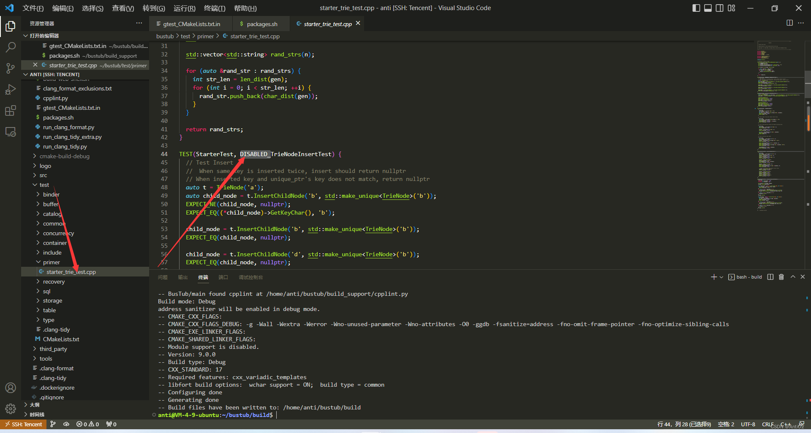
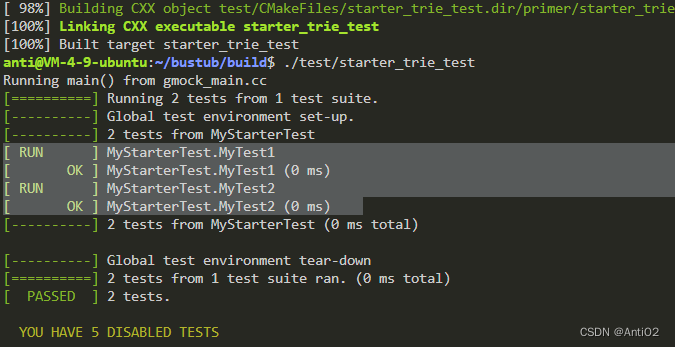
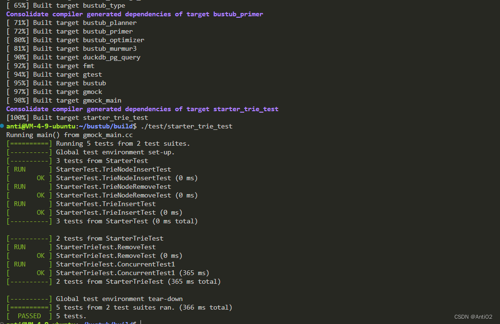
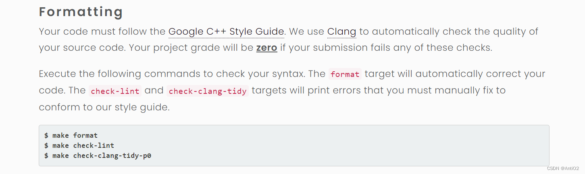
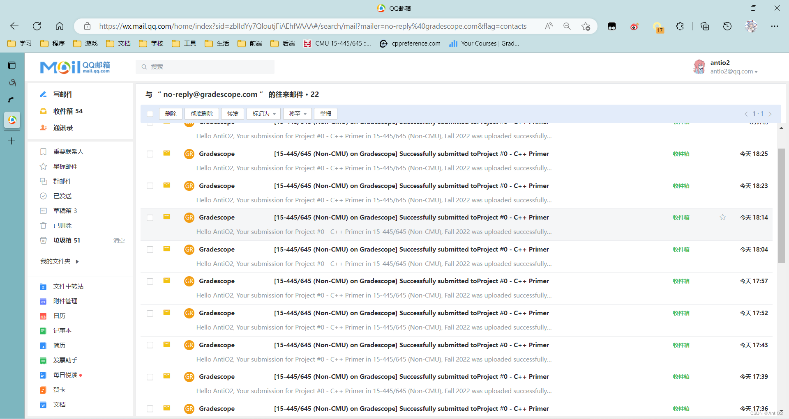
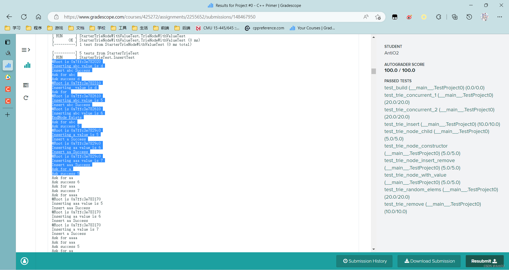

# CMU 15-445 (FALL 2022) Project #0 一些注意事项

>We will make the auto-grader for each assignment available to non-CMU students on Gradescope after their due date for CMU students. In exchange for making this available to the public, we ask that you do not make your project implementations public on Github or other source code repositories.

CMU为外校的学生提供了自动测试平台和公开课，代价是什么呢？那就是不要直接公开代码在网上。还请大家遵守。

这篇博客记录一些踩的坑，欢迎交流
## 知识点
### 语言基础
- C++基础语法
- `unique_ptr`的用法
- `std::move`可以将左值显示转化为右值
- 并发锁的使用
### 算法要求
- Trie本身的原理很简单，可以实现`O(length)`的增删改查操作，当然缺点就是空间换时间
- [可以先做这道题](https://leetcode.cn/problems/implement-trie-prefix-tree/)。也可以直接做
## 开发环境
我是在自己的Ubuntu22.04的服务器上搭建环境的。但是用的本地Clion开发。如果要用win，记得一定要先在linux上面把源文件下好，不然脚本会出现错误（因为换行符的原因，如果出错了可以进行替换）。
## 本地测试
==注意在make前把想要测试的题目Test文件中的DISABLED_给去掉。==
因为GTest的宏，测试名前面有`DISABLED_`会被跳过测试。


- 然后你可以通过自己写代码增加一些样例
- 比如
```cpp
TEST(MyStarterTest,MyTest1)
{
  {
    Trie trie;
    bool success;

    trie.Insert<int>("aaa",1);
    success=trie.Insert<int>("aa",1);
    EXPECT_EQ(success, true);
  }
}
TEST(MyStarterTest,MyTest2)
{
  {
    Trie trie;
    bool success;

    trie.Insert<int>("abc",1);
    success=trie.Insert<int>("abed",1);
    EXPECT_EQ(success, true);
  }
}
```
- `MyStarterTest`就是一个测试组，函数的第二个参数是测试的名字。通过对值比较判断测试是否通过
- 比如`EXPECT_EQ(success, true)`，就是判断变量success是否为true
- `EXPECT_EQ((*child_node)->GetKeyChar(), 'c');`判断该节点是否key为c
- `EXPECT_NE(child_node, nullptr);`判断`child_node`是否不等于`nullptr`
- 自定义测试效果


## 网上评测

网址是[gradescope](https://www.gradescope.com/)。然后填入上面的邀请码，学校记得写CMU。

==提交记得用zip==不能用github!!!

## 代码格式

本地测试通过之后直接去网上提交之前，记得格式化自己的代码。

总之记得通过这个检查自己的代码格式是否正确。


然后经历过无数次debug后发现自己有个初值没赋。

然后这个OJ有个比较好的地方就是你可以通过cout打印出你想要的信息


## 注意事项
- 遇到问题尝试在不同的地方输出测试信息，然后顺着程序控制流看，如果多次找不到错误一定要仔细，想想自己是不是哪里看漏了