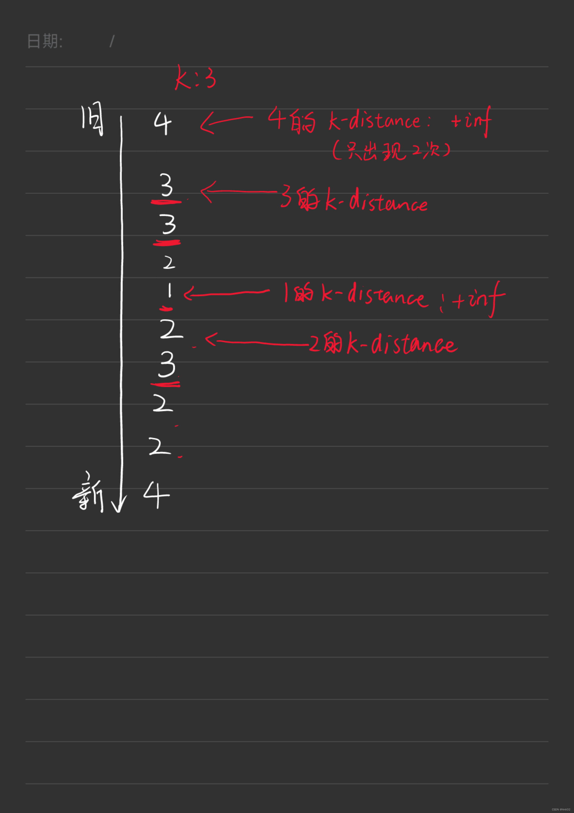
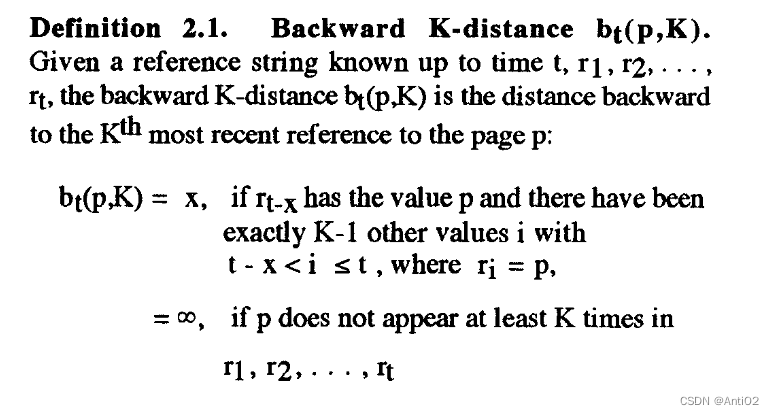
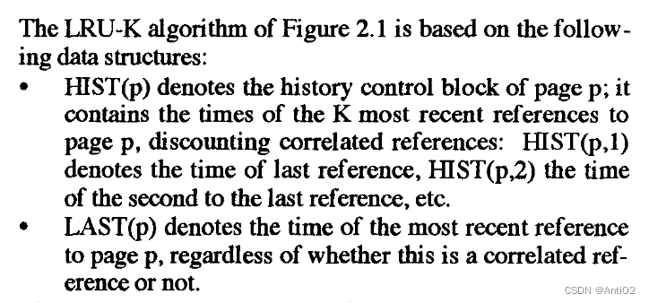
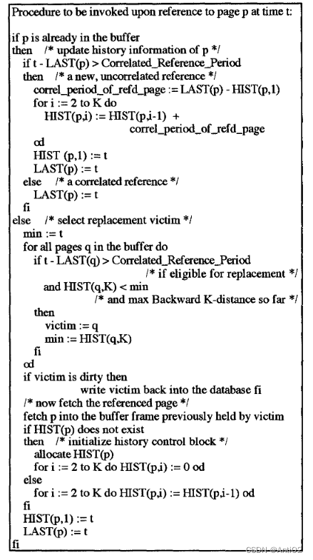
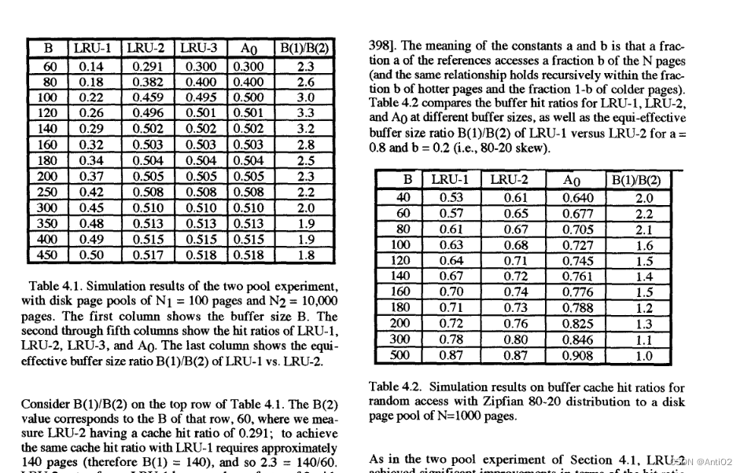
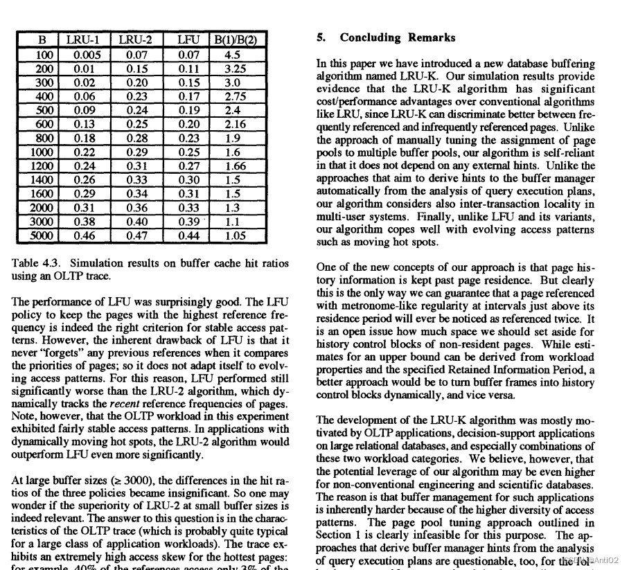
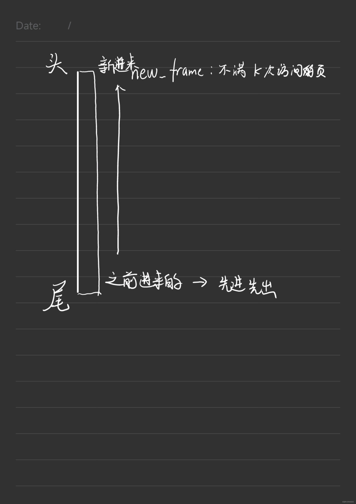
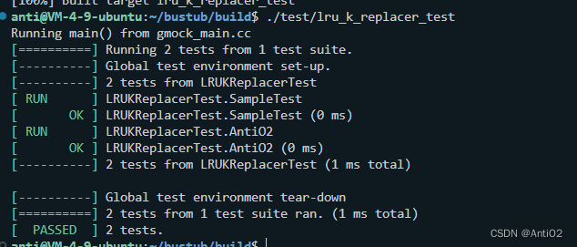
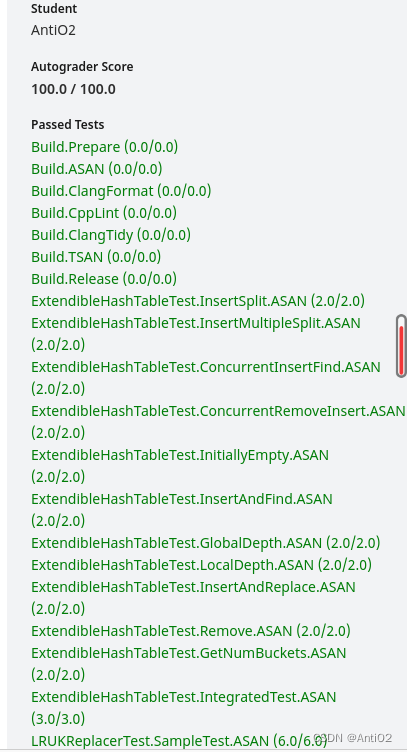

## 文章简介
- CMU 15-445 (FALL 2022) Project #1 Task#2 LRU-K 替换策略详解实现，尽量提供思路，也可以为其他同学实现LRU-K算法做参考
- 参考文献：[The LRU-K page replacement algorithm for database disk buffering (acm.org)](https://dl.acm.org/doi/epdf/10.1145/170036.170081)
- 在网上都找不到其他参考，只有这一篇1993年的论文
## 算法解析
### LRU-K替换策略
- LRU-K是LRU算法的一种衍生。强烈建议先做一下这一道题[146. LRU 缓存 - 力扣（LeetCode）](https://leetcode.cn/problems/lru-cache/)
- 先看题目对该算法的描述
> The LRU-K algorithm evicts a frame whose backward k-distance is maximum of all frames in the replacer. Backward k-distance is computed as the difference in time between current timestamp and the timestamp of kth previous access. A frame with less than k historical accesses is given +inf as its backward k-distance. When multipe frames have +inf backward k-distance, the replacer evicts the frame with the earliest timestamp.
- 大意是，每次替换会优先替换k-距离最远的一个数。
- 假如这个k是3，简单画一下一个实例，依次加入下面几个数
- 

- 如果一个数出现次数达到了K次，那么k-distance就是倒数第K次出现的位置
- 如果一个数出现不到K次，那么k-distance就是+inf
- 这是对K-distance严谨的定义

### 驱逐策略
优先驱逐距离为$+inf$的frame,如果有多个这样的数，其实LRU-K是有多种策略来决定下一个驱逐谁的(比如用LRU)，在本题目中
>When multipe frames have +inf backward k-distance, the replacer evicts the frame with the earliest timestamp.

使用的先进先出（FIFO）策略，比如在上图中，4和1都出现了不足K次，如果要驱逐就驱逐先出现的4。
如果没有k-distance为正无穷的frame,优先驱逐该距离最大的。
## 一些重要的概念
我们需要理解为什么需要用LRU-K而非LRU策略
- 假设：读取页的序列是随机的，但是每个页有一个比较稳定的概率被读取到，假设p被读取的概率是$b_p$,那么我们可以预测，两次p被读取的间隔是$I_p$，并且$I_p$和$(b_p)^-1$是正相关的（它们是反比关系）
- 接下来列举一些情况，请思考它们（我不知道英文该怎么准确翻译，大概意会一下）
	- 内部事务（Intra-Transaction） ：比如一个事务先读取一个页，然后在提交之前再次访问这个页。其实就是：用于更新的事务，先读取一列，再更新这列
	- 事务重试（Transaction-Retry）：一个事务访问一个页然后中止。接下来重试这个事务并且再次访问这个页。
	- 内部流程(Intra-Process): 一个事务访问一个页面，并且成功提交了。然后下一个同样流程的事务再次访问这个页。这种模式的访问通常是由进行大量更新的程序引起的，比如连续更新100条记录
	- (Inter-Process)这个名字不知道怎么翻译了，注意上一个是`Intra`表达在一个Process里面,`Inter`表示在两个Process之间。这个例子是说：一个事务访问一个页，然后另外一个不同流程的事务也访问这个页。这两个事务之前是完全独立的，目的也不一样。
- 上述四个例子的前三个被称作==correlated reference-pair type==，这种类型暂时被我叫做**关联访问对**，注意第四个例子是不关联的，如果我们通过这些关联访问对来估计前面提到的间隔时间$I_p$，通常会得到错误的结果。为什么这么说呢，考虑上面提到的例子一：我们要在一个事务更新时访问一个page两次，如果我们第一次访问后，估计$I_p$为$+inf$那么就会丢掉这个page，在第二次访问时又通过IO读入缓存造成浪费。如果我们通过这两次间隔时间来估计$I_p$，那么这个间隔时间是非常短的！我们就会造成一个误解：这个page很常用。但事实上这个更新事务已经结束了，可能很长一段时间内这个page不会被再次用到。
- **所以我们可以得到这样一个结论**：缓存系统*不应该*直接丢弃一个page，而是应该保留到下一次访问或者是保留到下一次访问的可能性变到很小的时候。
- 在另外一方面，我们估计两次使用page的间隔时，**不应该**使用关联访问对来估计。
- 如何判断两次访问是不是关联访问呢？一个方法是设置一个时间阈值，在阈值之下就是关联访问。
- 关联访问可能是一连串的访问，而不只是两次。比如一百次对同一个页上记录的更新。我们把这一连串称为关联访问时期。在估计一个页两次使用间隔时，应该时计算`一次关联访问的结束`和`下一段关联访问开始`之间的时间间隔。
- 即使一个页面被驱逐，我们也需要保留这个访问历史一段时间。比如我们在第1秒访问了p,第二秒驱逐了p，第3秒又访问了p，第4秒驱逐了p，第5秒访问了p(这里不一定是秒，可以理解为很快)。那么实际上我们是以一个很高的频率在访问p，但是如果没有历史记录，我们是无法意识到这个事实的。这个历史保留时间被称为$Retained Information Period$,论文中给出的建议时间是200s(一个拇指法则)
## 具体实现
### 数据结构约定

- 在这里，首先定义了两个函数
	- 第一个是`HIST(p)`,是关于p的访问记录（history）的。`HIST(p,n)`就是页面p倒数第n次被访问的时间。例如`HIST(2,1)`就是2号页面最后一次被访问的时间(这个是不算关联访问的，也就是说每段关联访问只被记录一次)
	- `LAST(p)`就是页面p最后一次被访问的时间，这个是无论关联访问的


### 伪代码实现

- 每当我们新增一次访问记录，如果p已经被记录了，有两种情况
	- 这次访问在关联访问中，（也就是在他的前面已经有了其他关联访问），那么我们只需要更新`LAST(p)`就好了 
	- 如果是一段新的访问，那么关闭旧的访问，并且计算$LAST(p)-HIST(p,1)$将他缩为一个点。
- 如果这个page没有在buffer中，那么我们需要丢弃另外一个page（buffer满了的情况）
	- 	一个正在**关联访问时期**中的page是不应该被丢掉的。
	- 优先选择K-distance最大的。也就是$b_t(q,K)$最大，或者说是$HIST(q,K)$最小的。（之前看这个地方不理解，后来想通了：HIST是记录的时间，时间戳越小访问的越早，也就是距离越大）
- 伪代码是长这样的

- 它这里的实现就是用了一个队列记录`HIST`不同的page出现时间，然后用了循环来寻找满足条件最小的时间戳。如果被驱逐的是个被修改过的页面，还需要将它写回硬盘。
- 在实际的实现中，我们可以考虑用堆来优化这个寻找最大K-distance的过程。
- 然后就是一些实验证明，有兴趣的可以去看下原文。这里就先不讲了

## C++实现
- 这里我没有实现论文中区分关联访问的情况，而是将所有访问都视作独立的。
### 解析
- 首先来看我们有哪些数据结构
```cpp
  size_t current_timestamp_{0};
  size_t curr_size_{0};
  size_t max_size_;
  size_t replacer_size_;
  size_t k_;
  std::mutex latch_;

  using timestamp = std::list<size_t>;//记录单个页时间戳的列表
  using k_time = std::pair<frame_id_t,size_t>;
  std::unordered_map<frame_id_t,timestamp> hist;//用于记录所有页的时间戳
  std::unordered_map<frame_id_t,size_t> recorded_cnt_;//用于记录,访问了多少次
  std::unordered_map<frame_id_t,bool> evictable_;//用于记录是否可以被驱逐

  std::list<frame_id_t> new_frame_;//用于记录不满k次的页
  std::unordered_map<frame_id_t,std::list<frame_id_t>::iterator> new_locate_;

  std::list<k_time> cache_frame_;//用于记录到达k次的页
  std::unordered_map<frame_id_t,std::list<k_time>::iterator> cache_locate_;
```
| 名称               | 作用                                    |
| ------------------ | --------------------------------------- |
| current_timestamp_ | 当前的时间戳,每进行一次record操作加一   |
| curr_size_         | 当前存放的可驱逐页面数量                |
| max_size           | 最多可驱逐页面数量（去掉被pin住的页面） |
| replacer_size_     | 整个主存大小（包括被pin的页面）         |
| k_                 | lru-k中的k值                            |
| latch_             | 用于维护多线程的锁                      |
| timestamp          | 单个页面的一连串时间戳                  |
| k_time             | 页面和kth时间戳                         |
| hist               | 所有页面的访问记录                      |
| recorded_cnt_      | 被访问次数的记录                        |
| evictable          | 记录一个页面是否可以被驱逐              |
| new_frame_         | 记录不满足k次访问页的页号               |
| new_locate_        | 页号到上面这个链表迭代器的哈希表        |
| cache_frame        | 到达k次页的链表                         |
| cache_locate_      | 哈希表，解释同上                        |
- 对于满足访问过k次的和没到达k次的，我们可以通过两个链表来管理
- 第一个链表是不满足k次的，我们每次通过头插法加入新的页面，如果要在这里面驱逐一个页面，采用`reverse_iterator`反向迭代器从后往前遍历，查找允许被驱逐的页面
- 接着我们定义一个新的类型，`using k_time = std::pair<frame_id_t,size_t>;`这个表示页面对应的倒数第k次访问的时间戳。
- ```cpp
  std::list<k_time> cache_frame_;//用于记录到达k次的页
  std::unordered_map<frame_id_t,std::list<k_time>::iterator> cache_locate_;
  ```
  - 我们定义一个新的链表，这个链表是按照时间戳从小到大排列的
  - 也就是说，越前面的页它的k-distance越大
- 我们通过二分查找维护这个`cache_frame_`的稳定性
```cpp
	auto kth_time = hist[frame_id].front();//获取当前页面的倒数第k次出现的时间
     k_time new_cache(frame_id,kth_time);

     auto it = std::upper_bound(cache_frame_.begin(),cache_frame_.end(),new_cache, CmpTimestamp);//找到该插入的位置
     it = cache_frame_.insert(it,new_cache);
     cache_locate_[frame_id] = it;
```
- 然后来看方法列表

| 方法原型                                                    | 作用                                          |
| ----------------------------------------------------------- | --------------------------------------------- |
| LRUKReplacer(size_t num_frames, size_t k)                   | 生成器，num_frames是最大缓存，k是lru_k中的k值 |
| auto Evict(frame_id_t *frame_id) -> bool                    | 驱逐一个页面，并保存到frame_id中              |
| void RecordAccess(frame_id_t frame_id);                     | 增加一个页面的访问记录                        |
| void SetEvictable(frame_id_t frame_id, bool set_evictable); | 设置一个页面是否可以被驱逐                    |
| void Remove(frame_id_t frame_id);                           | 移除指定页面                                  |
| auto Size() -> size_t;                                      | 返回可驱逐页面的大小                          |
### 源码
#### `LRU-K.h`
```cpp
//
// Created by Anti on 2022/12/27.
//

#ifndef LRU_K_H
#define LRU_K_H
#include <limits>
#include <list>
#include <mutex>
#include <unordered_map>
#include <vector>
#include <algorithm>

class  LRUKReplacer {
public:
    using frame_id_t = int;
    explicit LRUKReplacer(size_t num_frames, size_t k);
    ~LRUKReplacer()=default;


    auto Evict(frame_id_t *frame_id) -> bool;

    void RecordAccess(frame_id_t frame_id);

    void SetEvictable(frame_id_t frame_id, bool set_evictable);

    void Remove(frame_id_t frame_id);

    auto Size() -> size_t;

private:
    size_t current_timestamp_{0};
    size_t curr_size_{0};
    size_t max_size_;
    size_t replacer_size_;
    size_t k_;
    std::mutex latch_;

    using timestamp = std::list<size_t>;//记录单个页时间戳的列表
    using k_time = std::pair<frame_id_t,size_t>;
    std::unordered_map<frame_id_t,timestamp> hist;//用于记录所有页的时间戳
    std::unordered_map<frame_id_t,size_t> recorded_cnt_;//用于记录,访问了多少次
    std::unordered_map<frame_id_t,bool> evictable_;//用于记录是否可以被驱逐

    std::list<frame_id_t> new_frame_;//用于记录不满k次的页
    std::unordered_map<frame_id_t,std::list<frame_id_t>::iterator> new_locate_;

    std::list<k_time> cache_frame_;//用于记录到达k次的页
    std::unordered_map<frame_id_t,std::list<k_time>::iterator> cache_locate_;
    static auto CmpTimestamp(const k_time &f1,const k_time &f2) -> bool;
};
#endif //LRU_K_H

```
#### `LRU-K.cpp`
```cpp
//
// Created by Anti on 2022/12/27.
//

#include "LRU_K.h"
LRUKReplacer::LRUKReplacer(size_t num_frames, size_t k) : replacer_size_(num_frames), k_(k) {
    max_size_=num_frames;
}

auto LRUKReplacer::Evict(frame_id_t *frame_id) -> bool {
    std::lock_guard<std::mutex> lock(latch_);
    /**
     * 如果没有可以驱逐元素
     */
    if(Size()==0)
    {
        return false;
    }
    /**
     * 首先尝试删除距离为无限大的缓存
     */
    for(auto it = new_frame_.rbegin();it!=new_frame_.rend();it++)
    {
        auto frame = *it;
        if(evictable_[frame])//如果可以被删除
        {
            recorded_cnt_[frame] = 0;
            new_locate_.erase(frame);
            new_frame_.remove(frame);
            *frame_id = frame;
            curr_size_--;
            hist[frame].clear();
            return true;
        }
    }
    /**
     * 再尝试删除已经访问过K次的缓存
     */
    for(auto it =cache_frame_.begin();it!=cache_frame_.end();it++)
    {
        auto frame = (*it).first;
        if(evictable_[frame])
        {
            recorded_cnt_[frame] = 0;
            cache_frame_.erase(it);
            cache_locate_.erase(frame);
            *frame_id = frame;
            curr_size_--;
            hist[frame].clear();
            return true;
        }
    }
    return false;
}

void LRUKReplacer::RecordAccess(frame_id_t frame_id)
{
    std::lock_guard<std::mutex> lock(latch_);

    if(frame_id>static_cast<frame_id_t>(replacer_size_))
    {
        throw std::exception();
    }
    current_timestamp_++;
    recorded_cnt_[frame_id]++;
    auto cnt = recorded_cnt_[frame_id];
    hist[frame_id].push_back(current_timestamp_);
    /**
     * 如果是新加入的记录
     */
    if(cnt==1)
    {
        if(curr_size_==max_size_)
        {
            frame_id_t frame;
            Evict(&frame);
        }
        evictable_[frame_id] = true;
        curr_size_++;
        new_frame_.push_front(frame_id);
        new_locate_[frame_id] = new_frame_.begin();
    }
    /**
     * 如果记录达到k次，则需要从新队列中加入到老队列中
     */
    if(cnt==k_)
    {
        new_frame_.erase(new_locate_[frame_id]);//从新队列中删除
        new_locate_.erase(frame_id);

        auto kth_time = hist[frame_id].front();//获取当前页面的倒数第k次出现的时间
        k_time new_cache(frame_id,kth_time);
        auto it = std::upper_bound(cache_frame_.begin(),cache_frame_.end(),new_cache,CmpTimestamp);//找到该插入的位置
        it = cache_frame_.insert(it,new_cache);
        cache_locate_[frame_id] = it;
        return;
    }
    /**
     * 如果记录在k次以上，需要将该frame放到指定的位置
     */
    if(cnt>k_)
    {
        hist[frame_id].erase(hist[frame_id].begin());
        cache_frame_.erase(cache_locate_[frame_id]);//去除原来的位置
        auto kth_time = hist[frame_id].front();//获取当前页面的倒数第k次出现的时间
        k_time new_cache(frame_id,kth_time);

        auto it = std::upper_bound(cache_frame_.begin(),cache_frame_.end(),new_cache, CmpTimestamp);//找到该插入的位置
        it = cache_frame_.insert(it,new_cache);
        cache_locate_[frame_id] = it;
        return;
    }
    /**
     * 如果cnt<k_，是不需要做更新动作的
     */
}

void LRUKReplacer::SetEvictable(frame_id_t frame_id, bool set_evictable)

{
    std::lock_guard<std::mutex> lock(latch_);
    if(recorded_cnt_[frame_id]==0)
    {
        return ;
    }
    auto status = evictable_[frame_id];
    evictable_[frame_id] = set_evictable;
    if(status&&!set_evictable)
    {
        --max_size_;
        --curr_size_;
    }
    if(!status&&set_evictable)
    {
        ++max_size_;
        ++curr_size_;
    }
}

void LRUKReplacer::Remove(frame_id_t frame_id) {
    std::lock_guard<std::mutex> lock(latch_);
    if (frame_id > static_cast<frame_id_t>(replacer_size_)) {
        throw std::exception();
    }
    auto cnt = recorded_cnt_[frame_id];
    if (cnt == 0)
    {
        return ;
    }
    if(!evictable_[frame_id])
    {
        throw std::exception();
    }
    if(cnt<k_)
    {
        new_frame_.erase(new_locate_[frame_id]);
        new_locate_.erase(frame_id);
        recorded_cnt_[frame_id] = 0;
        hist[frame_id].clear();
        curr_size_--;
    }
    else
    {
        cache_frame_.erase(cache_locate_[frame_id]);
        cache_locate_.erase(frame_id);
        recorded_cnt_[frame_id] = 0;
        hist[frame_id].clear();
        curr_size_--;
    }
}

auto LRUKReplacer::Size() -> size_t { return curr_size_; }
auto LRUKReplacer::CmpTimestamp(const LRUKReplacer:: k_time &f1,const LRUKReplacer:: k_time &f2) -> bool {
    return f1.second<f2.second;
}
```

### 测试
- 通过GoogleTest进行测试，下面是我写的测试实例
 ```cpp
TEST(LRUKReplacerTest, AntiO2)
{
  LRUKReplacer lru_replacer(3, 3);
  frame_id_t frame;
  ASSERT_EQ(lru_replacer.Size(),0);
  lru_replacer.RecordAccess(1);
  lru_replacer.RecordAccess(1);
  lru_replacer.RecordAccess(1);
  lru_replacer.RecordAccess(2);
  lru_replacer.RecordAccess(2);
  lru_replacer.RecordAccess(2);
  lru_replacer.RecordAccess(1);
  ASSERT_EQ(lru_replacer.Size(),2);
  lru_replacer.RecordAccess(3);
  lru_replacer.Evict(&frame);
  ASSERT_EQ(frame,3);
  lru_replacer.Evict(&frame);
  EXPECT_EQ(frame,1);

  lru_replacer.RecordAccess(1);
  lru_replacer.RecordAccess(3);
  lru_replacer.RecordAccess(1);
  lru_replacer.Evict(&frame);
  EXPECT_EQ(frame,1);
  lru_replacer.RecordAccess(3);
  lru_replacer.RecordAccess(3);
  lru_replacer.Evict(&frame);
  EXPECT_EQ(frame,2);
  lru_replacer.Evict(&frame);
  EXPECT_EQ(frame,3);
}
 ```
- 测试结果


## LRU-K小结

- LRU-K是对LRU算法的改进，规避了一些访问上实际的问题，同时带来的额外开销也是可以接受的，是一个值得学习的算法
- 在实际应用中，还应当考虑关联访问时期造成的影响。

---

## Buffer Pool介绍

- 在实现缓冲池之前，我们先需要知道两个概念的区别：frame和page。
- 在这里frame是指在内存中的一块区域，用于存放page。frame在内存中是固定的
- page是包含了元信息（比如是否是脏页面、page_id等）和page_data的一个类。page可以存放在frame中，也可以将数据写在disk上以便被缓存池丢掉。

### 属性

在类`BufferPoolManagerInstance`主要有以下属性
- pool_size_ 
	- pool_size_是缓冲池的大小，也是最多frame个数。
- Page *pages_
	- 指向一个Page数组，用于存放所有的Page。
- free_list_
	-	一个list,里面存放了空闲的frame_id 
- 还有之前实现的哈希表、lru_k_replacer、打开了当前对应文件的disk_manager
- `BufferPoolManagerInstance`是`class Page`的友元，可以直接访问Page的属性，我们需要用到Page以下的属性
	- data_是一个字符数组，用于存放数据
	- page_id_
	- is_dirty_ 记录是否是脏页面
	- pin_count_ 记录被pin住的数量，当pin_count==0时，这个页面才能够被驱逐
### 方法
#### NewPgImp
- 功能：为当前的数据库增加一页，并且返回该页。
- 如果内存中有空闲的frame,(free_list不空)则直接把该页放到这个frame上。否则通过之前的LRU_K策略驱逐一个frame,这里如果frame中的page是脏的，需要用之后的Flush方法写回磁盘。
- 这里要注意，生成一个Page后记得把它的data_清零，然后驱逐、增加等操作都要影响page_table_和replacer_的数据，记得哈希表去掉旧的page_id并添加新的键值对。
- 新的page按照题目意思pin_count_为1，不能够被驱逐。
#### FetchPgImp
- FetchPgImp传入一个page_id，并返回对应页面的指针。
- 如果通过hash表查到该page在内存中，直接返回，记得LRU-K记录一下访问历史。
- FetchPgImp驱逐过程和上一个方法类似。但是要加一步：从磁盘中将之前的data读入内存
`disk_manager_->ReadPage(page_id,pages_[frame_id].GetData());`
**注意**
- 如果要fetch的页面已经在pool中了，那么要进行以下操作
	- lru-k要进行record
	- 手动setEvictable为false
	- pincount++
- 如果不在pool中，那么也要进行以上操作，并且pincount = 1
- 上面这个卡了我很久，因为在文档里也没写具体的要求，大家写的时候注意一下   	
#### UnpinPgImp
- 如果对应页面`pin_count>0`将`pin_count_--`
- 当pin_count为0，设置该页面可被驱逐
#### FlushPgImp
- 通过disk_manager的WritePage将页面写入disk中
- 将脏页面标记设置为false.
#### FlushAllPgsImp
- Flush所有页面，注意这里不能写frame为空的位置
- 可以设置一个标记数组，将free_list遍历一遍找出空的frame,然后再遍历一次buffer_pool，不为空则flush。带来的时间和空间复杂度冗余都是$O(pool size)$，可以接受。
#### DeletePgImp
- 删除指定Page
## 代码实现
- 在这个Project中我学到了几个c++的用法。
- `Page *pages_;		pages_ = new Page[pool_size_];`之后，pages_指向一个数组。
- 在创建新page时，`pages_[frame_id]`是一个Page类型，不能通过指针创建，比如`pages_[frame_id] = new Page()`是错的。也不能`pages_[frame_id] = Page()`，因为Page没有拷贝方法。我们可以通过`new(&pages_[free_frame]) Page();`在指定位置上构造一个新的Page。这里new里面的参数是一个地址。
- 同理，`pages_[frame_id]`不是一个指针，所以我们在删除页的时候，不能使用`delete pages_[frame_id]`,可以通过`pages_[frame_id].~Page()`来调用析构函数。

然后其他的代码实现按照题目要求做就行了，注意每次frame的变更对page_table_、replacer_的影响，遇到错误使用GDB或者通过IDE调试工具来调试找到问题。
## 关于多线程
我自己直接用的是大锁，也就是在每个函数的第一排加了一行
`std::scoped_lock<std::mutex> lock(latch_);`

注意如果用这种方法，那么你的函数之间是不能相互调用的，比如你在、`FetchPgImp`中，准备驱逐一个脏页面，那么你是不能调用`FlushPgImp`的，否则会引起死锁。同理`AllocatePage()`前面也是不能加锁的，因为`AllocatePage()`会被`FetchPgImp`调用。
如果要写更细粒度的话，可以尝试读写锁分开，然后用Page里面的小锁。不过写的粗糙一点也能过就是了
