## 任务1 B+ Tree Page

这一部分要求实现三个类，主要是Getter和Setter方法。注意一下理解就好了，每一个类的内存分配是先头字节，然后是键值对，leaf page的头字节是28，internal page的头字节是24。

internal page有一个属性：`MappingType array_[1];`,MappingType是键值对`std::pair<KeyType, ValueType>`的宏，通过该数组我们直接对内存进行读写，比如

```
void B_PLUS_TREE_INTERNAL_PAGE_TYPE::SetKeyAt(int index, const KeyType &key) {
  array_[index].first = key;
}
```

这也算是利用了数组越界的特性，感觉挺妙的。

还有一个问题就是C++的变量初始化

```
auto B_PLUS_TREE_LEAF_PAGE_TYPE::KeyAt(int index) const -> KeyType {
  // replace with your own code
  KeyType key{array_[index].first};
  return key;
}
```

使用这个方式来返回KeyType类型的值。

##  任务2 B+Tree Data Structure

完成了第一个部分的基本页面实现后，我们在此基础上进行B+树的接口实现。

这里的B+树只支持`unique key`，所以当尝试插入相同key时，返回`false`。

B+树的算法可以看这里[-->B+树](https://zh.wikipedia.org/wiki/B%2B树)，给没有接触过的同学简单介绍以下，B+树和之前学过的那些数据结构有个不同，就是其他算法的数据放在主存里，而B+树多数节点是存储在硬盘上的（这就是为什么我们要先实现内存管理器Buffer Pool和B+树页面），也就是说，这个项目的B+树存储是基于`BUSTUB_PAGE`的。
### Insert部分
#### 题目分析
这个任务是在`src/storage/index/b_plus_tree.cpp`里面实现的。

做之前我们先看看头文件里面有什么

- index_name_:索引的名字

- root_page_id_:根页的id，初始为INVALID_PAGE_ID

- buffer_pool_manager_：内存管理池

- comparator_，用于比较key

-       leaf_max_size_(leaf_max_size),
        internal_max_size_(internal_max_size) {}
        分别是leaf和internal的max size
        看了这些之后还是感觉有些云里雾里的，于是看`test/storage/b_plus_tree_insert_test.cpp`
        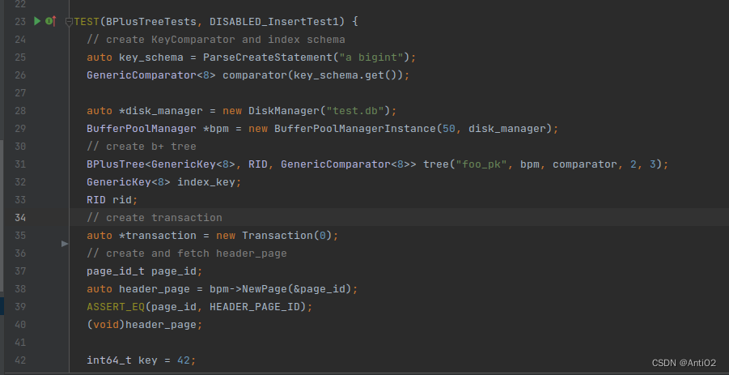
        测试代码中首先生成了一个Comparator,然通过文件名"test.db"生成了一个disk_manager,然后生成了bufferpoolmanager。最后将名字"foo_pk",bpm,comparator，和leaf_max_size ，internal_max_size传入生成了一个BPlusTree。在这里，keyType为GenericKey<8>,valueType为RID。
        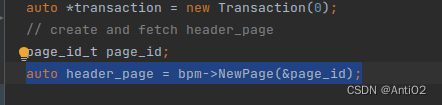
        接下来创建了一个作为header_page的页面。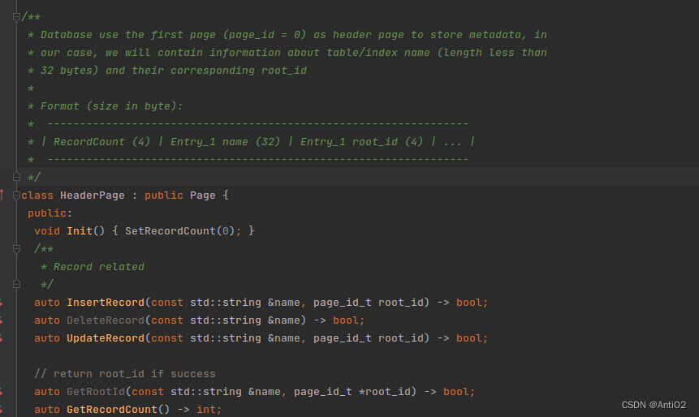
        header_page的page_id_总是为0，用于存储元数据。包含索引名称和对应的root_id的信息。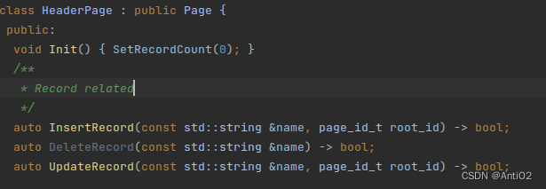

HeaderPage有三个方法，用于管理相关信息。通过`auto GetRootId(const std::string &name, page_id_t *root_id) -> bool;`，可以获取root_id
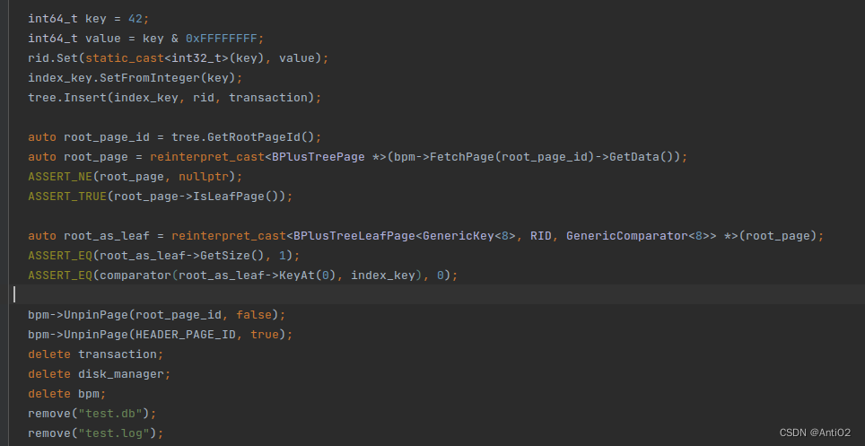
测试接下来检验插入是否成功。
#### 题目实现
首先实现`IsEmpty()`，如果`root_page_id_==INVALID_PAGE_ID`,返回true。
然后实现`GetValue()`函数，我这里粗略画了个流程图
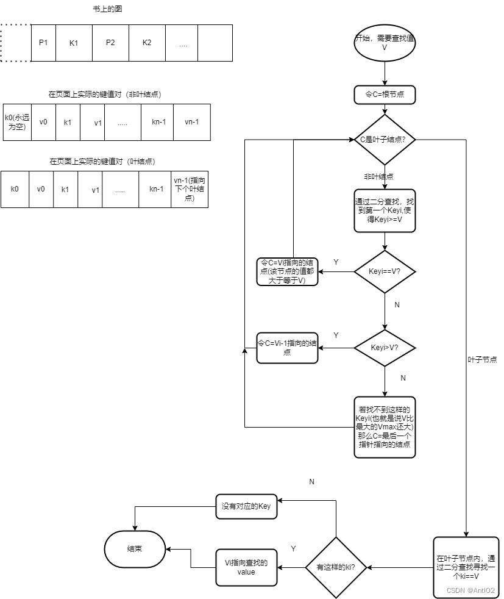
先分别把内部结点和叶子结点的二分查找写出来。
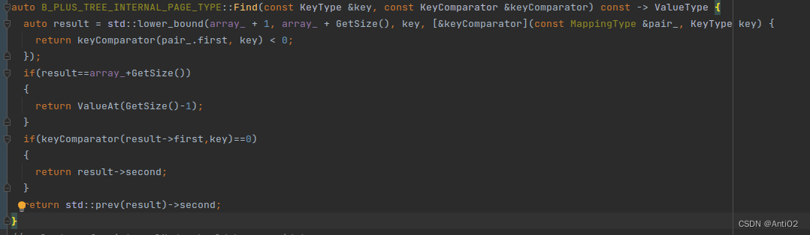
然后是叶子结点，注意我这里和内部结点有些不同，不能直接返回ValueType类型，而是需要判断是否找到了。
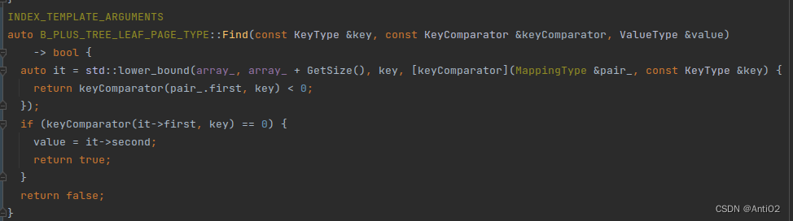
完成这两个帮助函数后，根据流程图完成GetValue部分的代码。

一些注意点：
- 通过`reinterpret_cast<BPlusTreePage *>(buffer_pool_manager_->FetchPage(page_id_)->GetData());`来从buffer_pool中获取页
- 每次Find到想要的数据之后，记得Unpin

**接下来考虑分裂的情况**：
- 如果是叶结点，之前有n-1个键值对，再插入一个键值对到达max_size,此时分裂，并且前[n/2]个结点放在原来结点，剩下的放在新结点。
- 如果是非叶结点，那么分裂之后，本来该移动到新节点的第一个元素不会被添加（因为非叶结点的key0隐含了），而是会被添加到该非叶节点的父节点。

如果还没懂的话，推荐用CMU提供的在线工具自己去试试的，网址在这里[BusTub B+ Tree Printer](https://15445.courses.cs.cmu.edu/fall2022/bpt-printer/)
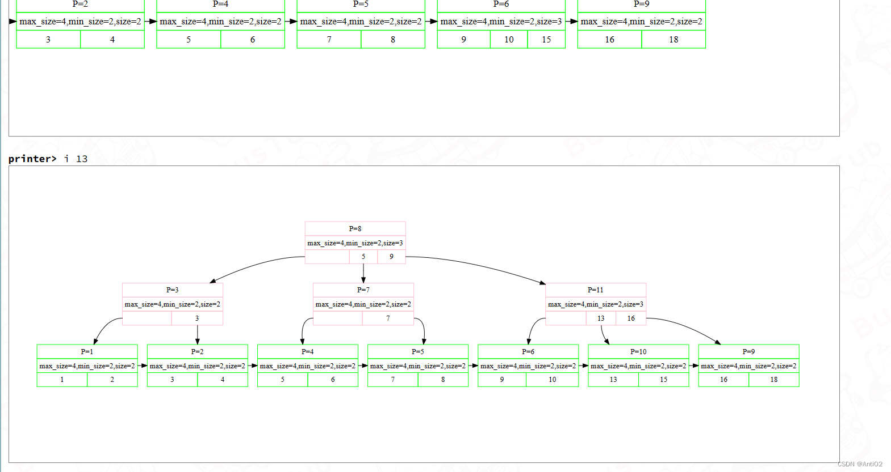


画出流程图如下
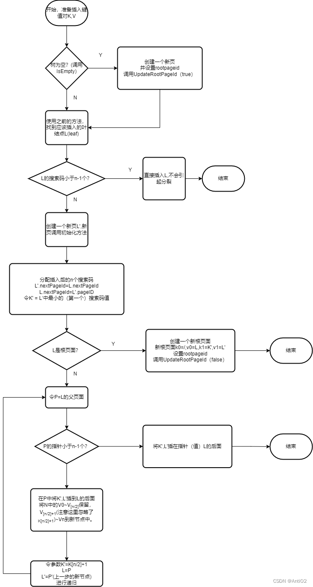

画出流程图之后，就可以实现代码了。
这里插入有一个问题：*就是找到了对应的位置后该如何插入呢*?键值对在页上是直接顺序储存的，好像只能采用O(n)的方法把空位依次挪出来。这个看似时间复杂度很高，但是是在内存上进行操作的，决定时间复杂度主要的因素应该是磁盘读取的时间，所以在内存上的读取时间可以忽略不记。

**一些代码实现注意事项**
- 每次申请了新页面，使用page的GetData()方法转化为B+树的page类型
- 记得Init初始化页面，这里会初始化page_id和parent_id,缓冲区中的page自带的id和b+树页的page_id是不一样的！所以这步很重要
- 记得手动SetPageType
- 记得Unpin
- 在写的时候才发现，InsertParent只能写在b_plus_tree_internal_page里面，原因是b_plus_tree和b_plus_tree_internal_page两个类的模板中的ValueType不同。
- 每次插入后记得IncreaseSize()
- InternalPage在分裂后，新的internal_page中，Value所指向的子页面都要更新parent_id
-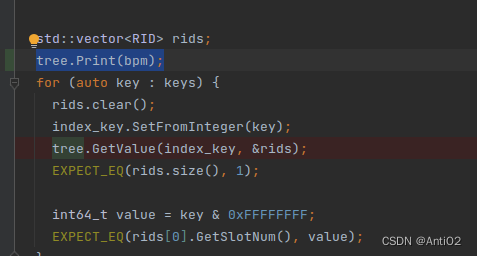
可以使用这个方法来调试，打印B+树的结点🌲，来看自己写对没有。写完之后通过b_plus_tree_insert_test的前两个测试点（第三个需要实现Task3）。
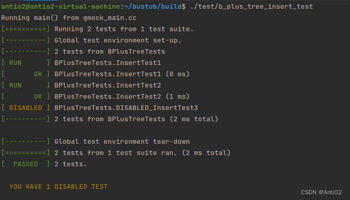
### Delete部分
这一部分实现`Remove(const KeyType &key, Transaction *transaction) {}`
首先画出流程图
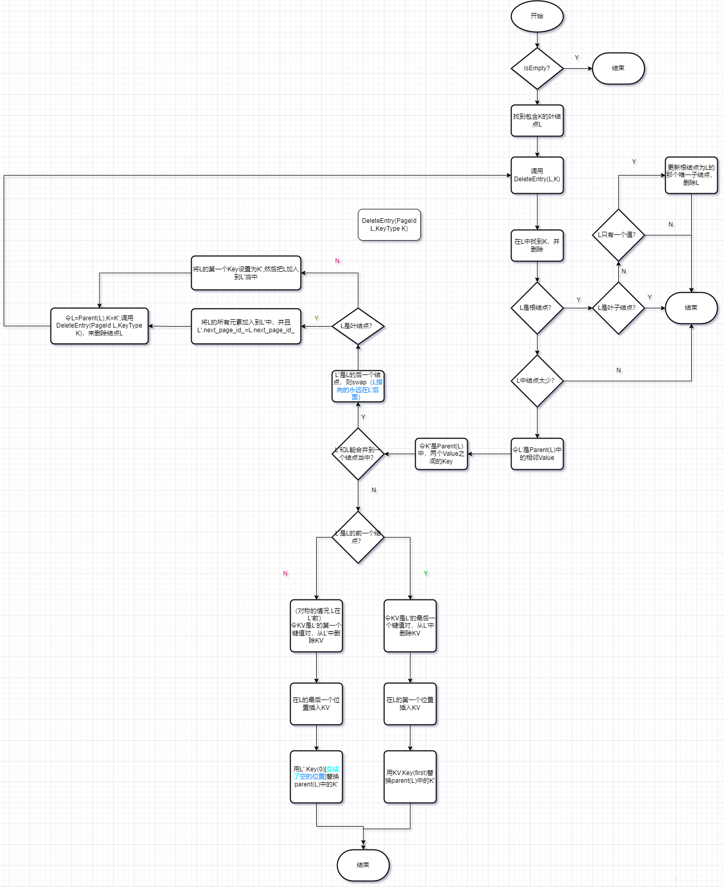

（这里图片不能用SVG，不知道能否看清楚）最后重新分布，从L'借一个索引项，书上叶结点和非叶结点是两种情况，但是实际上在代码实现中，内部节点是有第一个key但是不使用，故两种情况是对齐的，不再分开讨论。
🥰然后写代码实现的时候记得细心一点，如果出错了就用IDE调试，然后对照流程图看哪里出错了。首先应该本地可以通过测试点1
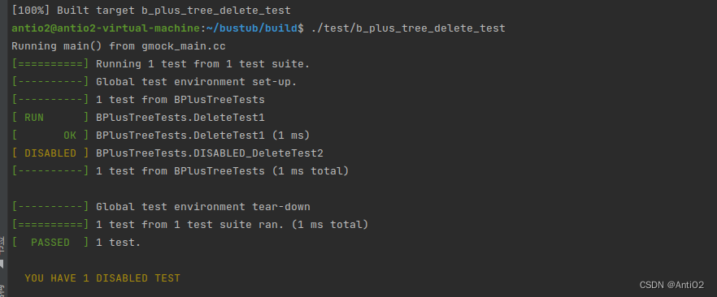
然后记得提交之前用`check-lint`检查一下格式以及`check-clang-tidy-p2`检查代码规范，有时候用`make format`是格式化不完的。
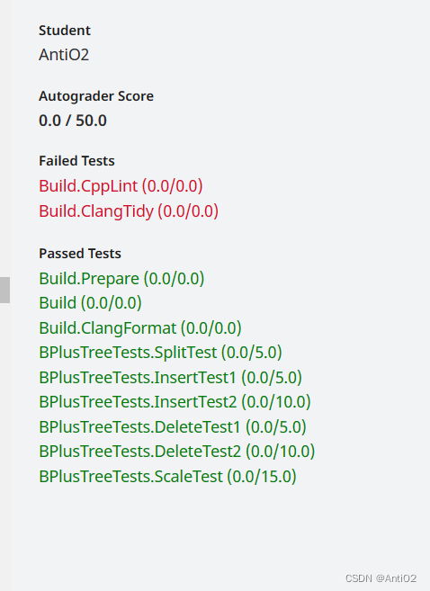
我这里本来该是第一次就过CheckPoint1的😭，我来说几个自己代码不规范的地方吧
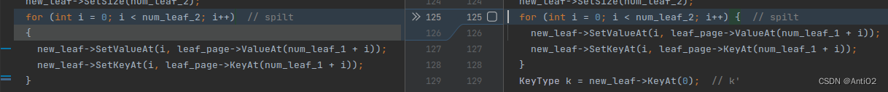
这里左花括号`{`应该在上一行，但是注释导致了无法自动格式化。还有一点，注释的`//`后面和内容之间有一个空格，代码和`//`之间至少两个空格。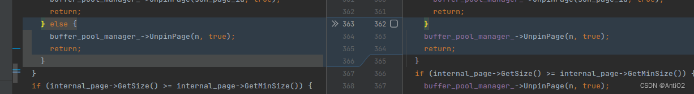
if中如果最后使用了return，后面不要用else

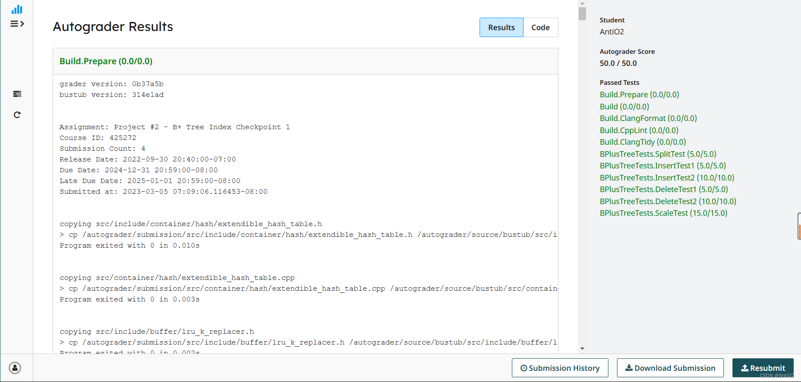
修改格式后再提交，成功通过。我认为这个项目的代码量相比于其他课程代码量偏大,所以自己做的时候一定要细心🔍

## 任务3 Index Iterator
实现一个迭代器。🪡
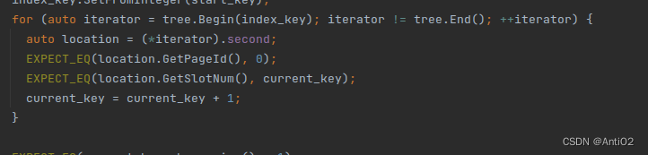
从测试文件来看，项目使用b_plus_tree的begin()方法来获取一个迭代器，至于怎么构造迭代器是自己决定的。
所以我们的迭代器有以下几个属性：
1. 一个指向LeafPage的指针，是当前迭代器所在位置。
2. index表示键值对在当前页中的位置。
3. bpm,内存管理器，用于获取当前页以及迭代时获取下一个页面📃
### 代码实现
这里我的实现顺序是：
- 首先实现构造函数`IndexIterator(LeafPage* leafPage,int idx,BufferPoolManager* bpm) :leaf_page_(leafPage),idx_(idx),bpm_(bpm){};`
- 然后分别实现Begin()和Begin(key)，这里带参的Begin(key)代码流程和之前的GetValue大同小异，如果没找到等于key的值就返回第一个大于等于该指针键值对的迭代器。Begin()的话直接从左边一路走下来就好了。
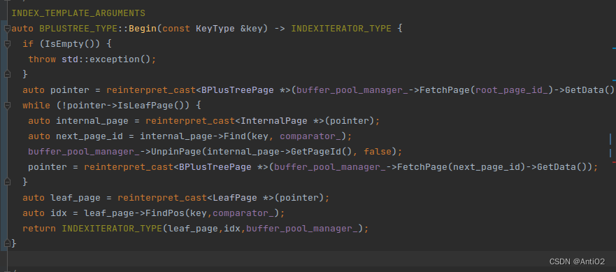

- End()和Begin()相反，一直走最右路就好，最后index=叶结点的size
- 然后还有一个需要注意的点，我们把叶结点指针作为参数传给了迭代器，所以我们还在用迭代器的时候是要保证该页面在内存池里的📌。一开始我是在**析构函数**里面了进行一次Unpin操作，但是可能会导致内存池已经被删除后，迭代器才析构导致内存异常的情况。但是如果不Unpin的话，比如循环里面一直调用tree.end(),就会导致页面被pin上去占用内存池。目前没有想到解决方法，如果要在外部创建迭代器的话，必须在bpm被delete之前进行销毁。可能使用智能指针可以解决，但是测试的结构就不允许这么干。

之后重载运算符比较简单
- operator++()先判断是否是该页的最后一个记录，如果是，那么leaf_page变为下一页，并且unpin当前页面。这里要注意如果最后一个leaf的最后一条记录，那么是不能跳到next_page上的，应该直接idx++,这样迭代器位置就和End()一样了。
- 判断是否相等：判断leaf_page_和idx_是否相等即可。
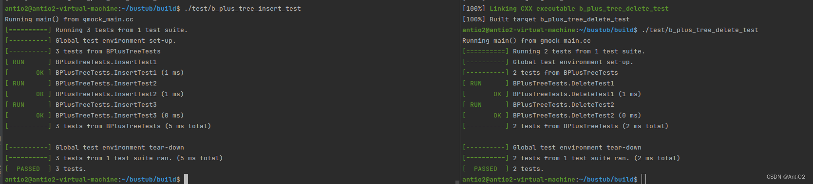
完成代码后在本地通过Insert和Delete最后一个测试点。这个任务应该是该项目中代码量最小的。

## 任务4 多线程
首先直接加大锁肯定是不行的，要用Crabbing的方式进行加锁。

锁的接口在Page里面。
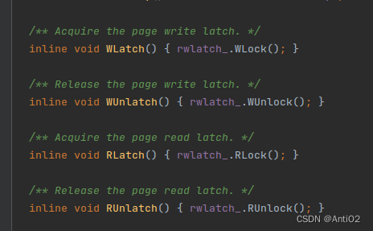
- 注意一个Page需要先被Unlock，然后再Unpin。那么就出现了一个问题，之前Task2写的查找到需要的叶结点操作都是用完父节点就直接释放了，现在在插入和删除操作时必须搞一个队列保存所有页，然后确认子页面safe后释放所有的祖先页（优先释放最上面的）。
- root_page_id_需要B+树去单独搞个锁去保护一下，修改root_page_id时申请个root_latch的写锁，读的时候搞个读锁。
- 如何判断safe?
	- 插入操作：子结点个数小于maxsize-1(有哨兵位置)
	- 删除：子结点个数大于minsize
- 想了一下，InsertParent这种子递归函数、应该内部是不用给父节点加锁的，因为在搜索调用它的过程时已经锁上了。但又隐隐约约感觉不太对。希望能有会的来说一下

其他的不说什么了，具体的加锁操作可以看资料https://15445.courses.cs.cmu.edu/fall2022/notes/09-indexconcurrency.pdf
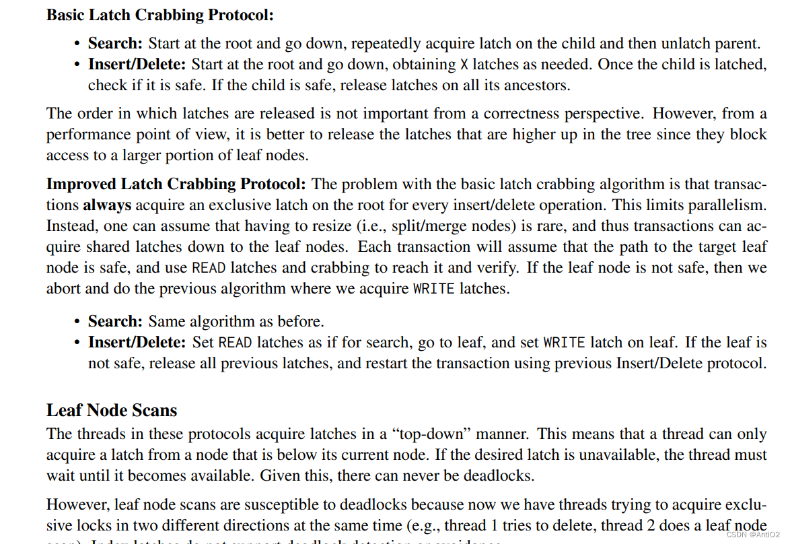
直接按照这个最基础的写。然后写之前记得提交一下Git,免得写烂了。

然后我这里犯了一个很低级的错误，不知道你们能不能看出来。
反正我在这里调了一个小时才发现不是锁的问题。而且之前在Find中也错过类似的。真的能被自己蠢哭
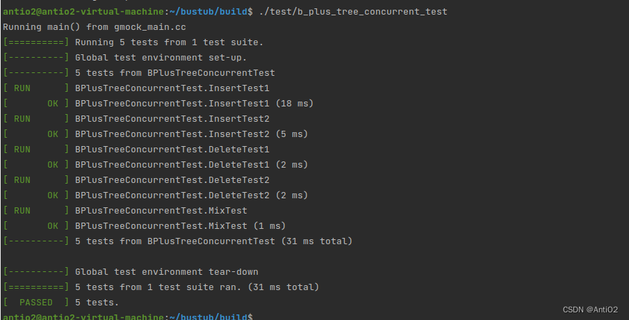
这个要注意思考pin住的页和lock的关系，要是一个页被锁住，那么肯定是不能彻底unpin掉它的，否则lru-k策略可能把他换掉，page的latch信息不会被写进磁盘，从而引发死锁问题。如果你要去unlock一个不在内存中的page，就会引起内存泄漏问题。

然后还有一点，如果你有死锁问题可能是其他帮助函数写错了，不要只死盯着insert和remove不放。
最后放一张我检查时画的流程图吧，蓝色是读锁，红色是写锁

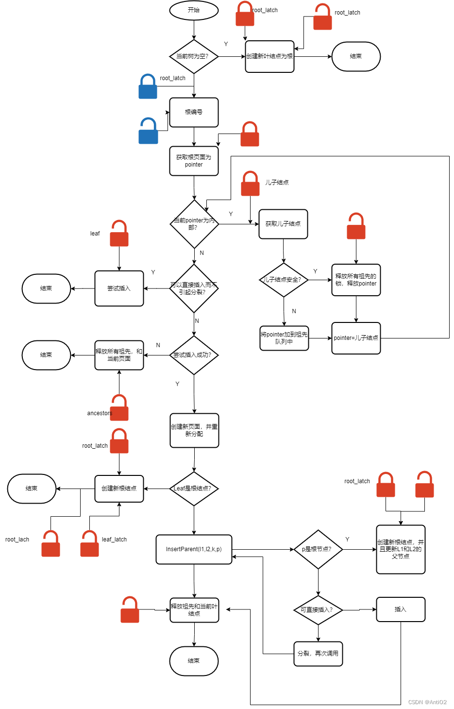