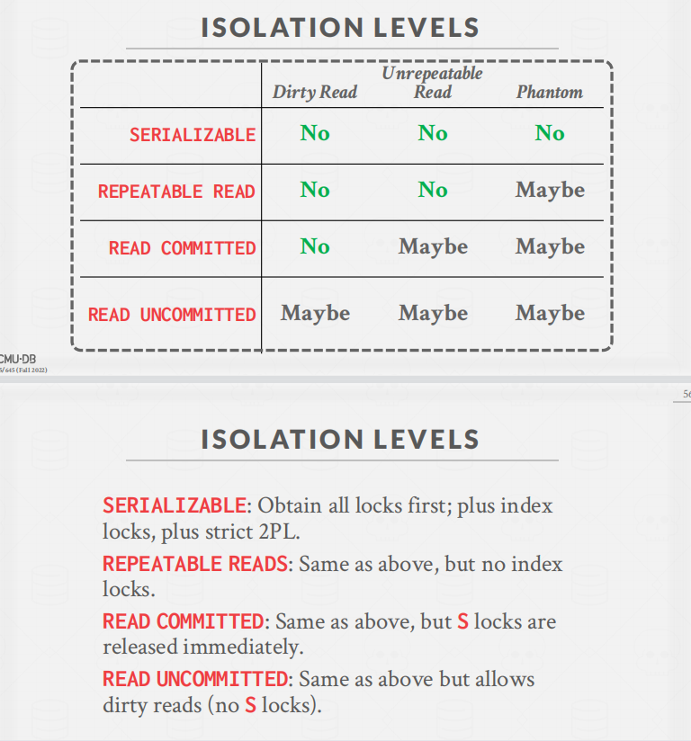
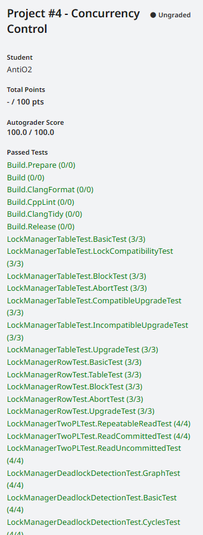

## Task1 Lock Manager

### 📱阅读代码：Transcation

首先阅读`src/include/concurrency/transaction.h` 提供的API

首先定义了2PL事务的四个状态。

```c++
enum class TransactionState { GROWING, SHRINKING, COMMITTED, ABORTED };
```

需要实现三个隔离级别:读未提交(脏读问题)、读提交（不可重复读问题,[虽然读已提交，但是在同一事务中多次读可能出现不同结果]）、可重复读（存在幻读问题，增加了记录）
```c++
enum class IsolationLevel { READ_UNCOMMITTED, REPEATABLE_READ, READ_COMMITTED };
```

三种写操作：插入，修改，删除

```c++
enum class WType { INSERT = 0, DELETE, UPDATE };
```

事务终止原因：

- 在收缩阶段加锁。
- 在收缩阶段解锁时出错
- 更新锁冲突，（另一个事务已经在等待升级这个锁）
- 死锁
- 在读未提交上加共享锁

```C++
enum class AbortReason {
  LOCK_ON_SHRINKING,
  UNLOCK_ON_SHRINKING,
  UPGRADE_CONFLICT,
  DEADLOCK,
  LOCKSHARED_ON_READ_UNCOMMITTED
};
```

**类：TableWriteRecord**

记录在表上的操作（用于之后undo）

**类：IndexWriteRecord**

记录在索引项上的操作

**类：Transaction**

```C++
/** The current transaction state. */
TransactionState state_{TransactionState::GROWING}; 事务状态
/** The isolation level of the transaction. */
IsolationLevel isolation_level_; 事务的隔离级别
/** The thread ID, used in single-threaded transactions. */
std::thread::id thread_id_; 事物的线程号	
/** The ID of this transaction. */
txn_id_t txn_id_; 事务编号

/** The undo set of table tuples. */
std::shared_ptr<std::deque<TableWriteRecord>> table_write_set_; 记录在表上的操作,TableWriteRecord
/** The undo set of indexes. */
std::shared_ptr<std::deque<IndexWriteRecord>> index_write_set_; 记录在索引上的操作
/** The LSN of the last record written by the transaction. */
lsn_t prev_lsn_;  最后一个record的lsn（用于构建一个向前链表，在undo时快速找到上一条记录）

/** Concurrent index: the pages that were latched during index operation. */
std::shared_ptr<std::deque<Page *>> page_set_; // 用于索引操作时，记录上锁的页（B+树里面用到的）
/** Concurrent index: the page IDs that were deleted during index operation.*/
std::shared_ptr<std::unordered_set<page_id_t>> deleted_page_set_; // 用于记录索引操作时，删除的页

/** LockManager: the set of shared-locked tuples held by this transaction. */
std::shared_ptr<std::unordered_set<RID>> shared_lock_set_; // 用于记录被共享锁保护的tuple
/** LockManager: the set of exclusive-locked tuples held by this transaction. */
std::shared_ptr<std::unordered_set<RID>> exclusive_lock_set_; 该事务中被排他锁保护的tuple
```

### 🍃阅读代码：TransactionManager

TransactionManager中，有锁管理器和log manager。

Transaction提供了以下的API:

1. **begin**

```C++
auto TransactionManager::Begin(Transaction *txn, IsolationLevel isolation_level) -> Transaction * {
  // Acquire the global transaction latch in shared mode.
  global_txn_latch_.RLock();

  if (txn == nullptr) {
    txn = new Transaction(next_txn_id_++, isolation_level);
  }

  if (enable_logging) {
    LogRecord record = LogRecord(txn->GetTransactionId(), txn->GetPrevLSN(), LogRecordType::BEGIN);
    lsn_t lsn = log_manager_->AppendLogRecord(&record);
    txn->SetPrevLSN(lsn);
  }

  std::unique_lock<std::shared_mutex> l(txn_map_mutex);
  txn_map[txn->GetTransactionId()] = txn;
  return txn;
}

```

开始一个事务。如果txn为nullptr则新建一个事务（否则这个事务是已经被生成好的）。然后记录该事务id->事务的映射。

2. **Commit**

```C++
void TransactionManager::Commit(Transaction *txn) {
  txn->SetState(TransactionState::COMMITTED);

  // Perform all deletes before we commit.
  auto write_set = txn->GetWriteSet();
  while (!write_set->empty()) {
    auto &item = write_set->back();
    auto table = item.table_;
    if (item.wtype_ == WType::DELETE) {
      // Note that this also releases the lock when holding the page latch.
      table->ApplyDelete(item.rid_, txn);
    }
    write_set->pop_back();
  }
  write_set->clear();

  // Release all the locks.
  ReleaseLocks(txn);
  // Release the global transaction latch.
  global_txn_latch_.RUnlock();
}
```

在提交阶段，完成所有的删除操作，然后涉及RID的释放锁


3. **Abort**

```C++
void TransactionManager::Abort(Transaction *txn) {
  txn->SetState(TransactionState::ABORTED);
  // Rollback before releasing the lock.
  auto table_write_set = txn->GetWriteSet();
  while (!table_write_set->empty()) {
    auto &item = table_write_set->back();
    auto table = item.table_;
    if (item.wtype_ == WType::DELETE) {
      table->RollbackDelete(item.rid_, txn);
    } else if (item.wtype_ == WType::INSERT) {
      // Note that this also releases the lock when holding the page latch.
      table->ApplyDelete(item.rid_, txn);
    } else if (item.wtype_ == WType::UPDATE) {
      table->UpdateTuple(item.tuple_, item.rid_, txn);
    }
    table_write_set->pop_back();
  }
  table_write_set->clear();
  // Rollback index updates
  auto index_write_set = txn->GetIndexWriteSet();
  while (!index_write_set->empty()) {
    auto &item = index_write_set->back();
    auto catalog = item.catalog_;
    // Metadata identifying the table that should be deleted from.
    TableInfo *table_info = catalog->GetTable(item.table_oid_);
    IndexInfo *index_info = catalog->GetIndex(item.index_oid_);
    auto new_key = item.tuple_.KeyFromTuple(table_info->schema_, *(index_info->index_->GetKeySchema()),
                                            index_info->index_->GetKeyAttrs());
    if (item.wtype_ == WType::DELETE) {
      index_info->index_->InsertEntry(new_key, item.rid_, txn);
    } else if (item.wtype_ == WType::INSERT) {
      index_info->index_->DeleteEntry(new_key, item.rid_, txn);
    } else if (item.wtype_ == WType::UPDATE) {
      // Delete the new key and insert the old key
      index_info->index_->DeleteEntry(new_key, item.rid_, txn);
      auto old_key = item.old_tuple_.KeyFromTuple(table_info->schema_, *(index_info->index_->GetKeySchema()),
                                                  index_info->index_->GetKeyAttrs());
      index_info->index_->InsertEntry(old_key, item.rid_, txn);
    }
    index_write_set->pop_back();
  }
  table_write_set->clear();
  index_write_set->clear();

  // Release all the locks.
  ReleaseLocks(txn);
  // Release the global transaction latch.
  global_txn_latch_.RUnlock();
}
```

来阅读事务中止的代码

首先检查table_write_set(对tuple的修改)

然后从后往前，进行Undo操作

- 如果是删除：RollbackDelete (这里是修改删除bit)
- 回滚插入操作： 进行删除
- 回滚更新操作。调用UpdateTuple，更新为旧值

然后对索引进行回滚操作。索引的回滚还是和之前类似，看代码就行，不再赘述了。


### 🔐概念：意向锁

注意，这里是对表加锁


- 为了获得S或IS（意向读锁），至少在父结点有IS锁。IS就是说，我下面可能要读了！。IS只和X锁冲突，因为X表示全都要写，肯定会和至少一个读操作冲突。
- 为了获得X,IX,SIX。至少在父结点有IX锁。IX指示，下面我至少有一个record要写！。所以，会和S锁（读取整张表）冲突。

- [什么是共享意向排它锁？它与IS IX S X之间的相容矩阵是怎样的？ - 知乎 (zhihu.com)](https://www.zhihu.com/question/437451897)

也就是说，对行加锁前，要先对表加锁。

意向锁升级[仅能在growing阶段]

- IS : S,X,IX,SIX
- S: X,SIX
- IX: X,SIX
- SIX: X

### LockManager代码实现

#### LockTable

我这里创建一个函数，检查加锁是否合法。

```c++
enum class LockObject{ TABLE, ROW }; //表示在表还是ROW上加锁
auto LockManager::CheckLock(Transaction *txn,  LockMode lock_mode, LockManager::LockObject lock_object) -> bool;
```


首先阅读代码中的**NOTE**, 了解不同隔离级别下的加锁规则。

>    * SUPPORTED LOCK MODES:
>    *    Table locking should support all lock modes.
>    *    Row locking should not support Intention locks. Attempting this should set the TransactionState as
>    *    ABORTED and throw a TransactionAbortException (ATTEMPTED_INTENTION_LOCK_ON_ROW)

```c++
if(lock_object==LockObject::ROW) {
  if(lock_mode == LockMode::INTENTION_SHARED|| lock_mode == LockMode::INTENTION_EXCLUSIVE ||  lock_mode == LockMode::SHARED_INTENTION_EXCLUSIVE) {
    txn->SetState(TransactionState::ABORTED);
    throw new TransactionAbortException(txn->GetTransactionId(),AbortReason::ATTEMPTED_INTENTION_LOCK_ON_ROW);
  }
}
```


> For instance S/IS/SIX locks are not required under READ_UNCOMMITTED, and any such attempt should set the
>
> TransactionState as ABORTED and throw a TransactionAbortException (LOCK_SHARED_ON_READ_UNCOMMITTED).

直接按照描述实现事务中止条件即可

```C++
if(txn->GetIsolationLevel()==IsolationLevel::READ_UNCOMMITTED) {
  if(lock_mode == LockMode::SHARED || lock_mode == LockMode::INTENTION_SHARED ||  lock_mode == LockMode::SHARED_INTENTION_EXCLUSIVE) {
    txn->SetState(TransactionState::ABORTED);
    throw new TransactionAbortException(txn->GetTransactionId(),AbortReason::LOCK_SHARED_ON_READ_UNCOMMITTED);
  }
}
```

>    *    Similarly, X/IX locks on rows are not allowed if the the Transaction State is SHRINKING, and any such attempt
>    *    should set the TransactionState as ABORTED and throw a TransactionAbortException (LOCK_ON_SHRINKING).

```c++
if(txn->GetState()==TransactionState::SHRINKING) {
  if(lock_mode==LockMode::EXCLUSIVE||lock_mode == LockMode::INTENTION_EXCLUSIVE) {
    txn->SetState(TransactionState::ABORTED);
    throw new TransactionAbortException(txn->GetTransactionId(),AbortReason::LOCK_ON_SHRINKING);
  }
}
```

>    *    REPEATABLE_READ:
>         *    The transaction is required to take all locks.
>         *    All locks are allowed in the GROWING state
>         *    No locks are allowed in the SHRINKING state

```C++
if(txn->GetIsolationLevel()==IsolationLevel::REPEATABLE_READ) {
  if(txn->GetState()==TransactionState::SHRINKING) {
    txn->SetState(TransactionState::ABORTED);
    throw new TransactionAbortException(txn->GetTransactionId(),AbortReason::LOCK_ON_SHRINKING);
  }
  return true;
}
```

>    *    READ_COMMITTED:
>         *    The transaction is required to take all locks.
>         *    All locks are allowed in the GROWING state
>         *    Only IS, S locks are allowed in the SHRINKING state

```C++
  if(txn->GetIsolationLevel()==IsolationLevel::READ_COMMITTED) {
    if(txn->GetState()==TransactionState::SHRINKING) {
      if(lock_mode!=LockMode::INTENTION_SHARED&&lock_mode!=LockMode::SHARED) {
        txn->SetState(TransactionState::ABORTED);
        throw new TransactionAbortException(txn->GetTransactionId(),AbortReason::LOCK_ON_SHRINKING);
      }
    }
    return true;
  }
```

>    *    READ_UNCOMMITTED:
>         *    The transaction is required to take only IX, X locks.
>         *    X, IX locks are allowed in the GROWING state.
>         *    S, IS, SIX locks are never allowed

和上面差不多，添加判断是否在收缩阶段加锁就好

完成检查函数后，在LockTable第一行添加

```C++
  CheckLock(txn,lock_mode,LockObject::TABLE);	
```

如果出错直接抛出异常，然后事务中止。

检查完隔离等级后，检查该表是否有请求队列

```
  table_lock_map_latch_.lock();
  auto lock_request_queue_it =  table_lock_map_.find(oid);
  table_lock_map_latch_.unlock();
  if(lock_request_queue_it==table_lock_map_.end()) {
    table_lock_map_latch_.lock();
    table_lock_map_.emplace(oid,new LockRequestQueue());
    lock_request_queue_it = table_lock_map_.find(oid);
    table_lock_map_latch_.unlock();
  } else {

  }
```

如果该表没有请求队列，就造一个。

然后遍历请求队列：

- 如果已存在该事务

  - 已经获得对应锁：返回true

  - 未获得锁：

    - 已经有其他事务在等待升级：中止事务
    - 检查**是否可以升级**（参考Note）[检查这里是否只有增长阶段能升级锁]

    >    *    While upgrading, only the following transitions should be allowed:
    >         *    IS -> [S, X, IX, SIX]
    >         *    S -> [X, SIX]
    >         *    IX -> [X, SIX]
    >         *    SIX -> [X]

    - 删除原有的锁授权。这里需要修改事务中的各种set.

    - 创建升级事务请求，并加到队首

- 如果未存在该事务，则将该请求加到等待列表。

这里需要通过**兼容矩阵**判断，能否授予该请求锁。我们需要判断能否加锁


```C++
auto LockManager::CheckGrant(const std::shared_ptr<LockRequest>& checked_request, std::shared_ptr<LockRequestQueue> request_queue) -> bool {
  const auto& lock_mode = checked_request->lock_mode_;
  for(const auto &request: request_queue->request_queue_) {
    if(request->granted_) {
      switch (request->lock_mode_) {
        case LockMode::SHARED:
          if(lock_mode==LockMode::INTENTION_SHARED||lock_mode==LockMode::SHARED) {
            break ;
          } else {
            return false;
          }
        case LockMode::EXCLUSIVE:
          return false ;
        case LockMode::INTENTION_SHARED:
          if(lock_mode==LockMode::EXCLUSIVE) {
            return false;
          } else {
            break ;
          }
        case LockMode::INTENTION_EXCLUSIVE:
          if(lock_mode==LockMode::INTENTION_SHARED||lock_mode==LockMode::INTENTION_EXCLUSIVE) {
            break ;
          } else {
            return false;
          }
        case LockMode::SHARED_INTENTION_EXCLUSIVE:
          if(lock_mode==LockMode::INTENTION_SHARED) {
            break ;
          } else {
            return false;
          }
      }
    } else {
      // 遇到了未授权的请求， 按照先进先出的原则，如果不是当前请求，返回false，否则返回true
      return request==checked_request.get();
        // 如果就是当前请求，可以授权
    }
  }
  throw new Exception("在授权锁中，出现未知情况"); // 当前的请求并不在队列中
}

```

然后通过条件变量，等待当前的升级请求被满足

```C++
std::unique_lock<std::mutex> lock(lock_request_queue->latch_, std::adopt_lock);
while(!CheckGrant(upgrade_request,lock_request_queue)) {
    lock_request_queue->cv_.wait(lock);
    if(txn->GetState()==TransactionState::ABORTED) {
      lock_request_queue->request_queue_.erase(upgrade_request_iter);
      lock_request_queue->upgrading_=INVALID_TXN_ID;
      lock_request_queue->cv_.notify_all();
      return false;
    }
}
// 获得锁
lock_request_queue->upgrading_=INVALID_TXN_ID;
upgrade_request->granted_=true;
ModifyLockSet(txn, oid, lock_mode, LockObject::TABLE, ModifyMode::ADD);
if(lock_mode!=LockMode::EXCLUSIVE) {
  lock_request_queue->cv_.notify_all(); //这里的if是个小优化，因为对于X锁，通知了其他线程也没有用，它们是无法满足得到锁的条件的。
}
return true;
```

处理完了升级请求，再来考虑新增加的加锁请求。此时，创建一个新的请求到队列后面，并且等待就好了。当等待完成，授予其新锁，并更新信息

#### UnLockTable

功能：指定事务，解锁其上的表锁。

>    *    Both UnlockTable() and UnlockRow() should release the lock on the resource and return.
>         *    Both should ensure that the transaction currently holds a lock on the resource it is attempting to unlock.
>         *    If not, LockManager should set the TransactionState as ABORTED and throw
>         *    a TransactionAbortException (ATTEMPTED_UNLOCK_BUT_NO_LOCK_HELD)

首先查看是否存在表上的锁，如果不存在，抛出异常

```C++
table_lock_map_latch_.lock();
auto lock_request_queue_it = table_lock_map_.find(oid);
table_lock_map_latch_.unlock();
if(lock_request_queue_it==table_lock_map_.end()) {
  txn->SetState(TransactionState::ABORTED);
  throw new TransactionAbortException(txn->GetTransactionId(),AbortReason::ATTEMPTED_UNLOCK_BUT_NO_LOCK_HELD);
}
```

>    *    Additionally, unlocking a table should only be allowed if the transaction does not hold locks on anyrow on that table. If the transaction holds locks on rows of the table, Unlock should set the Transaction Stateas ABORTED and throw a TransactionAbortException (TABLE_UNLOCKED_BEFORE_UNLOCKING_ROWS).

在解锁之前，必须保证没有任何行锁。

```C++
const auto& row_s_lock_set = txn->GetSharedRowLockSet()->find(oid);
const auto& row_x_lock_set = txn->GetExclusiveRowLockSet()->find(oid);
// 判断行锁必须为空
if(!((row_s_lock_set==txn->GetSharedRowLockSet()->end()||row_s_lock_set->second.empty())&&
      (row_x_lock_set==txn->GetExclusiveRowLockSet()->end()||row_x_lock_set->second.empty()) )) {
  txn->SetState(TransactionState::ABORTED);
  throw new TransactionAbortException(txn->GetTransactionId(),AbortReason::TABLE_UNLOCKED_BEFORE_UNLOCKING_ROWS);
}
```

之后检查队列，如果存在：txn相同并且被授予锁，那么删除。

>    * TRANSACTION STATE UPDATE
>    *    Unlock should update the transaction state appropriately (depending upon the ISOLATION LEVEL)
>    *    Only unlocking S or X locks changes transaction state.
>       *
>    * REPEATABLE_READ:
>      * Unlocking S/X locks should set the transaction state to SHRINKING
>           *
>    * READ_COMMITTED:
>      * Unlocking X locks should set the transaction state to SHRINKING.
>      * Unlocking S locks does not affect transaction state.
>           *
>    * READ_UNCOMMITTED:
>      * Unlocking X locks should set the transaction state to SHRINKING.
>      * S locks are not permitted under READ_UNCOMMITTED.
>      * The behaviour upon unlocking an S lock under this isolation level is undefined.
>           *

```C++
switch(txn->GetIsolationLevel()) {
  case IsolationLevel::REPEATABLE_READ:
    if((*it)->lock_mode_==LockMode::EXCLUSIVE||(*it)->lock_mode_==LockMode::SHARED) {
      txn->SetState(TransactionState::SHRINKING);
    }
    break;
  case IsolationLevel::READ_COMMITTED:
    if((*it)->lock_mode_==LockMode::EXCLUSIVE) {
      txn->SetState(TransactionState::SHRINKING);
    }
    break;
  case IsolationLevel::READ_UNCOMMITTED:
    if((*it)->lock_mode_==LockMode::EXCLUSIVE) {
      txn->SetState(TransactionState::SHRINKING);
    }
    if((*it)->lock_mode_==LockMode::SHARED) {
      txn->SetState(TransactionState::ABORTED);
      throw new Exception("未定义行为，在读未提交加了读锁");
    }
    break;
```

在这里注意还有一个坑点：

1. 在Commit阶段，会先设置事务状态为commit，再遍历所有表上的锁，并调用Unlock Table .
2. 如果收缩变换这里不判断事务状态是否为growing，就会导致ABORT/COMMIT状态又变回SHRINKING

#### Lock Row

我们首先要增加锁判断逻辑

根据

IS 升级为 S,X,IX,SIX

IX 升级为 X,SIX

当一个行锁需要S锁，至少需要IS表锁。需要X行锁，至少需要IX表锁。

增加判断条件

```C++
auto LockManager::CheckTableIntentionLock(Transaction *txn, const LockManager::LockMode &lockMode,table_oid_t oid) -> void {
  switch (lockMode) {
    case LockMode::SHARED:
      if(!txn->IsTableIntentionSharedLocked(oid)&&!txn->IsTableSharedLocked(oid)
          &&!txn->IsTableExclusiveLocked(oid)&&!txn->IsTableIntentionExclusiveLocked(oid)
          &&!txn->IsTableSharedIntentionExclusiveLocked(oid)) {
        txn->SetState(TransactionState::ABORTED);
        throw new TransactionAbortException(txn->GetTransactionId(),AbortReason::TABLE_LOCK_NOT_PRESENT);
      }
      break;
    case LockMode::EXCLUSIVE:
      if(!txn->IsTableExclusiveLocked(oid)&&!txn->IsTableIntentionExclusiveLocked(oid)
          &&!txn->IsTableSharedIntentionExclusiveLocked(oid)) {
        txn->SetState(TransactionState::ABORTED);
        throw new TransactionAbortException(txn->GetTransactionId(),AbortReason::TABLE_LOCK_NOT_PRESENT);
      }
      break;
    default:
      break; // 其他三种情况之前已经抛出。
  }
}
```


这是一个简单的DFS，就不再讲了。

```C++
while (HasCycle(&txn_id)) {
	// 删除结点
}
```


找到环之后，删除该事务的结点（删除以其为顶点的边）

然后对它请求的锁队列都notify一遍

并将该事务Abort

## Task2 Deadlock Detection

通过检测锁的等待请求关系，也就是检测环来检查是否有死锁。


- Your background thread should build the graph on the fly every time it wakes up. You should **not** be maintaining a graph, it should be built and destroyed every time the thread wakes up.

也就是说，检测线程是一个周期性的后台线程，在唤醒时，再构造边。目前，我的想法是：可以通过遍历请求队列，来检查有哪些边需要被添加。

比如遍历

```
std::unordered_map<table_oid_t, std::shared_ptr<LockRequestQueue>> table_lock_map_;
```

通过遍历oid，找出哪个锁Grant给哪个事务了。因为我们的锁是FIFO的，所以可以将Queue分成两个部分，第一部分已经被授予了锁，第二部分在等待锁。


说回具体的实现，首先实现环，再来想其他的。

我们通过保存起点和其到达的点来保存图，我定义了下面的数据结构。

```C++
  using edge_t = std::pair<txn_id_t,txn_id_t>;
  using edge_list = std::vector<edge_t>;
  using edge_map = std::unordered_map<txn_id_t, std::unordered_map<txn_id_t, edge_list::iterator> >;

  edge_list edge_list_;
  edge_map edge_map_;

```

edge_map以起点为key，value值为一个vector，保存终点和在edge_list中的迭代器位置（用于快速维护list）。

然后就是添加边和移除边的代码


> 这里我现在想了一下，如果GetEdgeList()调用频率不高的话，不用写这么复杂。每次调用时再临时维护GetEdgeList()就行。然后我发现了预先给了一个waits_for_，于是我就改写法了。这是我最开始的写法
>
> ```C++
> void LockManager::AddEdge(txn_id_t t1, txn_id_t t2) {
>   auto t1_map_iter = edge_map_.find(t1);
>   if(t1_map_iter==edge_map_.end()) {
>     // 说明之前没有t1起点的边
>     t1_map_iter = edge_map_.emplace(t1, std::unordered_map<txn_id_t, edge_list::iterator>{} ).first;
>   }
>   auto t2_iter = t1_map_iter->second.find(t2);
>   if(t2_iter == t1_map_iter->second.end()) {
>     // 说明之前没有该边。
>     edge_list_.emplace_back(t1,t2);
>     auto new_edge_list_iter =  std::prev(edge_list_.end());
>     (t1_map_iter->second).emplace(t2,new_edge_list_iter); // 插入map中
>   }
> }
> 
> void LockManager::RemoveEdge(txn_id_t t1, txn_id_t t2) {
>   auto t1_map_iter = edge_map_.find(t1);
>   if(t1_map_iter!=edge_map_.end()) {
>     auto t2_iter = t1_map_iter->second.find(t2);
>     if(t2_iter != t1_map_iter->second.end()) {
>       // 找到了改变，先从list中删除，然后再从map中删除
>       edge_list_.erase(t2_iter->second);
>       t1_map_iter->second.erase(t2_iter);
>     }
>   }
> }
> 
> auto LockManager::HasCycle(txn_id_t *txn_id) -> bool { return false; }
> 
> auto LockManager::GetEdgeList() -> std::vector<std::pair<txn_id_t, txn_id_t>> {
>   // std::vector<std::pair<txn_id_t, txn_id_t>> edges(0);
>   return edge_list_;
> }
> ```


完成了加边之后，开始找环。

注意环是从小到大开始找，但是返回的应该是环中的最大值。

```C++
auto LockManager::HasCycle(txn_id_t *txn_id) -> bool {
  for (const auto &txn : txn_set_) {
    txn_sort_list_.emplace_back(txn);
  }
  std::sort(txn_sort_list_.begin(), txn_sort_list_.end(),
            [](const txn_id_t &t1, const txn_id_t &t2) { return t1 < t2; });
  for (const auto &begin_txn : txn_sort_list_) {
    cycle_set_.clear();
    if (SearchCycle(begin_txn)) {
      // 说明有环；找到最大的.
      auto youngest_txn = *cycle_set_.begin();
      for (auto cycle_node : cycle_set_) {
        youngest_txn = std::max(youngest_txn, cycle_node);
      }
      *txn_id = youngest_txn;
      return true;
    }
  }
  return false;
}

auto LockManager::SearchCycle(txn_id_t txn_id_) -> bool {
  if (searched_set_.count(txn_id_) > 0) {
    return false;
    // 说明从此开始，没有环
  }
  if (cycle_set_.find(txn_id_) != cycle_set_.end()) {
    // 已经被标记过了，说明形成了环
    return true;
  }
  cycle_set_.emplace(txn_id_);
  auto &linked_nodes = waits_for_[txn_id_];
  std::sort(linked_nodes.begin(), linked_nodes.end(), [](const txn_id_t &t1, const txn_id_t &t2) { return t1 < t2; });
  for (const auto &linked_node : linked_nodes) {
    if (SearchCycle(linked_node)) {
      return true;
    }
  }
  // 找完了都没有环，加入被搜索过的。
  searched_set_.emplace(txn_id_);
  cycle_set_.erase(txn_id_);
  return false;
}

```

## Task3 Concurrent Query Execution

You will need to update the `Next()` methods of some executors (sequential scan, insert, and delete)

需要对这几个算子加锁。

首先我们要了解加锁的级别：

通过上网，查询到不同事务分别要加哪些锁

> read-uncommitted(简称：RU)：这里查询不加锁，但是增删改加了行级共享锁，直到事物被提交或回滚才会解锁。
> read-committed(简称：RC)：事务读取的时候，查询操作不会加锁。进行增删改时，会加行级共享锁，直到事物被提交或回滚才会解锁。
> repeatable-read(简称：RR)：事务读取时加行级共享锁，直到事务结束才会释放。
> serializable(简称：SE)：事务读取时加表级排它锁，直到事务结束时，才释放。这里因为有一个串行化的一种状态，未触发前只可以进行查询操作，一旦进行增删改串行化就会被触发，增删改查都会被事务阻塞！
> ————————————————
> 版权声明：本文为CSDN博主「IT_Holmes」的原创文章，遵循CC 4.0 BY-SA版权协议，转载请附上原文出处链接及本声明。
> 原文链接：https://blog.csdn.net/IT_Holmes/article/details/122641669

### seq Scan



| 隔离级别         | 加锁情况                               |
| ---------------- | -------------------------------------- |
| read-uncommitted | 不加锁                                 |
| read-committed   | 查询操作加锁,加完行锁马上释放          |
| repeatable-read  | 读取时加行级共享锁，读取完再释放行锁。 |

也就是说，在Init中，需要先加IS锁，然后在Next中，对行加S锁

首先是加表锁

```C++
void SeqScanExecutor::Init() {
  table_info_ = exec_ctx_->GetCatalog()->GetTable(plan_->GetTableOid());
  auto txn = exec_ctx_->GetTransaction();
  if(txn->GetIsolationLevel()!=IsolationLevel::READ_UNCOMMITTED) {
    // 需要加意向读锁
    if(!exec_ctx_->GetLockManager()->LockTable(txn, LockManager::LockMode::INTENTION_SHARED,table_info_->oid_)) {
      txn->SetState(TransactionState::ABORTED);
      throw Exception(ExceptionType::INVALID,"Cant lock table");
    }
  }
  table_iter_ = table_info_->table_->Begin(exec_ctx_->GetTransaction());
}
```

然后是加行锁

```C++
if(txn->GetIsolationLevel()!=IsolationLevel::READ_UNCOMMITTED) {
  // 如果不是RU，需要在读前加S锁
  if(!lm->LockRow(txn,LockManager::LockMode::SHARED,oid,*rid)) {
    throw ExecutionException("Can't lock row");
  }
}
```

在解锁时，不同隔离级别解锁时机不同，具体参照我上面的表

```C++
auto res = table_info_->table_->GetTuple(*rid, tuple, exec_ctx_->GetTransaction());
lock_rids_.emplace_back(rid);
if(txn->GetIsolationLevel()==IsolationLevel::READ_COMMITTED) {
  if(!lm->UnlockRow(txn,oid,*rid)) {
    throw ExecutionException("Can't unlock row");
  }
}
if(table_iter_==table_info_->table_->End()) {
  done_ = true;
  if(txn->GetIsolationLevel()==IsolationLevel::REPEATABLE_READ) {
    // 如果是RR，在最后释放读锁。
    for(auto const &lock_rid:lock_rids_) {
      if(!lm->UnlockRow(txn, oid, *lock_rid)) {
        throw ExecutionException("Can't unlock row");
      }
    }
  }
  if(txn->GetIsolationLevel()!=IsolationLevel::READ_UNCOMMITTED) {
    // 释放IS
    if(!exec_ctx_->GetLockManager()->UnlockTable(txn,table_info_->oid_)) {
      txn->SetState(TransactionState::ABORTED);
      throw ExecutionException("Can't unlock table");
    }
  }
  lock_rids_.clear();
}
return res;
```


### insert

对于insert,首先对表上IX锁。

然后在写时，对每个tuple上X锁。

注意还要维护transaction的write set.

```C++
while (child_executor_->Next(&next_tuple, &next_rid)) {

  if (table_info_->table_->InsertTuple(next_tuple, &next_rid, exec_ctx_->GetTransaction())) {
    // 如果插入成功，才能获取rid，这个时候才能得到lock
    // 所以会出现一个问题:幻象读取。
    try {
      if(!lock_m->LockRow(txn,LockManager::LockMode::EXCLUSIVE,table_info_->oid_,next_rid)) {
        txn->SetState(TransactionState::ABORTED);
        throw ExecutionException("Can't lock row");
      }
    }catch (TransactionAbortException& e) {
      throw ExecutionException(e.GetInfo());
    }
    for (auto index : indexes_) {
      index->index_->InsertEntry(next_tuple.KeyFromTuple(child_executor_->GetOutputSchema(), index->key_schema_,
                                                         index->index_->GetKeyAttrs()),
                                 next_rid, exec_ctx_->GetTransaction());
      txn->AppendIndexWriteRecord(IndexWriteRecord(next_rid,table_info_->oid_,WType::INSERT,next_tuple,index->index_oid_,exec_ctx_->GetCatalog()));
    }
    txn->AppendTableWriteRecord(TableWriteRecord(next_rid,WType::INSERT, next_tuple, table_info_->table_.get()));
    try {
      if(!lock_m->UnlockRow(txn,table_info_->oid_,next_rid)) {
        txn->SetState(TransactionState::ABORTED);
        throw ExecutionException("Can't unlock row");
      }
    }catch (TransactionAbortException& e) {
      throw ExecutionException(e.GetInfo());
    }
    rows_cnt++;
  }
}
try {
  if(!lock_m->UnlockTable(txn,table_info_->oid_)) {
    txn->SetState(TransactionState::ABORTED);
    throw ExecutionException("Can't unlock table");
  }
}catch (TransactionAbortException& e) {
  throw ExecutionException(e.GetInfo());
}
```

这里还有一个疑点：需不需要在代码里面解锁行锁：

经过思考之后，其实是不需要的，X锁应当在Commit或Abort 阶段被transaction manager解锁。（如果在执行时解锁，会导致进入收缩阶段！）

所以我又改成了不需要解锁的代码

```C++
auto InsertExecutor::Next(Tuple *tuple, RID *rid) -> bool {
  if (is_end_) {
    return false;
  }
  // exec_ctx_->GetLockManager()->LockUpgrade(exec_ctx_->GetTransaction(), *rid);
  RID next_rid;
  Tuple next_tuple;
  int32_t rows_cnt = 0;
  auto lock_m = exec_ctx_->GetLockManager();
  while (child_executor_->Next(&next_tuple, &next_rid)) {
    if (table_info_->table_->InsertTuple(next_tuple, &next_rid, exec_ctx_->GetTransaction())) {
      // 如果插入成功，才能获取rid，这个时候才能得到lock
      // 所以会出现一个问题:幻象读取。
      try {
        if(!lock_m->LockRow(txn,LockManager::LockMode::EXCLUSIVE,table_info_->oid_,next_rid)) {
          txn->SetState(TransactionState::ABORTED);
          throw ExecutionException("Can't lock row");
        }
      }catch (TransactionAbortException& e) {
        throw ExecutionException(e.GetInfo());
      }
      for (auto index : indexes_) {
        index->index_->InsertEntry(next_tuple.KeyFromTuple(child_executor_->GetOutputSchema(), index->key_schema_,
                                                           index->index_->GetKeyAttrs()),
                                   next_rid, exec_ctx_->GetTransaction());
        txn->AppendIndexWriteRecord(IndexWriteRecord(next_rid,table_info_->oid_,WType::INSERT,next_tuple,index->index_oid_,exec_ctx_->GetCatalog()));
      }
      txn->AppendTableWriteRecord(TableWriteRecord(next_rid,WType::INSERT, next_tuple, table_info_->table_.get()));
      rows_cnt++;
    }
  }
  std::vector<Value> values;
  values.reserve(GetOutputSchema().GetColumnCount());
  values.emplace_back(TypeId::INTEGER, rows_cnt);
  *tuple = Tuple{values, &GetOutputSchema()};
  is_end_ = true;
  return true;
}
```

### delete

delete和insert还挺像的，照着改就行。

```C++
void DeleteExecutor::Init() {
  child_executor_->Init();
  try {
    if(!exec_ctx_->GetLockManager()->LockTable(txn_,LockManager::LockMode::INTENTION_EXCLUSIVE,plan_->table_oid_)) {
      throw ExecutionException("Can't Get X Lock On Table");
    }
  }catch (TransactionAbortException& e) {
    throw ExecutionException(e.GetInfo());
  }
  table_info_ = exec_ctx_->GetCatalog()->GetTable(plan_->table_oid_);
  indexes_ = exec_ctx_->GetCatalog()->GetTableIndexes(table_info_->name_);
}

auto DeleteExecutor::Next([[maybe_unused]] Tuple *tuple, RID *rid) -> bool {
  if (is_end_) {
    return false;
  }
  int32_t row_cnt = 0;
  Tuple next_tuple{};
  RID next_rid;
  auto lock_m = exec_ctx_->GetLockManager();
  while (child_executor_->Next(&next_tuple, &next_rid)) {
    try {
      if(!lock_m->LockRow(txn_,LockManager::LockMode::EXCLUSIVE,table_info_->oid_,next_rid)) {
        txn_->SetState(TransactionState::ABORTED);
        throw ExecutionException("Can't lock row");
      }
    }catch (TransactionAbortException& e) {
      throw ExecutionException(e.GetInfo());
    }
    if (!table_info_->table_->MarkDelete(next_rid, exec_ctx_->GetTransaction())) {
      continue;
    }
    for (auto index : indexes_) {
      index->index_->DeleteEntry(
          next_tuple.KeyFromTuple(table_info_->schema_, index->key_schema_, index->index_->GetKeyAttrs()), next_rid,
          exec_ctx_->GetTransaction());
      txn_->AppendIndexWriteRecord(IndexWriteRecord(next_rid,table_info_->oid_,WType::DELETE,next_tuple,index->index_oid_,exec_ctx_->GetCatalog()));
    }
    txn_->AppendTableWriteRecord(TableWriteRecord(next_rid,WType::DELETE, next_tuple, table_info_->table_.get()));
    row_cnt++;
  }
  std::vector<Value> values = {Value(TypeId::INTEGER, row_cnt)};
  *tuple = Tuple(values, &plan_->OutputSchema());
  return is_end_ = true;
}
```

## ⚠ 一些思考




首先是考虑四个隔离级别，分别是如何加锁的，为何要这么加锁。

然后就是具体的，在代码中加锁应该是哪个位置。

