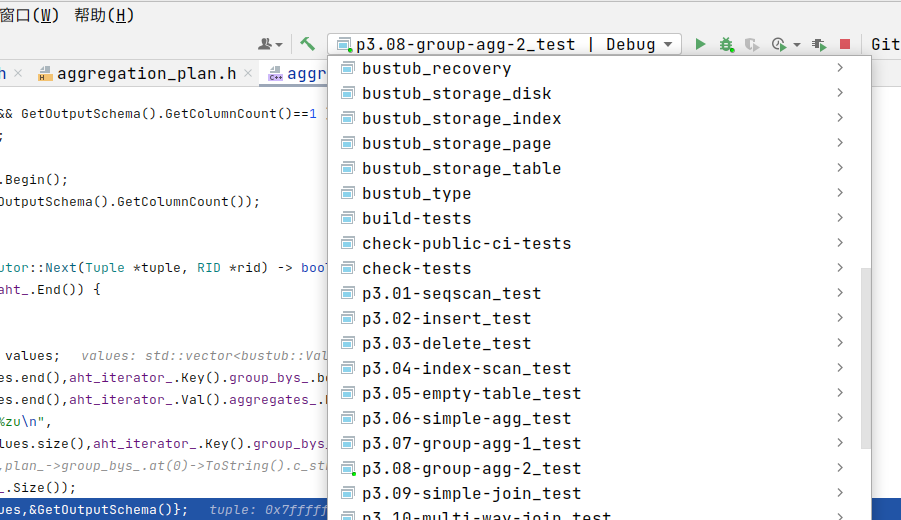
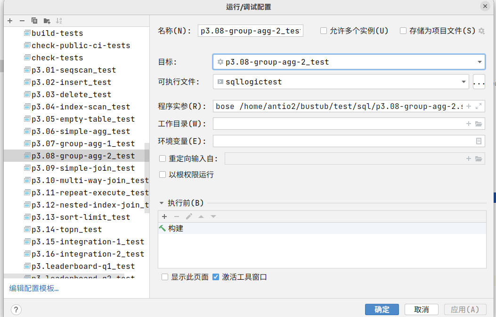
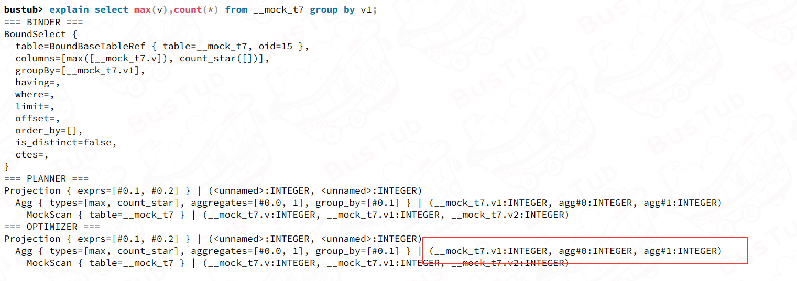
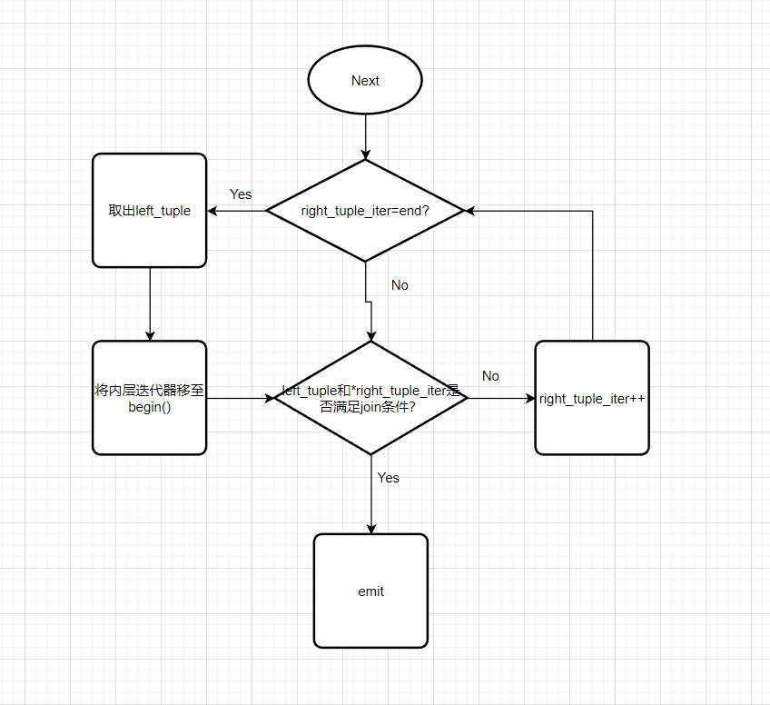
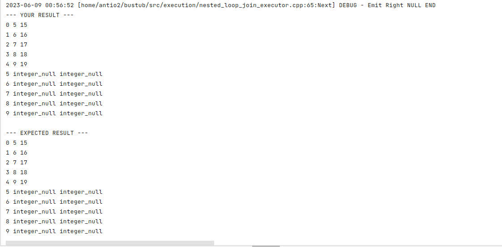
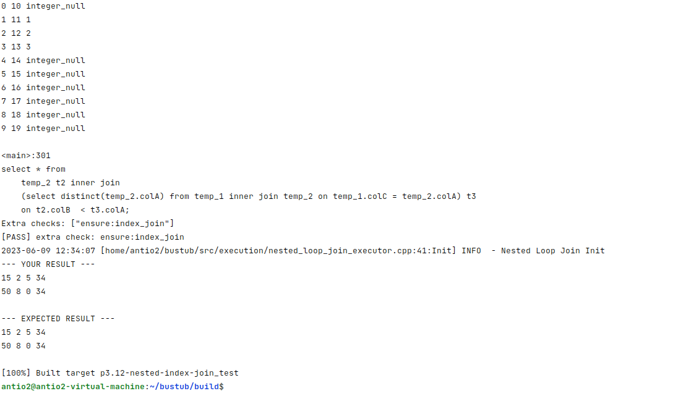

## 0x00 准备工作

🧐首先通过查看示例了解怎么实现执行器

### 0x01 相关的类

#### Executor&Catalog&Schema

所有的Executor(在bustub中)，都是Abstract_Executor的派生类

```C++
class AbstractExecutor {
 public:
  /**
   * Construct a new AbstractExecutor instance.
   * @param exec_ctx the executor context that the executor runs with
   */
  explicit AbstractExecutor(ExecutorContext *exec_ctx) : exec_ctx_{exec_ctx} {}

  /** Virtual destructor. */
  virtual ~AbstractExecutor() = default;

  /**
   * Initialize the executor.
   * @warning This function must be called before Next() is called!
   */
  virtual void Init() = 0;

  /**
   * Yield the next tuple from this executor.
   * @param[out] tuple The next tuple produced by this executor
   * @param[out] rid The next tuple RID produced by this executor
   * @return `true` if a tuple was produced, `false` if there are no more tuples
   */
  virtual auto Next(Tuple *tuple, RID *rid) -> bool = 0;

  /** @return The schema of the tuples that this executor produces */
  virtual auto GetOutputSchema() const -> const Schema & = 0;

  /** @return The executor context in which this executor runs */
  auto GetExecutorContext() -> ExecutorContext * { return exec_ctx_; }

 protected:
  /** The executor context in which the executor runs */
  ExecutorContext *exec_ctx_;
};
```

可以看到必须实现的接口：

- `void Init()`用于初始化，必须在`Next()`之前被调用。
- `bool Next(Tuple *tuple, RID *rid)`来获取该执行器下一个Tuple和RID,如果没有则返回false。
- `const Schema & GetOutputSchema()`,获取该执行器输出的Schema。

🐧Schema存储了一个列向量，类似于`(__mock_table_1.colA:INTEGER, __mock_table_1.colB:INTEGER)`,Column包含了列名、列类型、列在tuple中的偏移量、列大小等信息。

`Abstract_executor`还有一个属性：`ExecutorContext *exec_ctx_`,指示了执行器的上下文。

exec_ctx的构造器如下

```
ExecutorContext(Transaction *transaction, Catalog *catalog, BufferPoolManager *bpm, TransactionManager *txn_mgr,
                LockManager *lock_mgr)
```

可以看出来执行器内容由当前事务、catalog、缓存管理器、事务管理器、锁管理器组成。

`catalog`,（中文翻译目录）旨在供 DBMS 执行引擎中的执行器使用。它处理表创建、表查找、索引创建和索引查找。ty.ht 通过查看`catalog`原始类，可以看到几个方法，`get_table`,`get_index`,`tree_index`,`create_table`,`create_index`等。

😼除此之外，还有一个抽象类——`AbstractPlanNode`,这个代表了执行计划树结点的基类，构造方法有一个指示输出的schema的`shared_ptr`,还有子计划结点的向量

```c++
AbstractPlanNode(SchemaRef output_schema, std::vector<AbstractPlanNodeRef> children)
    : output_schema_(std::move(output_schema)), children_(std::move(children)) {}
```

#### Expression

🦄bustub还有一系列Expression类，来表示表达式，比如逻辑表达式、常量表达式。

来看构造函数

```C++
AbstractExpression(std::vector<AbstractExpressionRef> children, TypeId ret_type)
    : children_{std::move(children)}, ret_type_{ret_type} {}
```

因为Expression被树状结构表示，它是由一系列的子表达式的。还有返回类型。

Expression抽象类有以下几个方法：

- `virtual auto Evaluate(const Tuple *tuple, const Schema &schema) const -> Value = 0;`通过给定tuple和schema求当前表达式的值。比如constant_value_expression类型的直接返回一个value,column_value_expression返回该tuple中指定列的值，arithmetic_expression返回两个子表达式的计算结果。
- `virtual auto EvaluateJoin(const Tuple *left_tuple, const Schema &left_schema, const Tuple *right_tuple,const Schema &right_schema) const -> Value = 0;` 用于获取联结操作中指定列的值。


#### Tuple

tuple类表示一个元组，接下来解析tuple的实现：

>```c++
>private:
>// Get the starting storage address of specific column
>auto GetDataPtr(const Schema *schema, uint32_t column_idx) const -> const char *;
>
>bool allocated_{false};  // is allocated?
>RID rid_{};              // if pointing to the table heap, the rid is valid
>uint32_t size_{0};
>char *data_{nullptr};
>```

GetDataPtr用于获取指向数据的指针。对于isInline类型（不是Varchar），返回`(char*)(data+offset)`,对于not inline的列， `*reinterpret_cast<int32_t *>(data_ + col.GetOffset())`这个本身（data_ + col.GetOffset()的值）是一个指针，该位置存放了一个offset值，最后`return (data_ + offset);`

tuple在内存中的存放格式如下，注意不会保存RID

```c++
void Tuple::SerializeTo(char *storage) const {
  memcpy(storage, &size_, sizeof(int32_t)); // 大小
  memcpy(storage + sizeof(int32_t), data_, size_);// data_
}
```

然后是Tuple的构造器

```c++
Tuple::Tuple(std::vector<Value> values, const Schema *schema) : allocated_(true) {
  assert(values.size() == schema->GetColumnCount());

  // 1. Calculate the size of the tuple.
  uint32_t tuple_size = schema->GetLength(); // 注意这里tuple_size和schema的length不同，tuple_size包含了varchar的长度，而schema中只有其指向offset指针的大小（sizeof(int32_t*)）
  for (auto &i : schema->GetUnlinedColumns()) {
    auto len = values[i].GetLength();
    if (len == BUSTUB_VALUE_NULL) {
      len = 0;
    }
    tuple_size += (len + sizeof(uint32_t));// len为varchar的实际长度。sizeof(uint32_t)为指示offset的指针大小。
  }

  // 2. Allocate memory. 分配大小为tuple_size的内存空间
  size_ = tuple_size;
  data_ = new char[size_];
  std::memset(data_, 0, size_);

  // 3. Serialize each attribute based on the input value.
  uint32_t column_count = schema->GetColumnCount();
  uint32_t offset = schema->GetLength();

  for (uint32_t i = 0; i < column_count; i++) {
    const auto &col = schema->GetColumn(i);
    if (!col.IsInlined()) {
      // Serialize relative offset, where the actual varchar data is stored.
      // 将真正的数据的offset存放到列的偏移上
      *reinterpret_cast<uint32_t *>(data_ + col.GetOffset()) = offset;
      // Serialize varchar value, in place (size+data).
      values[i].SerializeTo(data_ + offset);
      auto len = values[i].GetLength();
      if (len == BUSTUB_VALUE_NULL) {
        len = 0;
      }
      offset += (len + sizeof(uint32_t)); // 改变下一个varchar的偏移值，该varchar（不算列在inline段的占用），大小为len+sizeof(uint32_t)
    } else {
      values[i].SerializeTo(data_ + col.GetOffset());
    }
  }
}
```


Serialize根据不同的value实现方式不同，对于inline类型，是直接将其放到对应位置。对于varchar类型，先存放长度（data的长度，不含头部），然后memcpy数据段。

```c++
void BooleanType::SerializeTo(const Value &val, char *storage) const {
  *reinterpret_cast<int8_t *>(storage) = val.value_.boolean_;
}

void IntegerType::SerializeTo(const Value &val, char *storage) const {
  *reinterpret_cast<int32_t *>(storage) = val.value_.integer_;
}

void VarlenType::SerializeTo(const Value &val, char *storage) const {
  uint32_t len = GetLength(val);
  if (len == BUSTUB_VALUE_NULL) {
    memcpy(storage, &len, sizeof(uint32_t));
    return;
  }
  memcpy(storage, &len, sizeof(uint32_t));
  memcpy(storage + sizeof(uint32_t), val.value_.varlen_, len);
}

```


🚁大概了解了几个相关类之后，再来看提供的Sample。

### 0x02 Projection

下面看提供的几个例子。

```sql
bustub> EXPLAIN SELECT 1 + 2;
=== BINDER ===
BoundSelect {
  table=<empty>,
  columns=[(1+2)],
  groupBy=[],
  having=,
  where=,
  limit=,
  offset=,
  order_by=[],
  is_distinct=false,
  ctes=,
}
=== PLANNER ===
Projection { exprs=[(1+2)] } | (__unnamed#0:INTEGER)
  Values { rows=1 } | ()
=== OPTIMIZER ===
Projection { exprs=[(1+2)] } | (__unnamed#0:INTEGER)
  Values { rows=1 } | ()
```

Projection通常有一个child,负责输出。

```sql
bustub> EXPLAIN SELECT colA FROM __mock_table_1;
=== BINDER ===
BoundSelect {
  table=BoundBaseTableRef { table=__mock_table_1, oid=0 },
  columns=[__mock_table_1.colA],
  groupBy=[],
  having=,
  where=,
  limit=,
  offset=,
  order_by=[],
  is_distinct=false,
  ctes=,
}
=== PLANNER ===
Projection { exprs=[#0.0] } | (__mock_table_1.colA:INTEGER)
  MockScan { table=__mock_table_1 } | (__mock_table_1.colA:INTEGER, __mock_table_1.colB:INTEGER)
=== OPTIMIZER ===
Projection { exprs=[#0.0] } | (__mock_table_1.colA:INTEGER)
  MockScan { table=__mock_table_1 } | (__mock_table_1.colA:INTEGER, __mock_table_1.colB:INTEGER)bustub> EXPLAIN SELECT colA FROM __mock_table_1;
```

```sql
bustub> EXPLAIN SELECT colA + colB AS a, 1 + 2 AS b FROM __mock_table_1;
=== BINDER ===
BoundSelect {
  table=BoundBaseTableRef { table=__mock_table_1, oid=0 },
  columns=[((__mock_table_1.colA+__mock_table_1.colB) as a), ((1+2) as b)],
  groupBy=[],
  having=,
  where=,
  limit=,
  offset=,
  order_by=[],
  is_distinct=false,
  ctes=,
}
=== PLANNER ===
Projection { exprs=[(#0.0+#0.1), (1+2)] } | (a:INTEGER, b:INTEGER)
  MockScan { table=__mock_table_1 } | (__mock_table_1.colA:INTEGER, __mock_table_1.colB:INTEGER)
=== OPTIMIZER ===
Projection { exprs=[(#0.0+#0.1), (1+2)] } | (a:INTEGER, b:INTEGER)
  MockScan { table=__mock_table_1 } | (__mock_table_1.colA:INTEGER, __mock_table_1.colB:INTEGER)bustub> EXPLAIN SELECT colA + colB AS a, 1 + 2 AS b FROM __mock_table_1;
```

Projection有三种输出：

- `ColumnValueExpression`: directly places a column of the child executor to the output. The syntax `#0.0` means the first column in the first child. You will see something like `#0.0 = #1.0`（第一个字节点的第一列等于第二个子结点的第二列） in a plan for joins.(直接输出子结点的一个列)
- `ConstantExpression`: represents a constant value (输出常量).
- `ArithmeticExpression`: a tree representing an arithmetic computation. For example, `1 + 2` would be represented by an `ArithmeticExpression` with two `ConstantExpression` (`1` and `2`) as children.

Projection的NEXT()实现很简单

```c++

auto ProjectionExecutor::Next(Tuple *tuple, RID *rid) -> bool {
  Tuple child_tuple{};

  // Get the next tuple
  const auto status = child_executor_->Next(&child_tuple, rid);

  if (!status) {
    return false;
  }

  // Compute expressions
  std::vector<Value> values{};
  values.reserve(GetOutputSchema().GetColumnCount());
  for (const auto &expr : plan_->GetExpressions()) {
    values.push_back(expr->Evaluate(&child_tuple, child_executor_->GetOutputSchema()));
  }

  *tuple = Tuple{values, &GetOutputSchema()};

  return true;
}
```

首先从子执行器获取下一个tuple,然后根据输出schema申请对应大小(有多少列)的Value向量用于输出。，接下来遍历`ProjectionPlanNode`中的`expressions_`,这些expression就是在0x01中提到过的，用于表示输出的表达式。接下来生成一个新的Value`expr->Evaluate(&child_tuple, child_executor_->GetOutputSchema())`,通过Expression的Evaluate方法，代入对应的Schema和tuple，计算出一个值。计算出所有Value后，通过Value和Schema生成一个tuple`*tuple = Tuple{values, &GetOutputSchema()};`。然后返回true,Next方法结束。

```cpp
  for (const auto &expr : plan_->GetExpressions()) {
    values.push_back(expr->Evaluate(&child_tuple, child_executor_->GetOutputSchema()));
  }
```

在这句中，对于ConstantValueExpression，返回是常量，child_tuple对于输出没有影响。对于column_value,`ColumnValueExpression`类中在创建时有一个属性：col_idx_，可以知道是第几列，从而调用`tuple->GetValue(&schema, col_idx_)`得出结果。

```cpp
auto Evaluate(const Tuple *tuple, const Schema &schema) const -> Value override {
  return tuple->GetValue(&schema, col_idx_);
}
```

### 0x03 Filter

A **filter** plan node is used to filter the output of a child using a given predicate. For example,

```
EXPLAIN SELECT * FROM __mock_table_1 WHERE colA > 1;
```

A filter plan node has exactly one child and contains a predicate.

- 之前我一直把predicate记混成predict了，现在才发现predicate是什么意思😂
- predicate是（断言/谓语），比如*Frank likes cake*中的谓语可以是以下两种情况
  - *likes cake*是谓语，Frank是参数
  - *likes*是谓语，*Frank*和*cake*是参数
  - 不管怎么样，谓语都可能是真或假。

**FilterPlanNode**返回满足predicate为真的tuple。

```cpp
auto FilterExecutor::Next(Tuple *tuple, RID *rid) -> bool {
  auto filter_expr = plan_->GetPredicate();

  while (true) {
    // Get the next tuple
    const auto status = child_executor_->Next(tuple, rid);

    if (!status) {
      return false;
    }

    auto value = filter_expr->Evaluate(tuple, child_executor_->GetOutputSchema()); // 判断断言的值
    if (!value.IsNull() && value.GetAs<bool>()) {
      return true;
    }
  }
}
```


### 0x04 Value

>The ValuesPlanNode represents rows of values. For example,
>* `INSERT INTO table VALUES ((0, 1), (1, 2))`, where we will have`(0, 1)` and `(1, 2)` as the output of this executor.
>* 也就是说，schema是（int,int），然后这个例子有两行。

可以看出VALUE的NEXT()根据schema输出一行，然后通过指针指向下一行。

```sql

bustub> EXPLAIN values (1, 2, 'a'), (3, 4, 'b');
=== BINDER ===
BoundSelect {
  table=BoundExpressionListRef { identifier=__values#0, values=[[1, 2, a], [3, 4, b]] },
  columns=[__values#0.0, __values#0.1, __values#0.2],
  groupBy=[],
  having=,
  where=,
  limit=,
  offset=,
  order_by=[],
  is_distinct=false,
  ctes=,
}
=== PLANNER ===
Projection { exprs=[#0.0, #0.1, #0.2] } | (__values#0.0:INTEGER, __values#0.1:INTEGER, __values#0.2:VARCHAR)
  Values { rows=2 } | (__values#0.0:INTEGER, __values#0.1:INTEGER, __values#0.2:VARCHAR)
=== OPTIMIZER ===
Values { rows=2 } | (__values#0.0:INTEGER, __values#0.1:INTEGER, __values#0.2:VARCHAR)bustub> EXPLAIN values (1, 2, 'a'), (3, 4, 'b');
```

```sql
bustub> EXPLAIN INSERT INTO table1 VALUES (1, 2, 'a'), (3, 4, 'b');
=== BINDER ===
BoundInsert {
  table=BoundBaseTableRef { table=table1, oid=22 },
  select=  BoundSelect {
    table=BoundExpressionListRef { identifier=__values#0, values=[[1, 2, a], [3, 4, b]] },
    columns=[__values#0.0, __values#0.1, __values#0.2],
    groupBy=[],
    having=,
    where=,
    limit=,
    offset=,
    order_by=[],
    is_distinct=false,
    ctes=,
  }
}
=== PLANNER ===
Insert { table_oid=22 } | (__bustub_internal.insert_rows:INTEGER)
  Projection { exprs=[#0.0, #0.1, #0.2] } | (__values#0.0:INTEGER, __values#0.1:INTEGER, __values#0.2:VARCHAR)
    Values { rows=2 } | (__values#0.0:INTEGER, __values#0.1:INTEGER, __values#0.2:VARCHAR)
=== OPTIMIZER ===
Insert { table_oid=22 } | (__bustub_internal.insert_rows:INTEGER)
  Values { rows=2 } | (__values#0.0:INTEGER, __values#0.1:INTEGER, __values#0.2:VARCHAR)bustub> EXPLAIN INSERT INTO table1 VALUES (1, 2, 'a'), (3, 4, 'b');
```

Value用于直接提供值。

Value Plan中有用于表示值的表达式。

```
std::vector<std::vector<AbstractExpressionRef>> values_;
```

最外层vector是行的向量，中间的`std::vector<AbstractExpressionRef>`是一行中的表达式。也就是说，value plan中有多行等待转换的数据，每一行数据有多个表达式（列）组成。value_executor负责每次取`values_`的一行，并将其转换为tuple🔁,然后输出。

```cpp
auto ValuesExecutor::Next(Tuple *tuple, RID *rid) -> bool {
  if (cursor_ >= plan_->GetValues().size()) {
    return false;
  }

  std::vector<Value> values{};
  values.reserve(GetOutputSchema().GetColumnCount());

  const auto &row_expr = plan_->GetValues()[cursor_]; // 获取指针指向的行
  for (const auto &col : row_expr) {
    values.push_back(col->Evaluate(nullptr, dummy_schema_)); // 计算每列的值
  }

  *tuple = Tuple{values, &GetOutputSchema()}; // 将一行值转换为tuple
  cursor_ += 1; // 指向下一行

  return true;
}
```

### 0x05 如何通过Clion界面调试？

这里介绍一下p3的调试方法。

在构建好项目后，应该出现有对应的测试项目



然后编辑配置，这里选择目标文件，然后填写实参为对应的slt文件就行。注意使用绝对路径。



## 0x10 存取方法执行器

需要完成在阅读或写存储表的执行器。

### 0x11 SeqScan

SeqScan负责处理`SELECT * from table`，通过迭代整个table,并一个个返回它的tuple。

首先看SeqScanPlan的构造器

```C++
SeqScanPlanNode(SchemaRef output, table_oid_t table_oid, std::string table_name,
                AbstractExpressionRef filter_predicate = nullptr)
    : AbstractPlanNode(std::move(output), {}),
      table_oid_{table_oid},
      table_name_(std::move(table_name)),
      filter_predicate_(std::move(filter_predicate)) {}
```

构造需要输出的Schema,标识table的oid,table_name,和一个表达式predicate，在不使用MergeFilterScan时，该predicate始终为空。该Plan节点没有子节点。

通过 Catalog中的`GetTable(table_oid_t table_oid)`，可以获取到对应table_info。而catalog在exec_ctx中。

故

```C++
void SeqScanExecutor::Init() {
  tableInfo_  = exec_ctx_->GetCatalog()->GetTable(plan_->GetTableOid());
}
```

通过查看源文件，可以知道TableHeap类中可以获取tuple

```cpp
  /**
   * Read a tuple from the table.
   * @param rid rid of the tuple to read
   * @param tuple output variable for the tuple
   * @param txn transaction performing the read
   * @return true if the read was successful (i.e. the tuple exists)
   */
  auto GetTuple(const RID &rid, Tuple *tuple, Transaction *txn) -> bool;
```

也就是说像这样就能获取到指定RID的tuple

```cpp
tableInfo_->table_->GetTuple(*rid,tuple, exec_ctx_->GetTransaction());
```

那么获取了指定的RID（通过指针），就能很轻松地实现获取tuple

```cpp
void SeqScanExecutor::Init() {
  tableInfo_  = exec_ctx_->GetCatalog()->GetTable(plan_->GetTableOid());
  table_iter_ =  tableInfo_->table_.get()->Begin(exec_ctx_->GetTransaction());
}

auto SeqScanExecutor::Next(Tuple *tuple, RID *rid) -> bool {
  if(table_iter_==tableInfo_->table_->End()) {
    return false;
  }
  *rid = table_iter_++->GetRid();
  return tableInfo_->table_->GetTuple(*rid,tuple, exec_ctx_->GetTransaction());
}
```

### 0x12 Insert

Insert的执行器比较怪。具体看一下就懂了。Next返回的tuple是一个整数，指示插入了多少行。

```cpp
bustub> insert into test_simple_seq_1 values (2),(1),(3);
```

显示

| __bustub_internal.insert_rows |
| ----------------------------- |
| 3                             |

```shell
bustub> explain insert into test_simple_seq_2 values (1,2),(3,4),(5,6);
=== BINDER ===
BoundInsert {
  table=BoundBaseTableRef { table=test_simple_seq_2, oid=19 },
  select=  BoundSelect {
    table=BoundExpressionListRef { identifier=__values#0, values=[[1, 2], [3, 4], [5, 6]] },
    columns=[__values#0.0, __values#0.1],
    groupBy=[],
    having=,
    where=,
    limit=,
    offset=,
    order_by=[],
    is_distinct=false,
    ctes=,
  }
}
=== PLANNER ===
Insert { table_oid=19 } | (__bustub_internal.insert_rows:INTEGER)
  Projection { exprs=[#0.0, #0.1] } | (__values#0.0:INTEGER, __values#0.1:INTEGER)
    Values { rows=3 } | (__values#0.0:INTEGER, __values#0.1:INTEGER)
=== OPTIMIZER ===
Insert { table_oid=19 } | (__bustub_internal.insert_rows:INTEGER)
  Values { rows=3 } | (__values#0.0:INTEGER, __values#0.1:INTEGER)bustub> explain insert into test_simple_seq_2 values (1,2),(3,4),(5,6);
```

注意每次取出一个tuple插入后，还要通过` exec_ctx_->GetCatalog()->GetTableIndexes(table_info_->name_);`调用所有的索引，然后进行索引的插入。


### 0x13 Delete

`delete node`和`insert node`相似，都是通过`child_node`获取tuple，然后构造一个只有整数的tuple，指示操作的行数。并且更新索引。通过解释器就能很简单看出来是怎么做的了

```cpp
bustub> EXPLAIN delete from test_2 where colA = colB;
=== BINDER ===
Delete { table=BoundBaseTableRef { table=test_2, oid=21 }, expr=(test_2.colA=test_2.colB) }
=== PLANNER ===
Delete { table_oid=21 } | (__bustub_internal.delete_rows:INTEGER)
  Filter { predicate=(#0.0=#0.1) } | (test_2.colA:INTEGER, test_2.colB:INTEGER, test_2.colC:INTEGER)
    SeqScan { table=test_2 } | (test_2.colA:INTEGER, test_2.colB:INTEGER, test_2.colC:INTEGER)
=== OPTIMIZER ===
Delete { table_oid=21 } | (__bustub_internal.delete_rows:INTEGER)
  SeqScan { table=test_2, filter=(#0.0=#0.1) } | (test_2.colA:INTEGER, test_2.colB:INTEGER, test_2.colC:INTEGER)bustub> EXPLAIN delete from test_2 where colA = colB... ;
```

还是要记住删除索引

```cpp
    for(auto index:indexes) {
      index->index_->DeleteEntry(
          next_tuple.KeyFromTuple(
              table_info_->schema_,
              index->key_schema_,
              index->index_->GetKeyAttrs()
              ), next_rid,
          exec_ctx_->GetTransaction()
          );
    }
```

### 0x14 IndexScan

通过索引查询所有，知道怎么通过索引获取RID就可以实现了

```cpp
void IndexScanExecutor::Init() {
  index_info_ = exec_ctx_->GetCatalog()->GetIndex(plan_->index_oid_);
  table_info_ = exec_ctx_->GetCatalog()->GetTable(index_info_->table_name_);
  tree_ = dynamic_cast<BPlusTreeIndexForOneIntegerColumn *>(index_info_->index_.get());
  BPlusTreeIndexIteratorForOneIntegerColumn iterator = tree_->GetBeginIterator();
  while(iterator!=tree_->GetEndIterator()) {
    rids_.emplace_back((*iterator).second);
  }
}

```

## 0x20 Aggregation & Join Executors

### 0x21Aggregation

实现聚合操作，比如

```sql
EXPLAIN SELECT colA, MIN(colB) FROM __mock_table_1 GROUP BY colA;
EXPLAIN SELECT COUNT(colA), min(colB) FROM __mock_table_1;
EXPLAIN SELECT colA, MIN(colB) FROM __mock_table_1 GROUP BY colA HAVING MAX(colB) > 10;
EXPLAIN SELECT DISTINCT colA, colB FROM __mock_table_1;
```

我认为一个有代表性的sql语句是

```sql
bustub> EXPLAIN SELECT MIN(colB),colA FROM __mock_table_1 GROUP BY colA HAVING MAX(colB) > 10;
=== PLANNER ===
Projection { exprs=[#0.2, #0.0] } | (<unnamed>:INTEGER, __mock_table_1.colA:INTEGER)
  Filter { predicate=(#0.1>10) } | (__mock_table_1.colA:INTEGER, agg#0:INTEGER, agg#1:INTEGER)
    Agg { types=[max, min], aggregates=[#0.1, #0.1], group_by=[#0.0] } | (__mock_table_1.colA:INTEGER, agg#0:INTEGER, agg#1:INTEGER)
      MockScan { table=__mock_table_1 } | (__mock_table_1.colA:INTEGER, __mock_table_1.colB:INTEGER)

```

最终select的有`MIN(colB),colA`,但是HAVING使用聚合函数MAX,故Agg执行器中需要算两个聚合值：max(colB)和min(colB),Agg输出的schema中有`(__mock_table_1.colA:INTEGER, agg#0:INTEGER, agg#1:INTEGER)`,其中`agg#0:INTEGER`也就是`max`用于给过滤算子过滤。

也即是说，每次Agg函数的next输出这样一个schema: **用于分组的列，以及需要的聚合函数的值**

比如

```sql
bustub> EXPLAIN SELECT DISTINCT colA, colB FROM __mock_table_1;
=== OPTIMIZER ===
Agg { types=[], aggregates=[], group_by=[#0.0, #0.1] } | (__mock_table_1.colA:INTEGER, __mock_table_1.colB:INTEGER)
  MockScan { table=__mock_table_1 } | (__mock_table_1.colA:INTEGER, __mock_table_1.colB:INTEGER)
```

`DISTINCT`被计划为group_by,输出两个用于被分组的列。

那么如何实现呢？

在课程中，聚合有两种实现方式：排序和哈希。排序是先将指定列排序，然后就能选出独特值。

在这里，使用哈希方法。也就是说语句不需要`SORT`的情况，用哈希更好。

> We provide you with the `SimpleAggregationHashTable` data structure that exposes an in-memory hash table (`std::unordered_map`) but with an interface designed for computing aggregations. This class also exposes the `SimpleAggregationHashTable::Iterator` type that can be used to iterate through the hash table. You will need to fill out the `CombineAggregateValues` function for this class.

项目假定了哈希表不会溢出内存，然后提供了`SimpleAggregationHashTable`作为哈希表，并给了一个迭代器用于遍历所有值。

对于每一个`tuple`，检查它的 `entry`，如果不存在，那么加入哈希表。如果已经存在，那么有两种情况

- Duplicate:直接丢弃
- Group by:执行`aggregate computation`

接下来实现`class SimpleAggregationHashTable `中的`CombineAggregateValues`（在`src\include\execution\executors\aggregation_executor.h`里面），这个函数是被

```c++
  void InsertCombine(const AggregateKey &agg_key, const AggregateValue &agg_val) {
    if (ht_.count(agg_key) == 0) {
      ht_.insert({agg_key, GenerateInitialAggregateValue()});
    }
    CombineAggregateValues(&ht_[agg_key], agg_val);
  }
```

这样调用的，也就是说，对于每个tuple,先找出它的`agg_key`作为哈希表的key，如果哈希表中没有这个key，就先初始化。然后将需要聚合的值插入到哈希表中。

count(*)是最好写的，每次+1就行

```sql
        case AggregationType::CountStarAggregate:
          result->aggregates_.at(i).Add(ValueFactory::GetIntegerValue(1));
          break;
```

然后是count(column)，需要判断是否是null

```cpp
        case AggregationType::CountAggregate:
          if(input.aggregates_.at(i).IsNull()) {
                break;
          }
          else {
                if(result->aggregates_.at(i).IsNull()) {
                  result->aggregates_.at(i)=ValueFactory::GetIntegerValue(1);
                } else {
                  result->aggregates_.at(i).Add(ValueFactory::GetIntegerValue(1));
                }
                break;
          }
```

接下来的Sum,Min,Max就不再赘述了

```cpp
        case AggregationType::MinAggregate:
          if(input.aggregates_.at(i).IsNull()) {
                break;
          }
          else {
                if(result->aggregates_.at(i).IsNull()) {
                  result->aggregates_.at(i)=input.aggregates_.at(i);
                }
                else {
                  if((input.aggregates_.at(i).CompareLessThan(result->aggregates_.at(i)))==CmpBool::CmpTrue ){
                    result->aggregates_.at(i) = input.aggregates_.at(i);
                  }
                }
                break;
          }
```

实现好这个函数之后，这个文件只有最下面两个成员属性需要做了；

```cpp
 private:
  /** The aggregation plan node */
  const AggregationPlanNode *plan_;
  /** The child executor that produces tuples over which the aggregation is computed */
  std::unique_ptr<AbstractExecutor> child_;
  /** Simple aggregation hash table */
  // TODO(Student): Uncomment SimpleAggregationHashTable aht_;
  SimpleAggregationHashTable aht_;
  /** Simple aggregation hash table iterator */
  // TODO(Student): Uncomment SimpleAggregationHashTable::Iterator aht_iterator_;
  SimpleAggregationHashTable::Iterator aht_iterator_;
```

把注释前面部分删掉即可。提示你需要用这两个属性。

接下来可以去愉悦实现`src\execution\aggregation_executor.cpp`了。

首先实现构造函数

```cpp
AggregationExecutor::AggregationExecutor(ExecutorContext *exec_ctx, const AggregationPlanNode *plan,
                                         std::unique_ptr<AbstractExecutor> &&child)
    : AbstractExecutor(exec_ctx),plan_(plan),child_(std::move(child)), aht_(plan->aggregates_,plan->agg_types_), aht_iterator_(aht_.Begin()) {}
```

然后实现Init,这里就应该把子结点里的所有tuple拿出来了。

```cpp
while(child_->Next(&tuple,&rid)) {
    aht_.InsertCombine(MakeAggregateKey(&tuple), MakeAggregateValue(&tuple));
  }
```

然后要注意思考空表的情况。有以下两种特殊情况：

- 如果哈希表为空，但是有`count(*)`。这种情况应该会返回一个0值。
- 如果哈希表为空，但是是其他情况。比如在一个空表中`select v5, min(v1), sum(v2), count(*) from t1 group by v5`，这种时候是没输出的。

那么处理空表情况：如果哈希表为空且没有`group by`,也就是说只有聚合函数，那么应当初始化一行初始值。

```cpp
  if(aht_.Size()==0 && plan_->group_bys_.empty()) {
    aht_.InitEmpty();
  }
	
----- in SimpleHashTable
      auto InitEmpty() -> void { ht_.insert({AggregateKey{std::vector<Value>{}},GenerateInitialAggregateValue()}); }
    
```

这样就能处理空表了，比如

```sql
select count(*),count(*),count(v1) from t1; -- no groups, no output
--- YOUR RESULT ---
0 0 integer_null 

--- EXPECTED RESULT ---
0 0 integer_null
```

接下来是处理Next函数

Next直接遍历哈希表就行了。然后通过Explain，可以看出来输出时group by在前面，聚合值在后面。通过Values构造tuple时注意下顺序即可



### 0x22 NestedLoopJoin

Nested Loop Join实现嵌套循环连接。

```cpp
  NestedLoopJoinPlanNode(SchemaRef output_schema, AbstractPlanNodeRef left, AbstractPlanNodeRef right,
                         AbstractExpressionRef predicate, JoinType join_type)
      : AbstractPlanNode(std::move(output_schema), {std::move(left), std::move(right)}),
        predicate_(std::move(predicate)),
        join_type_(join_type) {}
```

plan_node中给出连接的左子结点和右子节点，还有断言。通过判断断言是否为真，来决定两个tuple是否被连接。


- 如何输出？

  - > The output schema of this operator is all columns from the left table followed by all the columns from the right table.

  - 输出的schema都是先左结点，再右结点

- 如何判断？

  - > for each tuple in the join's outer table, you should consider each tuple in the join's inner table, and emit an output tuple if the join predicate is satisfied.

  - 对于每个外层循环的tuple，都要循环考虑内层的tuple，如果满足之前提到的predicate（断言），那么输出结果。
  - 也就是说，我们可以先考虑拿到内层中的所有tuple并存放在内存中，然后通过调用外层（左结点）的next()函数，获得一个外层tuple，再用这个tuple去循环比较内存中的tuples(右结点的tuple)，如果满足断言，那么输出结果。

- 如何解决断言问题？

  - > **Hint:** You will want to make use of the predicate in the `NestedLoopJoinPlanNode`. In particular, take a look at `AbstractExpression::EvaluateJoin`, which handles the left tuple and right tuple and their respective schemas. Note that this returns a `Value`, which could be false, true, or NULL. See `FilterExecutor` on how to apply predicates on tuples.

  - 通过调用`AbstractExpression::EvaluateJoin`,比如比较连接(比如代数表示为$\theta_{a.col1<b.col1}$ )，的`EvaluateJoin`是

    ```cpp
      auto EvaluateJoin(const Tuple *left_tuple, const Schema &left_schema, const Tuple *right_tuple,
                        const Schema &right_schema) const -> Value override {
        Value lhs = GetChildAt(0)->EvaluateJoin(left_tuple, left_schema, right_tuple, right_schema);
        Value rhs = GetChildAt(1)->EvaluateJoin(left_tuple, left_schema, right_tuple, right_schema);
        return ValueFactory::GetBooleanValue(PerformComparison(lhs, rhs));
      }
    ```

- Init

  - 首先获取内层的所有tuples

    ```cpp
    void NestedLoopJoinExecutor::Init() {
      // throw NotImplementedException("NestedLoopJoinExecutor is not implemented");
      //
      LOG_INFO("Nested Loop Join Init");
      left_executor_->Init();
      right_executor_->Init();
      Tuple tuple;
      RID rid;
      while(right_executor_->Next(&tuple, &rid)) {
        // LOG_INFO("To Fetch Right Tuple");
        right_tuples_.emplace_back(tuple);
      }
      right_iter_ = right_tuples_.end();
    }
    ```
    
    

- Next操作如何进行呢？
  - 考虑第一次Next，首先要取出外层的left_tuple，然后和内层做比较。
    - 如果相等就返回结果。
    - 如果该次没有可以join的right_tuple，那么取出下一个left_tuple，继续进行比较。
  - 考虑接下来的Next操作：有几种情况：
    - 如果已经两层遍历完，返回false
    - 如果right_tuples已经被遍历完了，需要取出下一个left_tuple
    - 如果right_tuples没有被遍历完，使用上一次的left_tuple进行操作。
  - 画出流程图大概长这样



- 然后就是怎么emit的问题了
  - 如果满足连接条件，直接将左右tuple合并输出即可。
  - 如果是left join，那么在right_iter指到最后时，需要判断一下是否之前输出过。如果该left_tuple在整个循环都没输出过，需要输出一个tuple: 该tuple以left_tuple开始，以right_tuple列数目个的空值结束。
- 完成后，应该可以通过09的前三个测试

	



### 0x23 NestedIndexJoin

接下来是NestedIndexJoin。当join右侧的key存在索引时，loop join被优化为index join


>  the join condition is an equi-condition `v1 = v3`. This means that for all tuples from the left side, the system can use the key `v1` to query the index `t2v3` to produce the join result.

也就是说，我们需要对外侧的每个tuple先取到键，然后通过这个键去查询索引中是否有可以连接的右侧tuple。

> **Hint:** You will want to fetch the tuple from the outer table, construct the index probe key by using `key_predicate`, and then look up the RID in the index to retrieve the corresponding tuple for the inner table.

通过plan中的`key_predicate`，构造左tuple的探测键。

也就是说，通过

```cpp
    std::vector<Value> key{plan_->KeyPredicate()->Evaluate(&left_tuple,child_executor_->GetOutputSchema())};
    Tuple key_tuple = Tuple(key,index_info_->index_->GetKeySchema());
```

获取index的key，然后通过该key查询right_tuple。

然后注意一下实现左连接，该执行器和上一个差不多。


完成两个join后，9-12都能通过了

```makefile
make p3.09-simple-join_test p3.10-multi-way-join_test p3.11-repeat-execute_test p3.12-nested-index-join_test -j2
```



## 0x30 Sort + Limit Executors and Top-N Optimization

### 0x31 Sort

> Except in the case that the `ORDER BY` attributes matches the keys of an index, BusTub will use a [`SortPlanNode`](https://github.com/cmu-db/bustub/blob/master/src/include/execution/plans/sort_plan.h) for all `ORDER BY` operators.

 

除了ORDER BY 关键词被创建了索引的情况，可以使用Index Scan。

其他时候都要调用该Sort Plan Node进行排序

>  You can assume that all entries in a table can fit in memory

所有的tuple都可以被存放到内存中。

说实话，看到这里有一点小失望，因为课程中讲了很多merge sort，结果这里直接用`std::sort`就行了。

sort plan中存在`std::vector<std::pair<OrderByType, AbstractExpressionRef>> order_bys`决定排序

默认为ASC。

```
bustub> EXPLAIN SELECT * FROM __mock_table_1 ORDER BY colA ASC, colB DESC;
=== BINDER ===
BoundSelect {
  table=BoundBaseTableRef { table=__mock_table_1, oid=0 },
  columns=[__mock_table_1.colA, __mock_table_1.colB],
  groupBy=[],
  having=,
  where=,
  limit=,
  offset=,
  order_by=[BoundOrderBy { type=Ascending, expr=__mock_table_1.colA }, BoundOrderBy { type=Descending, expr=__mock_table_1.colB }],
  is_distinct=false,
  ctes=,
}
=== PLANNER ===
Sort { order_bys=[(Ascending, #0.0), (Descending, #0.1)] } | (__mock_table_1.colA:INTEGER, __mock_table_1.colB:INTEGER)
  Projection { exprs=[#0.0, #0.1] } | (__mock_table_1.colA:INTEGER, __mock_table_1.colB:INTEGER)
    MockScan { table=__mock_table_1 } | (__mock_table_1.colA:INTEGER, __mock_table_1.colB:INTEGER)
=== OPTIMIZER ===
Sort { order_bys=[(Ascending, #0.0), (Descending, #0.1)] } | (__mock_table_1.colA:INTEGER, __mock_table_1.colB:INTEGER)
  MockScan { table=__mock_table_1 } | (__mock_table_1.colA:INTEGER, __mock_table_1.colB:INTEGER)bustub> EXPLAIN SELECT * FROM __mock_table_1 ORDER BY colA ASC, colB DESC;
```

可以看出来，对于sort执行器，可以有多个order by的关键字。通过重写tuple间的cmp函数进行排序。

在Init中，首先创建对象存储子结点的所有tuple

```cpp
  using TupleInfo = std::pair<Tuple,RID>;
  std::vector<TupleInfo> tuples_;
```

然后要重写sort的排序函数，传统的写法是需要新建一个函数，比如

```cpp
bool SortExecutor::TupleCmp(const TupleInfo&t1, const TupleInfo&t2) 
```

来进行排序，但是在这里tuple本身的信息不足以支持比较操作。所以要通过lambda函数的变量捕获来实现。

接下来就是如何进行比较的问题。

通过order_by的expression进行计算value，并通过Compare函数进行比较。

如果满足两元素交换的条件，要立即退出。

否则要一直比较，直到两值完全相等，此时不交换顺序。

### 0x32 Limit

> The `LimitExecutor` constrains the number of output tuples from its child executorr. If the number of tuples produced by its child executor is less than the limit specified in the plan node, this executor has no effect and yields all of the tuples that it receives.

感觉这个比较简单，直接用一个计数器实现就好了。

plan_中有一个`std::size_t limit`变量表示limit值。

*完成sort和limit之后，通过测试`make p3.13-sort-limit_test -j2`*

### 0x33 Top-N Optimization Rule

> For this last task, you are going to modify BusTub's optimizer to support converting top-N queries. Consider the following query:
>
> ```
> EXPLAIN SELECT * FROM __mock_table_1 ORDER BY colA LIMIT 10;
> ```
>
> By default, BusTub will execute this query by (1) sort all data from the table (2) get the first 10 elements. This is obviously inefficient, since the query only needs the smallest values. A smarter way of doing this is to dynamically keep track of the smallest 10 elements so far. This is what the BusTub's `TopNExecutor` does.

当Limit和ORDER BY 同时出现时，我们只需要跟踪前N个元素即可。

- 第一步：生成新的plan node!

```shell
bustub> EXPLAIN SELECT * FROM __mock_table_1 ORDER BY colA LIMIT 10;
=== BINDER ===
BoundSelect {
  table=BoundBaseTableRef { table=__mock_table_1, oid=0 },
  columns=[__mock_table_1.colA, __mock_table_1.colB],
  groupBy=[],
  having=,
  where=,
  limit=10,
  offset=,
  order_by=[BoundOrderBy { type=Default, expr=__mock_table_1.colA }],
  is_distinct=false,
  ctes=,
}
=== PLANNER ===
Limit { limit=10 } | (__mock_table_1.colA:INTEGER, __mock_table_1.colB:INTEGER)
  Sort { order_bys=[(Default, #0.0)] } | (__mock_table_1.colA:INTEGER, __mock_table_1.colB:INTEGER)
    Projection { exprs=[#0.0, #0.1] } | (__mock_table_1.colA:INTEGER, __mock_table_1.colB:INTEGER)
      MockScan { table=__mock_table_1 } | (__mock_table_1.colA:INTEGER, __mock_table_1.colB:INTEGER)
=== OPTIMIZER ===
TopN { n=10, order_bys=[(Default, #0.0)]} | (__mock_table_1.colA:INTEGER, __mock_table_1.colB:INTEGER)
  MockScan { table=__mock_table_1 } | (__mock_table_1.colA:INTEGER, __mock_table_1.colB:INTEGER)bustub> EXPLAIN SELECT * FROM __mock_table_1 ORDER BY colA LIMIT 10;
```

通过观察发现，当planner中，有一个limit的子结点是sort，那么会被合并替换为一个TopN结点。

具体是如何实现的呢？通过观察`src/optimizer/optimizer.cpp`可以看到，

```cpp
auto Optimizer::Optimize(const AbstractPlanNodeRef &plan) -> AbstractPlanNodeRef {
  if (force_starter_rule_) {
    // Use starter rules when `force_starter_rule_` is set to true.
    auto p = plan;
    p = OptimizeMergeProjection(p);
    p = OptimizeMergeFilterNLJ(p);
    p = OptimizeNLJAsIndexJoin(p);
    p = OptimizeOrderByAsIndexScan(p);
    p = OptimizeSortLimitAsTopN(p);
    return p;
  }
  // By default, use user-defined rules.
  return OptimizeCustom(plan);
}
```

通过多次调用优化函数，对plan进行更改。而plan中是递归子结点调用优化器的。（我个人感觉类似于修饰器模式）

也就是说

```cpp
  std::vector<AbstractPlanNodeRef> children;
  for (const auto &child : plan->GetChildren()) {
    children.emplace_back(OptimizeSortLimitAsTopN(child));
  }
```

而要优化topn，满足下面条件就行了：

- 该结点为Limit类型
- 子结点为Sort类型
- 注意到Limit只能有一个子结点，所以判断第一个child类型就好了。

最后返回一个topN的plan。也就是说返回`src/include/execution/plans/topn_plan.h`

然后实现优化器

```cpp
  if(optimized_plan->GetType()==PlanType::Limit) {
    assert(optimized_plan->children_.size()==1);
    if(children.at(0)->GetType()==PlanType::Sort) {
// TODO 自己实现代码块
        TopNPlanNode top_n_plan(相应的参数);
      
    }
  }
// return 新的plan
```

实现好优化器之后，完成TopNExecutor。

如果要排序，假设共有n个tuple，所需时间为$nlogn$,假设limit为l且l<n,所需时间为$\Omicron(nlogl)$， 这里使用堆，每次插入维护和查询（弹出一个tuple）维护都需要$logl$,一共查询l次。


在Init中，通过[std::priority_queue - cppreference.com](https://en.cppreference.com/w/cpp/container/priority_queue) 维护一个堆

> A `priority queue` is a container adaptor that provides constant time lookup of the largest (by default) element, at the expense of logarithmic insertion and extraction.

也就是说，默认是大根堆，之前sort返回cmp函数为true时，是返回第一个参数较小的情况，大根堆默认较大的在顶部。所以我们在粘贴sort executor里面的比较函数时，要修改一下大小顺序。

> 在 C++ 中，`std::priority_queue` 是基于堆（Heap）实现的，它的内部数据结构是一个数组或向量，用于存储堆中的元素，同时还有一个比较函数，用于比较元素的大小关系。
>
> 当插入一个新元素时，`std::priority_queue` 会将该元素插入到堆的末尾，然后通过上滤操作（percolate up）将该元素移动到合适的位置上，以满足堆的性质。具体而言，上滤操作会将新元素不断向上移动，直到它的父节点小于或等于它，或者到达堆顶。
>
> 当弹出堆顶元素时，`std::priority_queue` 会将堆顶元素和堆末尾的元素交换位置，然后通过下滤操作（percolate down）将堆顶元素移动到合适的位置上，以满足堆的性质。具体而言，下滤操作会将堆顶元素不断向下移动，直到它的子节点大于或等于它，或者到达堆底。
>
> 在进行上滤或下滤操作时，`std::priority_queue` 会使用比较函数来确定元素的大小关系。如果比较函数返回 `true`，则表示第一个参数的优先级比第二个参数高，即第一个参数应该在堆中靠前的位置；如果比较函数返回 `false`，则表示第二个参数的优先级比第一个参数高，即第二个参数应该在堆中靠前的位置。
>
> 默认情况下，`std::priority_queue` 使用 `std::less` 作为比较函数，即使用 `<` 运算符来比较元素的大小关系。如果想要使用自定义的比较函数，可以在创建 `std::priority_queue` 对象时，将该比较函数作为第三个模板参数传递进去。在进行上滤或下滤操作时，`std::priority_queue` 会使用该比较函数来确定元素的大小关系。例如，如果要使用小根堆，可以使用一个 lambda 表达式来定义比较函数，如下所示：
>
> ```cpp
> auto cmp = [](int left, int right) { return left > right; };
> std::priority_queue<int, std::vector<int>, decltype(cmp)> min_heap(cmp);
> ```
>
> 在上面的代码中，定义了一个 lambda 表达式 `cmp`，它将两个元素的大小比较结果取反，即 `left > right` 变为 `left < right`，从而实现了小根堆的效果。然后在创建 `std::priority_queue` 对象时，将该比较函数作为第三个模板参数传递给它。

比如在上浮过程中，Cmp函数的使用方式是`(Cmp(父节点，子结点))`，默认使用`std::less`小于符号，如果父节点比子结点小，返回true，那么子结点上浮，最终的效果是越上面的越大。在下滤操作中，如果`(Cmp(父节点，子结点))`返回true，交换结点，最终效果是较小的父节点沉下去了，维护大根堆特性。


回到我们的Top-N中来，要使满足维护前N的tuple,应该保证：

- 当每次插入时，如果队列中已经有了N个tuple，那么这是第N+1个tuple
- 弹出一个tuple，该tuple是最‘小’的。小是指：排序在后面的位置。
- 可以看出来，我们应该把最小的tuple放在上面，而不是直觉中的大根堆。
- 要是最'小'的tuple在上面，每次`cmp(父结点，子结点)`时，如果父子结点需要交换，就是满足sort序中，父在子前面的情况，`cmp(父，子){return 父顺序在儿子前面}`，而我们在sort中实现的逻辑也是这样。
- 也就是说，sort执行器中的比较函数可以直接用在这里，而不需要更改。（最后默认返回我改成了false）

```cpp
  auto cmp = [order_bys = plan_->order_bys_, schema = GetOutputSchema()](TupleInfo &t1, TupleInfo &t2){
// TODO 实现你的比较函数
  };
  std::priority_queue<TupleInfo,std::vector<TupleInfo>, decltype(cmp)> pq(cmp);
```

这里说的可能有点绕，实际上我们就是要实现一个堆，每次插入结点时，把最优先度小（输出时在后面）的弹出去。最后我们遍历这个堆是从优先度低到优先度高排序的。所以最后通过一个vector存储并反转。（也可以直接使用堆）。知道堆是如何实现的，应该有助于理解这里。

到这里，应该可以通过1-16了