## sleep
本来在找tick和现实时间的对应关系，看源码好像没定义。
```c
void
clockintr()
{
  acquire(&tickslock);
  ticks++;
  wakeup(&ticks);
  release(&tickslock);
}
```

## primes

```c
p = get a number from left neighbor
print p
loop:
    n = get a number from left neighbor
    if (p does not divide n)
        send n to right neighbor
```

初始状态： 传入初始值p并打印，该值为质数。
工作状态：从左侧pipe：循环读入数，若不能被n整除，传入右侧的pipe。
结束状态：左侧pipe无新的输入。等待子程序退出，关闭管道。
本质是并行计算的埃氏筛

考虑边界情况：
1. 需要主程序写出所有数。
2. 当读入**第**一个n，不能被p整除。创建管道和子进程。

举一个2 ~ 5的例子如下。




```c
#include "kernel/types.h"
#include "kernel/stat.h"
#include "user/user.h"

#define TRUE 1
#define FALSE 0
const int _end = 35; 
const int _start = 2;

void panic(char* err) {
    fprintf(2, "[FATAL] primes: %s\n", err);
}

typedef struct context
{
    /* data */
    int _create_pipe; // 当前进程是否创建了pipe
    int _pipe[2]; 
} ctx_t;


void work(ctx_t ctx) {
    close(ctx._pipe[1]);
    ctx_t child_ctx;
    child_ctx._create_pipe = FALSE;
    int p;
    if (read(ctx._pipe[0], (char *)&p, sizeof(int)) != sizeof(int)) {
        // 初始化失败
        close(ctx._pipe[0]);
        exit(0);
    }
    printf("prime %d\n", p);
    int n;
    while (read(ctx._pipe[0], (char *)&n, sizeof(int)) == sizeof(int)) {
        if(n % p) {
            if(!child_ctx._create_pipe) {
                if (pipe(child_ctx._pipe) != 0) {
                    panic("Can't create pipe");
                }
                child_ctx._create_pipe = TRUE;
                if (fork() == 0) {
                    work(child_ctx);
                    exit(0);
                }
                close(child_ctx._pipe[0]);
            }
            write(child_ctx._pipe[1], (char *)(&n), sizeof(int));
        }
    }
    close(ctx._pipe[0]);
    close(child_ctx._pipe[1]);
    wait(0);
    return;
}

int main() {
    ctx_t ctx;
    close(0); // close stdin
    if (pipe(ctx._pipe) != 0)
    {
        panic("Can't create pipe");
    }
    ctx._create_pipe = TRUE;
    if (fork() == 0)
    {
        work(ctx);
        exit(0);
    }
    close(ctx._pipe[0]);
    for (int i = _start; i < _end; i++)
    {
        write(ctx._pipe[1], (char *)(&i), sizeof(int));
    }
    close(ctx._pipe[1]);
    wait(0);
    exit(0);
}
```
注意一下close和wait的顺序。pipe当最后一个writer（也就是父进程的`ctx._pipe[1]`）关闭后，发送一个EOF信号。所以父进程需要先关闭pipe写端再wait，子进程才能退出。

## find

参考ls的实现。xv6的目录文件本身由一连串dirent组成。dirent中包含一个inode number和一个name字符串。

感觉这里要实现的find和linux中的find不太一样。根据测试用例猜的要实现`find <dir> <file name>`


## xargs

注意两个地方：
1. `exec(char *path, char **argv)`传入的参数中，`argv[0]` 为可执行文件名，不要忘记加。
2. 从stdin读取参数时，记得去掉换行符，再往exec中传。

___
实现： https://github.com/AntiO2/xv6/tree/util