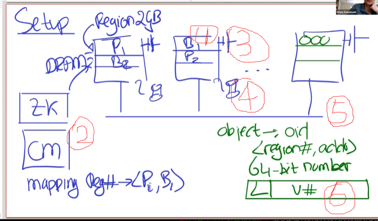
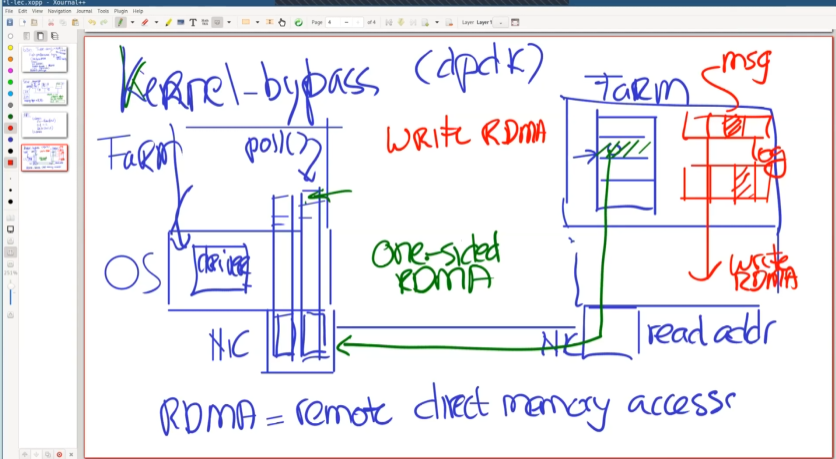
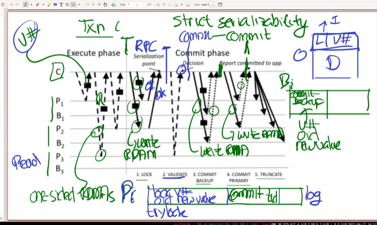
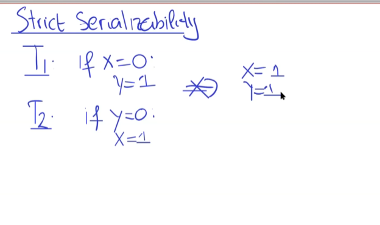

# [MIT6.824] FaRM, Optimistic Concurrency Control

特征：

- Fa:高性能Txn
- R:  remote使用Kernel-bypass和RDMA(允许网卡从远程服务器读内存)
- M: NVDRAM(消除硬盘瓶颈)
- OCC: 乐观并发控制
- Research Prototype: FaRM正在研究中，不像Spanner一样大规模使用。

## Setup

所有的机器都在一个数据中心中。

1. replica在DRAM中，如果某台机器崩溃掉了，故障恢复会将backup作为primary恢复。

2. 一个使用Zookeeper的配置管理器（CM）负责记录分片到主从服务器的映射。

3. 如果数据中心电源全都拉闸，因为内存丢失，是无法恢复的。为了解决问题，每台服务器配一个独立的电源。

4. 如果发生断电，机器有足够的时间使用电池将内存上的日志、事务状态刷新到SSD上面。

5. 存储的object有一个唯一的oid，oid由region number和address(object在所在区域的偏移量)绑定。

6. 在每个对象的64位头中，存储63位版本号，和1个锁位。

## API

操作一个对象：

- Tx Begin.
  - read(oid) : 读取对象
  - o.f += 1 修改对象
  - write(oid, o) 写回对象
- TX Commit.

使用类似2PC的机制来提交事务。

## 一些技术

### Kernel-bypass

通常，应用程序通过调用内核使用网卡。比如通过调用内核使其发送包或内核读取网卡上的寄存器。

通过内核旁路，将网卡上的发送队列和接收队列等直接映射到应用程序的地址空间上，用户程序可以直接读写网卡而不通过OS。

为了避免终端，FaRM启动一个线程轮询网卡队列。

 

### RDMA ： Remote direct Memory access

通过发送RDMA包，可以远程读写另一台机器的内存。

Log和Txn(提交记录、日志记录等)通过RDMA写入。

通过RDMA实现RPC Call: 在发送方的程序写RDMA包，将数据通过RDMA写入远程消息队列。在接收方轮询消息队列，然后通过写RDMA回复。使用RDMA比RPC开销更小。

## 使用RDMA来实现事务

如何使用RDMA进行事务。

> Protocols for TXN, RPC..
>
> 每个服务器都需要进行。

使用乐观并发控制。

> read objects without lock

当读取某个对象时，同时获取其Version

当commit，检查开始写的对象，版本号是否已经被改变。如果事务编号不同，事务中止。如果相同，则commit。

事务协调器是在同一台机器上的应用程序。

**在执行事务期间**，TXN从3个分片进行读取。 在示例图里，1和2被修改，3只读。虚线是读取RDMA，实现是写RDMA

**在提交阶段**：进行如下过程：

1. Lock, 事务尝试获取写入对象的锁。

在Primary上，将Lock记录到Log中。包含oid, number, time, object的新值。

当P1或P2上的轮询线程看到新的Log，尝试获取Lock Log中的锁。通过TAS操作获取锁，如果获取失败，返回一条RDMA消息，TC abort 这个事务。

这里采用no wait是因为，如果加锁失败，意味该事务读到了旧的对象（该对象已经被前一个事务加锁尝试修改），违反了串行化。 

2. Validate: 对于只读的数据，进行单边的**读**RDMA。注意：读RDMA比写RDMA开销小。因为之前提到过，*在每个对象的64位头中，存储63位版本号，和1个锁位。* 如果该锁位被设置，说明该对象正在被其他事务尝试修改。如果版本号改变，也中止事务。 

3. Commit Backup: 将日志写入备份(B1, B2) 备份服务器此时不需要运行任何操作。然后TC确认Backup已经写入Log。注意Primary不直接和Backup通信。
4. Commit Primary: 将Logs通过RDMA写入primary logs， 并附加一条commit RDMA。一旦一个网卡确认了**提交**，就是真正的提交点。就可以应用更新

5. Truncate: 进行日志截断等工作。

  

TC通过Zookeeper知道怎么联系Primary和Backup。

###  **如何实现严格的串行化：**

所有读的数据，在获取锁时检查版本是否一致并且能否获取锁。

对于**只读事务：** 可以只是用两个读RDMA:

- Execute 阶段 读取数据
- Commit阶段 只Validate版本号。应该不需要写入Commit Log

这样就保证了只读事务的高性能。

