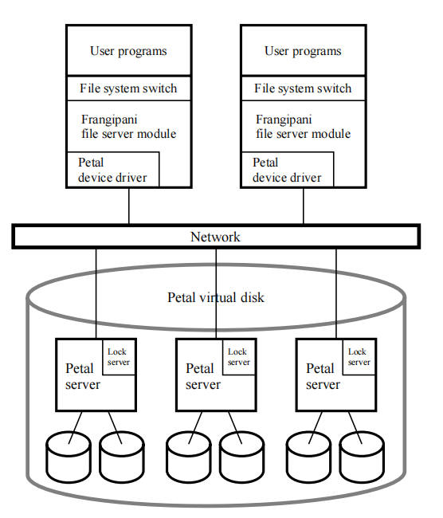
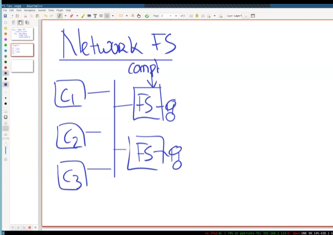
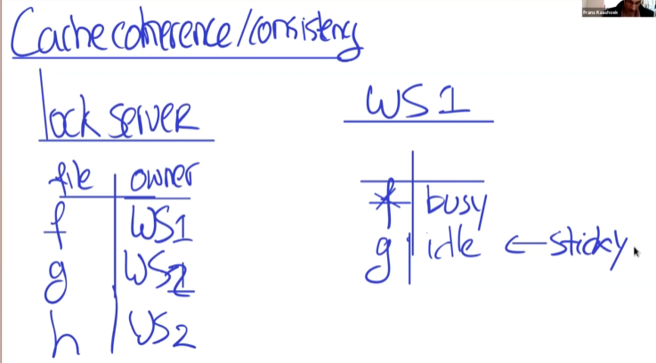
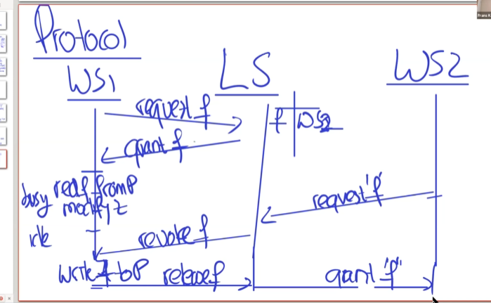
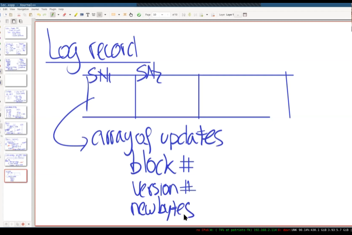
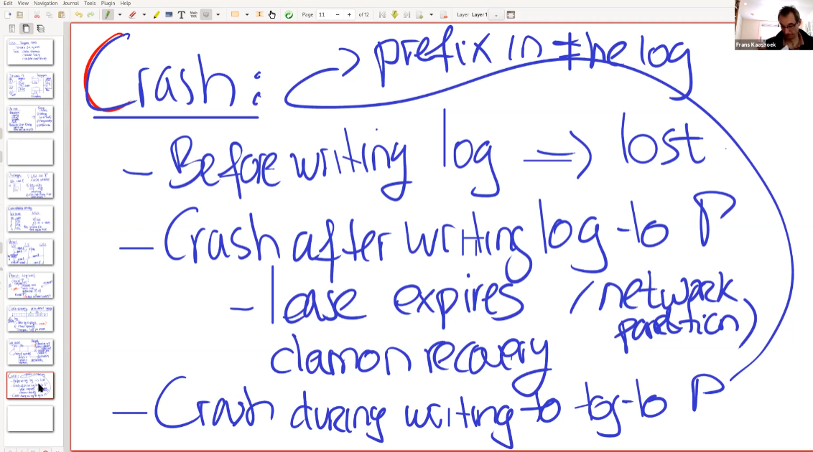
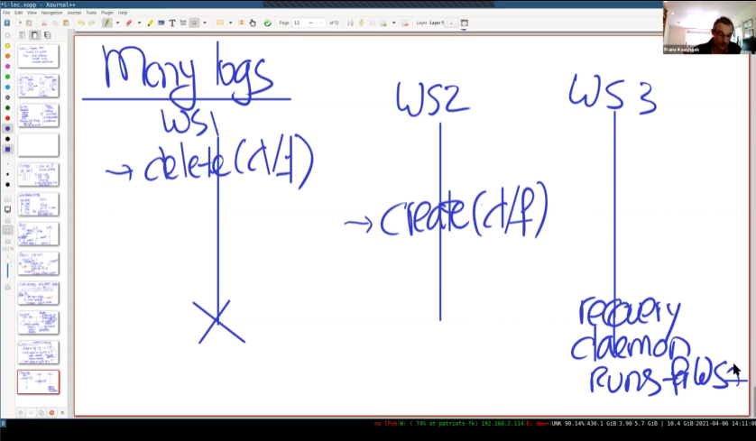

# Frangipani笔记 缓存一致性、分布式锁、崩溃恢复

## 研究内容

- Network file systems
- 目标：
  - 在用户之前共享文件
  - 缓存一致性协议 cache coherence
  - 分布式锁 distributed lock
  - 分布式崩溃恢复 distributed crash recovery

| NFS    | Frangipani                                                   | AFS                                                         |
| ------ | ------------------------------------------------------------ | ----------------------------------------------------------- |
| 结构   |   |  |
| 客户端 | **客户端本身**运行文件服务器代码。                           | 将操作发送给文件服务器（FS）                                |
| 服务器 | 通过Petal实现的一个虚拟磁盘，在网络上提供驱动。看起来像一块又大又普通的磁盘 | 进行open,read,close,write等操作                             |
| 安全性 |                                                              | 客户端可以不可靠，因为文件操作都在服务器上进行              |
| 扩展   | 可以通过增加client来提升，因为文件服务器本身是在client上运行的。 | 性能瓶颈出现在文件服务器中。                                |

## 用例

比如在一个Lab中，所有研究人员的电脑都是可信任的。并且他们的文件可能需要高性能、大容量的磁盘访问，还能进行一定的共享，或者是一个用户想访问多个工作站。这种情况下Frangipani就可以发挥作用。

设计：

- 研究人员可能在本地高性能修改文件，而不是都在Petal上访问。所以可能在本地（client）上创建缓存。
- 修改后的缓存逐渐写回Petal
- strong consistency. 
- performance

GFS相比起来，没有数据缓存，是为了mapreduce程序设计。但是Frangipani上，可以像单机系统一样运行Unix程序。不同的工作需求推动了不同的系统设计。

## 挑战

假如有多个主机使用该文件系统。

1. 一些work station(ws)在写，其他主机在读。其他主机应当看到最后一次写入的数据。cache coherence
2. ws1创建目录d/f,ws2同时创建目录d/g。应当确保文件之间不会互相崩溃。原子性：atomicity
3. WS1 崩溃。挑战：crash recovery。确保数据结构的一致性。

接下来介绍Frangipani如何解决这些问题。

## 缓存一致性

Frangipani使用一个锁表。锁本身是一个分布式服务（类似于ZooKeeper），在Frangipani中使用Paxos实现。

在锁服务器上，维护一个锁表，记录加锁对象和锁的持有者。

WS(客户端)本身也要维护一个锁表，记录自己当前持有锁的对象已经状态。

规则：

1. 为了缓存一个文件,首先需要获取锁。
2. 操作：请求锁，授予锁，释放锁，撤销(revoke)锁。

 

一个使用了上述四种操作的例子如上图。

WS1想要读取或者修改f，首先向LS(Lock Service)申请F的锁，LS发现此时没有WS占用F，就授予WS1 F的锁，并在自己的锁表中记录。WS1此时就可以读写F了。在写（busy状态）后，WS1并不主动释放锁，而是该锁进入idle状态，下次使用又可以立即进入busy状态而不需要向LS申请。此时WS2想要读取F，于是申请F的锁，LS发现锁表中有F的项，于是向WS1发起撤销(revoke)锁，WS1收到撤销命令，开始将缓存中的内容写回Petal，写完之后告诉LS释放了锁。此时，LS就可以授予(grant f)WS2 f的锁了。

注意，WS1释放锁是将锁由busy状态转化为idle。使用了更复杂的机制，而不是直接删除锁。

可以看出来，如果获取了锁，一定能读到最后写入的数据。保证了一致性。

## Crash Recovery

使用WAL。

Client流程：

- 在操作之前首先写入日志。
- 然后，install updating

如果在写入日志后崩溃，应用更新前崩溃，daemon可以根据log恢复。

通过checksum校验写入日志是否是原子的。

Log Record包含LSN，所更新块号（比如inode），Version编号，以及携带的数据。

当WS收到Revoke请求

- 将logs写入petal
- 应用更新（元数据或用户文件写入）
- release lock

数据写入（比如一个照片文件）不会包含在log中，而是直接写入Petal。上述的Log是针对元数据的，比如文件本身的信息，目录数据，inode等。

一个常见的操作：在传输大文件时，直接写入磁盘上的某个临时文件。在传输文件完成后，进行一次原子操作，将临时文件名改为原文件名。

也就是说，日志系统能够保证的是文件系统数据结构的一致性，而不能保证用户数据写入。

这里讨论了崩溃的3种情况

1. 在WAL写入之前。这种时候数据肯定丢失了。
2. 在WAL完全写入之后，但是还没有更新数据。这个时候首先服务器等待涉及数据的租约过期，然后daemon进行恢复工作。
3. 在WAL写入的过程中崩溃 ，可以通过checksum检验，此时并非全部丢弃。而是检查有哪些已经完整写入的前缀。然后daemon就可以进行前缀操作。

## 版本问题

1. 考虑这么一个问题：WS1首先删除d/f,WS2然后创建d/f。此时WS1崩溃，WS3的daemon启动 redo WS1 delete d/f。造成了d/f被删除。但是按照实际顺序，WS2创建是在WS1之后的。
2.  为了解决这个问题，使用了之前提到过的，Log中的Version Number。
3. 锁协议确保Version Number按照顺序递增。daemon不会redo 之前的version number。在inode中会记录当前是哪个version。
4. 比如要修改f的inode。该inode的version number是14，那么在日志中，该inode修改后的Log中的version number就应该是15。