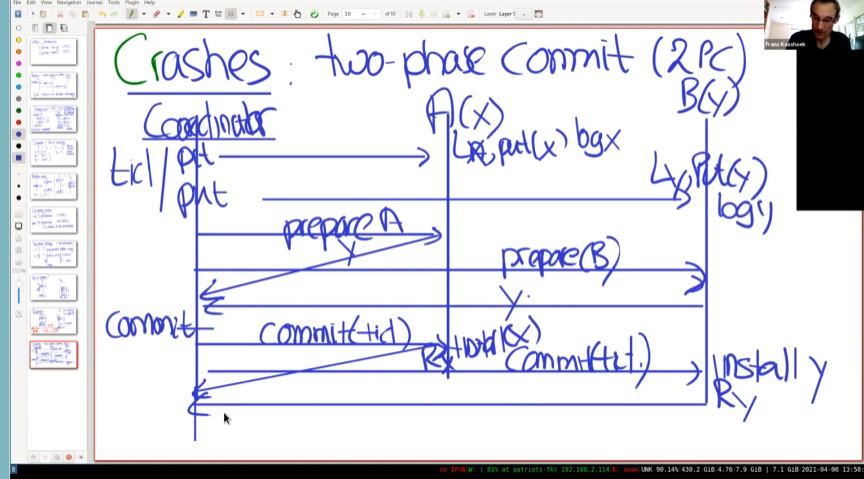
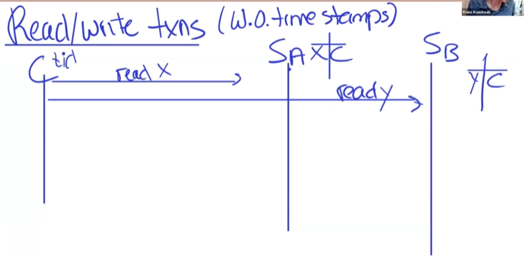
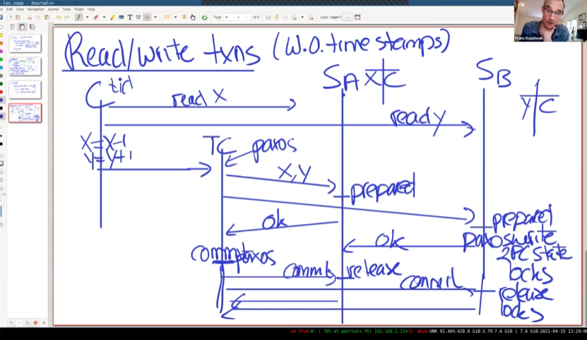
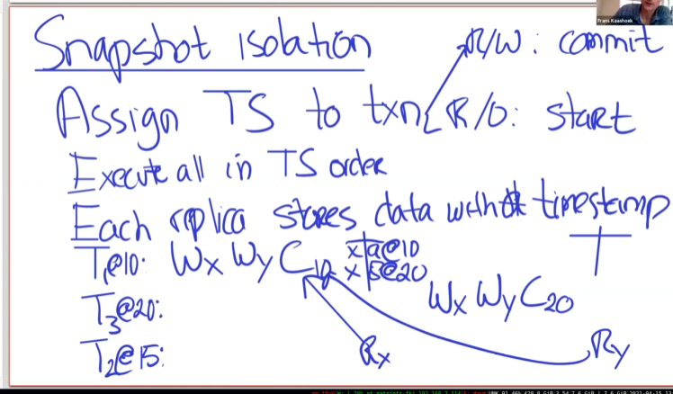
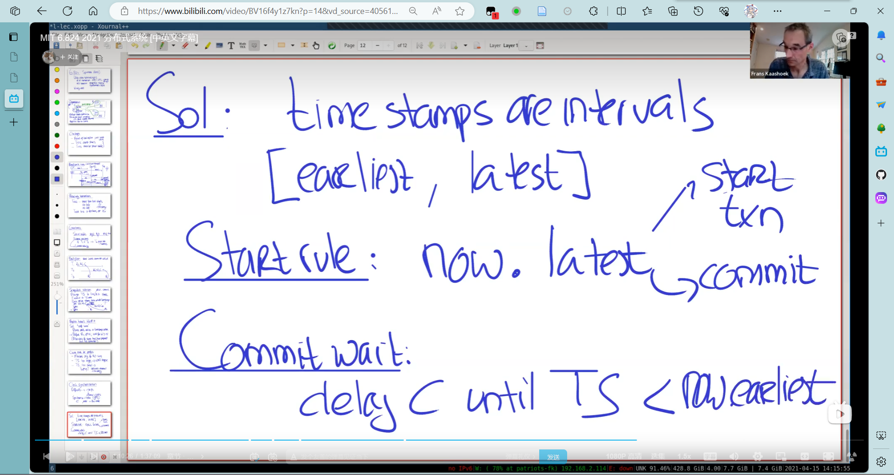

**Atomicity: All-or-Nothing and Before-or-After** 

## 主题

>  distributed transactions = concurrency control + atomic commit

- 在多个服务器上的分片大量数据记录，大量的客户端  
- 客户端应用程序操作通常涉及多次读取和写入     例如：
  - 银行转账：借记卡和贷记卡   
  -  vote：检查是否已经投票，记录投票，增加计数     
  - 在社交图中安装双向链接  
- 我们希望对应用程序编写者隐藏交错和失败 。这是一个传统的数据库问题

如果熟悉数据库的话，应该挺熟悉2PL、ACID这些概念的。

> distributed transactions have two big components:
> concurrency control (to provide isolation/serializability)
> atomic commit (to provide atomicity despite failure)

在单机上实现原子操作，但是在多个机器上进行原子操作是困难的。

## 可串行化

> What does serializable mean?
> you execute some concurrent transactions, which yield results
>  	"results" means both output and changes in the DB
> the results are serializable if:
>     	- there exists a serial execution order of the transaction that yields the same results as the actual execution
>     (serial means one at a time -- no parallel execution)
>     (this definition should remind you of linearizability)

可串行化定义：存在某种顺序，逐一执行事务能够获得相同的结果。

注意：可串行化可以重排事务的顺序，而可线性化必须按照操作的顺序获取一致的结果。所以这样来看，可串行化要比可线性化弱一些。

## 并发控制

- 悲观：

使用锁进行控制。

常见方式：2PL locking。

 严格锁：在事务开始就申请所有所需要的锁。

- 乐观：

optimistic(no locks)

abort if not serializable

## Two-phase Commit (2PC)

假如服务器A有数据X，服务器B上有数据y.

>   TC sends put(), get(), &c RPCs to A, B
>    The modifications are tentative, only to be installed if commit.
>   TC gets to the end of the transaction.
>   TC sends PREPARE messages to A and B.
>   If A is willing to commit,
>    A responds YES.
>    then A is in "prepared" state.
>   otherwise, A responds NO.
>   Same for B.
>   If both A and B say YES, TC sends COMMIT messages to A and B.
>   If either A or B says NO, TC sends ABORT messages.
>   A/B commit if they get a COMMIT message from the TC.
>    I.e. they write tentative records to the real DB.
>    And release the transaction's locks on their records.
>   A/B acknowledge COMMIT message.

TC发送PUT操作给A和B时，A和B先写入log。当TC准备提交，先向A和B发送prepare信息，如果A和B都准备好了提交并返回给TC，TC就发送COMMIT信息，否则发送ABORT信息。A/B收到COMMIT消息，将数据写入数据库，并释放持有的锁。

总之，还是使用WAL保证了可以正确地恢复。

1. 如果B准备好了提交（回应commit给prepare RPC），但是在之后崩溃了。 此时TC可能都收到了A和B的提交消息，并且发送commit给A和B，A进行了安装。所以B在恢复后必须进行commit。（通过TC重试） **if B voted YES, it must "block": wait for TC decision.**

2. 在COMMIT之后协调器崩溃。将决定的COMMIT ID也写入稳定存储。
3. 可以通过raft来做协调者容错。

对比：

| 协议         | RAFT                                                         | 2PC                                              |
| ------------ | ------------------------------------------------------------ | ------------------------------------------------ |
| 如何确保提交 | 多数获得log                                                  | 所有的数据分片服务器向协调器回复prepare yes信息  |
| 工作的目标   | 所有的raft peer复制相同的logs                                | 不同的服务器上有不同的数据                       |
| 不足         | RAFT不能确保所有服务器都在干事。（因为大多数在做相同的事就行） | 不保证可用性。因为需要确保所有的服务器都做完了事 |

## Spanner

Spanner的主要目标是管理在不同数据中心的复制数据。Spanner可以动态地控制配置，并且在不同的数据中心之前无感知地移动数据，实现资源平衡。

R/W读写事务通过2PC,2PL, Paxos Groups实现

R/O 只读事务在数据中心读。提供外部读写的一致性，当在某一个副本上读时，应当读到最新的数据。

## Organization

1. 假设有3个数据中心，A有数据分片a-m,并运行在一组paxos上复制给B和C。另一组分片n-z可能由另外一组paxos处理。或者是通过RAFT处理（类似于Lab3中的kvserver）。运行多组paxos可以提高并行性。
2. 因为“大多数”的规则，可以很轻松的处理某个数据中心过慢或者某个数据中心宕机的情况，因为大多数raft peer回复成功就行。
3. 优先访问*Replica close to clients*，这里的clients就是图上的S符号（server），因为对于spanner这个基础架构，访问它的client可能是更上层的service，比如课上提到的gmail。同时，gmail服务器可能和某个数据中心在同一个机房（或者同一个城市）里面，通过访问最近的replica，获取R/O事务的高性能。

## Challenges

- Read of local replica must yield fresh data.
  - But local replica may not reflect latest Paxos writes!
  - 读最近的replica,保证读到最新的写结果
- A transaction may involve multiple shards -> multiple Paxos groups.
  - 支持跨分片的事务，具有ACID语义
- Transactions that read multiple records must be serializable.
  - But local shards may reflect different subsets of committed transactions!

## R/W读写事务

读写事务使用之前提到过的2PL和2PC。

还是之前的转账例子。

C生成一个TID(事务编号)，并发送read x给SA，read y给SB。

注意这里的SA和SB都是之前提到过的分片，并不是单一服务器，而是一组Paxos(或者raft)。C需要访问SA和SB的leader, 在leader服务器上维护锁表。如果在此期间leader故障，事务就abort了，因为锁的信息不会经过raft，而是在leader上单机存储，leader故障，锁信息丢失。

之后，C在本地进行写操作，在完成后，把数据发送给TC服务器组 (transaction coordinator)。TC进行2PC。

## Read-only transactions

目标：在本地进行快速的只读事务。no lock, no 2PC, consistency。

- 保证事务的可串行化。

- 外部一致性：External Consistency
  - 如果T2在T1提交之后开始，那么T2**必须**看到T1的修改

### Snapshot Isolation

快照隔离。

为事务分配时间戳（TS）

对于R/W, 为Commit开始的时间分配TS

对于R/O, 为Start的时间分配TS.

然后按照TS顺序实行事务。

每个Replica保存多个键的值和对应的时间戳（多版本）

R/O的事务可能持续一段时间，但是都应当读取事务开始的时间戳。

T2的Read y在现实时间中发生在T3 Wy之后，但是它应当读取T2开始时时间戳y的值，也即是T1 Write y的值。

为了解决在T2开始读取时，replica还没有看到T1写入的问题（可能因为延迟，或者丢包，网络分区之类的）采用了Safe Time机制。Replica必须看到T2开始之后的写入，这样就能保证看到应该读到的值。

也应当等待准备好但还没有提交的事务完成。

在分布式系统中，**必须保证所有时钟都是准确的**。

这对r/o很重要。

- 如果TS偏移地过大（比如本地时钟快了一个小时）， 由于safe time,需要等待很久才能进行读取（比如其他服务器时间正常，需要等待一个小时才能看到safe time）
- TS 过小。破坏外部一致性，比如慢了一个小时，可能读取到一个小时之前的值，而不会看到最新提交的值。

Spanner通过原子钟、周期性和全球时间同步。

但是时钟不可能保证绝对精准，于是引入了时间戳间隔。

首先，向原子钟询问当前时间，然后加减一个可能的误差值，得到一个区间[earliest,latest],协议保证true time在这个区间内。

- Start Rule: 开始事务或者RW提交事务的时间戳选用latest
- Commit Wait 当提交事务的时间戳 小于 now.earliest才能进行提交。