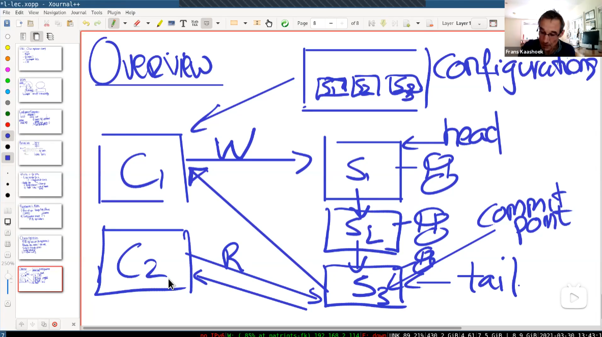
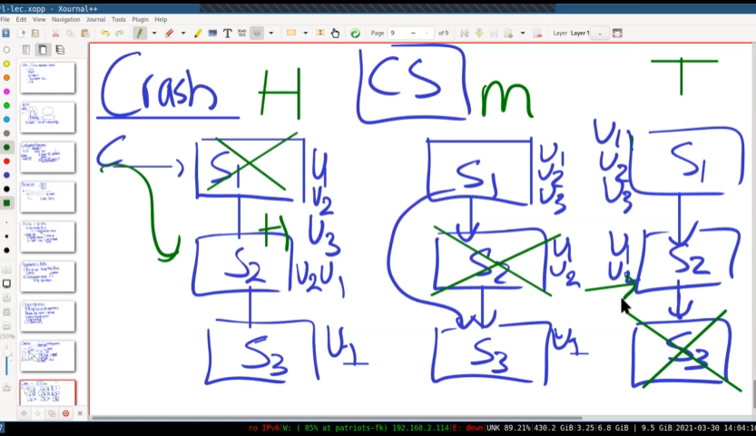
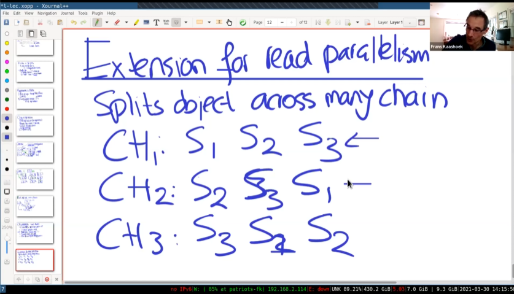

# 链式复制系统lecture笔记

## 构建复制状态机

- 方案一：Run all ops through Raft/Paxos

通过共识算法进行操作

- 方案2：Configuration service + P/B replication

配置服务器底层通过Raft或者其他共识性算法实现。

### 链式复制概览

对于很大量的操作，比如上亿级别的kv对，*Run all ops through Raft* 的性能会很低。

一般选择共识性算法+主从备份。

**特色：**

- Read ops
- Simple recovery plan
- 强线性型
- influential

配置使用RAFT协议，协调服务器记录链式服务器有哪些结点。C1向S1发送写请求，然后进行链式复制，直到S3（尾结点）发送ACK，此时Commit操作。所有的读取都向S3请求。这样就保证了线性一致性。

### 失败的情况：

- 头部服务器（S1）崩溃

配置服务器选用下一个结点S2当作头部。S2不能自己说自己是头部。这样就避免了脑裂。因为头部选用都是由配置服务器决定的。

- 中部服务器（S2）崩溃

配置服务器通知形成新的链。S1重发未发送到S3的信息。

- 尾部服务器（S3）崩溃。

配置服务器通知**客户端**，新的尾部是S2

### Add Replica

将新的服务器创建为新的尾部，开始从旧尾部复制状态到新的服务器。这个过程可能持续很久，当完全完成旧尾部的复制，就可以成为新的尾部。

## 和RAFT的比较

优点：

- 将读写操作分拆到头部和尾部。
- 头部只会发送一个RPC（到链上下一个结点）
- 只会从尾部读取
- Simple Crash Recovery

缺点:

- 只要有一台服务器fail，就会重新配置（对于raft来说，少数服务器宕机不会造成整个服务停止）

## 增加并发量

这里同时配置了三条链。

三个分片使用相同的服务器，却有不同的链。

这样就进行了一定的负载均衡

