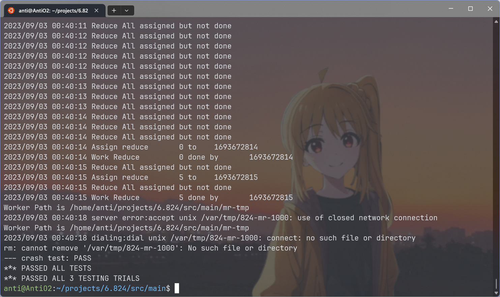

## 0x00 准备

- 阅读MapReduce论文
- 配置GO环境

因为之前没用过GO,所以 先在网上学了一下语法[A Tour of Go](https://go.dev/tour/welcome/1)

感觉Go的接口和方法的语法和C++挺不一样, 并发编程也挺有意思

## 0x01 MapReduce简介

需要实现master和coordinator。

MapReduce分为两个阶段:Map和Reduce阶段。

Map阶段函数提供Key,比如`pg-being_ernest.txt`是key，然后Worker通过这个Key获取Value。比如`pg-being_ernest.txt`的具体内容。然后将Key和Value（在例子中是文章的内容），传递给map function。获取结果，并将结果分成R个Reduce内容。

举个例子。假设我们要对`pg-being_ernest.txt`和`pg-dorian_gray.txt`统计词频。那么就要有两个`Map Task`(不一定有两个Worker，比如有3个Worker，那么就是2个Worker干活一个围观；如果只有一个Worker，那么该Worker会被前后分配两次Map操作)。假设有3个Reduce操作，那么`Map`的中间操作就会按照key被分为3个文件。

> `pg-being_ernest.txt`对应Map0 , Map0操作的kv被分进`mr-0-0,mr-0-1,mr-0-2`
>
> `pg-dorian_gray.txt`对应Map0 , Map0操作的kv被分进`mr-1-0,mr-1-1,mr-1-2`

当所有的Mapf已经生成结果，Worker就会被指派Reduce操作。比如被指派的Reduce操作编号为2，那么Reduce就会读取`mr-0-2`,`mr-1-2`。并且聚合相同的Key,传递给Reduce函数。

比如,`pg-being_ernest.txt`中的map操作有kv，`a 1 b 1 b 1`输出到`mr-0-2`。`pg-dorian_gray.txt`中的map操作有kv，`c 1 b 1 c 1`输出到`mr-0-2`。

然后Task编号为2的Reduce任务会读取所有对应的中间文件。得到key。`a 1 b 1 b 1 c 1 b 1 c 1`。然后再对要处理的key进行排序,得到 `a 1  b 1 b 1 b 1  c 1 c 1`。再按照相同的key调用reduce函数。

> 上面例子的调用为
>
> `reducef(key:"a",value:list[1])`,得到"1"
>
> `reducef(key:"b",value:list[1,1,1])`,得到"3"
>
> `reducef(key:"c",value:list[1,1])`,得到"2"
>
> 最后将kvs:[{"a","1"},{"b","3"},{"c","2"}]写入该reduce生成的文件`mr-out-2`

## 0x02 RPC

使用GO的RPC库，可以简单地实现Server

学习时参考了[Go 每日一库之 rpc - 知乎 (zhihu.com)](https://zhuanlan.zhihu.com/p/139384493)

在MapReduce操作流程中就是：

1. 首先启动多个Worker（以下简称C）和一个Coordinator（以下简称S）
2. C每隔一段时间(比如1s)会向S发送一个任务请求
   1. S首先检查Map任务还有没有分配完（注意不是运行完）。如果没有，分配一个Map任务给C
   2. 如果Map任务分配完了，并且还没有工作完，S让C等待
   3. 如果Map工作完了。Reduce还没分配完了，S给C分配一个空闲的Reduce任务
   4. 如果Reduce都工作完了，所有任务也都结束了。
3. 如果C完成了任务，会向S发送一个请求。S知道了某个任务完成，就会进行相应的操作标记。


一些注意的点:

每个任务是有时间上限的（10s）。每分配一个任务就会启动一个GO程，然后等待相应的时间，检查是否完成了工作。如果没完成，将该任务编号重新加入管道。

如何判断一个任务是否完成呢?

比如第一个Worker申请到了任务1，过了10s钟还没有完成，S又将任务1加入待完成管道。此时第2个worker申请到了任务1，又过了4s，第一个Worker发送一个MapDone的请求给S。S如何判断是否完成了该任务。

我的处理是维护任务是由哪个Worker运行的状态。其中Worker由RPC的时间戳标记。比如worker1在第一次请求时时间戳为`13213123`,Server维护maptask[1]是由`13213123`正在运行，当第一次超时，maptask[1]变成了worker2请求时的时间戳``13219889`。在第14s,收到MapDone的请求，检查其时间戳为`13213123`和当前正在运行的时间戳不同，所以丢弃掉该结果。


还有就是并发处理，这个使用锁就行了。

## 0x03 调试

1. 命令行的参数：（因为不用shell的话不能用通配符pg*.txt代替，只能输入所有文件名）

```
pg-being_ernest.txt
pg-dorian_gray.txt
pg-frankenstein.txt
pg-grimm.txt
pg-huckleberry_finn.txt
pg-metamorphosis.txt
pg-sherlock_holmes.txt
pg-tom_sawyer.txt

```

2. 在调试时出现报错

`cannot load plugin ./wc.so err: plugin.Open("./wc"): plugin was built with a different version of package internal/abi`

是因为`build wc.so`时的参数和运行mr参数不一致导致的。

3. 使用`./test-mr-many.sh 3`重复测试3次。通过测试




感觉Lab1做下来还是挺通透。像是引入GO和相关概念。通过lab,学习到了GO调试。

## 0x04 代码

### coordinator.go

```go
package mr

import (
    "log"
    "sync"
    "time"
)
import "net"
import "os"
import "net/rpc"
import "net/http"

type status int // 用于指示worker的状态

const (
    notStart status = iota
    running
    taskDone
)
const workMaxTime = 12 * time.Second

type Coordinator struct {
    // Your definitions here.
    nReduce          int // Reduce数量
    mMap             int // Map数量
    taskDone         bool
    reduceTaskStatus []status
    mapTaskStatus    []status
    // runningMap 是当前正在running的rpcId
    // 想一下这种情况：第一个worker没有在10秒内返回结果，于是master开始把同样的任务返回给了第二个worker,此时又过了几秒，比如两秒钟
    // 那么master如何判断是第二个worker完成了任务，还是第一个worker呢？
    runningMap    []RpcIdT
    runningReduce []RpcIdT
    mapTasks      chan TaskIdT // 待开始的map
    reduceTasks   chan TaskIdT // 待开始的reduce
    files         []string     // 要进行task的文件
    mapCnt        int          // 已完成的map数量
    reduceCnt     int          // 已完成的reduce数量
    latch         *sync.Cond
}

// Your code here -- RPC handlers for the worker to call.

// Example
// an example RPC handler.
//
// the RPC argument and reply types are defined in rpc.go.
func (c *Coordinator) Example(args *ExampleArgs, reply *ExampleReply) error {
    reply.Y = args.X + 1
    return nil
}

// Appoint 用于worker请求一个任务
func (c *Coordinator) Appoint(request *ReqArgs, reply *ResArgs) error {
    reply.ResId = request.ReqId
    reply.MapNumM = c.mMap
    reply.ReduceNumN = c.nReduce

    c.latch.L.Lock()
    done := c.taskDone
    c.latch.L.Unlock()
    if done {
       reply.ResOp = WorkDone
       return nil
    }
    switch request.ReqOp {
    case WorkReq:
       {
          // 请求一个任务
          c.latch.L.Lock()
          if len(c.mapTasks) > 0 {
             // 如果map任务还没有完全分配 分配一个map worker
             taskId := <-c.mapTasks
             reply.ResTaskId = taskId
             reply.ResContent = c.files[taskId]
             reply.ResOp = WorkMap
             c.runningMap[taskId] = reply.ResId
             c.mapTaskStatus[taskId] = running
             c.latch.L.Unlock()
             go c.checkDone(WorkMap, reply.ResTaskId)
             log.Printf("Assign map \t%d to \t%d\n", reply.ResTaskId, reply.ResId)
             return nil
          }
          if c.mapCnt < c.mMap {
             // 如果map任务已经全部分配完了，但是还没有运行完成，还不能开始reduce
             // worker需要暂时等待一下
             reply.ResOp = WorkNothing
             c.latch.L.Unlock()
             log.Println("Map All assigned but not done")
             return nil
          }
          if len(c.reduceTasks) > 0 {
             // 已经确定完成了所有map，还没有分配完reduce
             taskId := <-c.reduceTasks
             reply.ResTaskId = taskId
             reply.ResOp = WorkReduce
             c.runningReduce[taskId] = reply.ResId
             c.reduceTaskStatus[taskId] = running
             c.latch.L.Unlock()
             go c.checkDone(WorkReduce, reply.ResTaskId)
             log.Printf("Assign reduce \t%d to \t%d\n", reply.ResTaskId, reply.ResId)
             return nil
          }
          // 如果分配完了所有的reduce,但是还没有done.worker需要等待
          reply.ResOp = WorkNothing
          log.Println("Reduce All assigned but not done")
          c.latch.L.Unlock()
          return nil
       }
    case WorkMapDone:
       {

          c.latch.L.Lock()
          defer c.latch.L.Unlock()
          if c.runningMap[request.ReqTaskId] != request.ReqId || c.mapTaskStatus[request.ReqTaskId] != running {
             // 说明该map已经被abort
             reply.ResOp = WorkTerminate
             return nil
          }
          log.Printf("Work Map \t%d done by \t%d\n", request.ReqTaskId, request.ReqId)
          c.mapTaskStatus[request.ReqTaskId] = taskDone
          c.mapCnt++
       }
    case WorkReduceDone:
       {
          c.latch.L.Lock()
          defer c.latch.L.Unlock()
          if c.runningReduce[request.ReqTaskId] != request.ReqId || c.reduceTaskStatus[request.ReqTaskId] != running {
             // 说明该map已经被abort
             reply.ResOp = WorkTerminate
             return nil
          }
          c.reduceTaskStatus[request.ReqTaskId] = taskDone
          c.reduceCnt++
          log.Printf("Work Reduce \t%d done by \t%d\n", request.ReqTaskId, request.ReqId)
          if c.reduceCnt == c.nReduce {
             c.taskDone = true
             reply.ResOp = WorkDone
          }
       }
    default:
       return nil
    }
    return nil
}

// start a thread that listens for RPCs from worker.go
func (c *Coordinator) server() {
    log.Println("Launching Server")
    e := rpc.Register(c)
    if e != nil {
       log.Fatal("register error:", e)
    }
    rpc.HandleHTTP()
    //l, e := net.Listen("tcp", ":1234")
    sockname := coordinatorSock()
    _ = os.Remove(sockname)

    l, e := net.Listen("unix", sockname)
    go func(l net.Listener) {
       for {
          time.Sleep(5 * time.Second)
          if c.Done() {
             err := l.Close()
             if err != nil {
                log.Fatal("close error:", err)
             }
          }
       }
    }(l)

    if e != nil {
       log.Fatal("listen error:", e)
    }
    go func() {
       err := http.Serve(l, nil)
       if err != nil {
          log.Fatal("server error:", err)
       }
    }()
}

// Done main/mrcoordinator.go calls Done() periodically to find out
// if the entire job has finished.
func (c *Coordinator) Done() bool {
    c.latch.L.Lock()
    defer c.latch.L.Unlock()
    // Your code here.
    return c.taskDone
}

// checkDone 检查任务是否完成
func (c *Coordinator) checkDone(workType WorkType, t TaskIdT) {
    time.Sleep(workMaxTime)
    c.latch.L.Lock()
    defer c.latch.L.Unlock()
    switch workType {
    case WorkMap:
       {
          if c.mapTaskStatus[t] != taskDone {
             c.mapTaskStatus[t] = notStart
             c.mapTasks <- t
          }
       }
    case WorkReduce:
       {
          if c.reduceTaskStatus[t] != taskDone {
             // 如果没有完成任务
             c.reduceTaskStatus[t] = notStart
             c.reduceTasks <- t
          }
       }
    default:
       log.Panicf("Try Check Invalid WorkType %v\n", workType)
    }

}

// MakeCoordinator create a Coordinator.
// main/mrcoordinator.go calls this function.
// nReduce is the number of reduce tasks to use.
func MakeCoordinator(files []string, nReduce int) *Coordinator {
    log.Println("Launching Master Factory")
    c := Coordinator{}
    c.nReduce = nReduce
    c.mMap = len(files) // 每个file对应一个map
    c.taskDone = false

    c.files = files

    c.mapTasks = make(chan TaskIdT, c.mMap)
    c.mapTaskStatus = make([]status, c.mMap)
    c.runningMap = make([]RpcIdT, c.mMap)
    c.reduceTaskStatus = make([]status, nReduce)
    c.reduceTasks = make(chan TaskIdT, nReduce)
    c.runningReduce = make([]RpcIdT, nReduce)
    c.latch = sync.NewCond(&sync.Mutex{})

    for i := 0; i < c.mMap; i++ {
       c.mapTasks <- TaskIdT(i)
       c.runningMap[i] = -1
       c.mapTaskStatus[i] = notStart
    }
    for i := 0; i < c.nReduce; i++ {
       c.reduceTasks <- TaskIdT(i)
       c.runningReduce[i] = -1
       c.reduceTaskStatus[i] = notStart
    }
    c.server()
    return &c
}
```

### rpc.go

```go
package mr

//
// RPC definitions.
//
// remember to capitalize all names.
//

import "os"
import "strconv"

//
// example to show how to declare the arguments
// and reply for an RPC.
//

type ExampleArgs struct {
    X int
}

type ExampleReply struct {
    Y int
}
type RpcIdT int64 // RpcIdT 是通过时间戳生成的, 指示一个唯一的RpcId
type ReqArgs struct {
    ReqId     RpcIdT
    ReqOp     WorkType
    ReqTaskId TaskIdT
}

// ResArgs 是RPC的返回
// Response
type ResArgs struct {
    ResId      RpcIdT
    ResOp      WorkType
    ResTaskId  TaskIdT // 分配的任务编号
    ResContent string
    ReduceNumN int // 有n个reduce
    MapNumM    int // 有M个map任务
}
type WorkType int

// TaskIdT 是对任务的编号
type TaskIdT int

// 枚举工作类型
const (
    WorkNothing    WorkType = iota
    WorkReq                 // worker申请工作
    WorkMap                 // 分配worker进行map操作
    WorkReduce              // 分配worker进行reduce操作
    WorkDone                // [[unused]]master所有的工作完成
    WorkTerminate           // 工作中止
    WorkMapDone             // Worker完成了map操作
    WorkReduceDone          // Worker完成了reduce操作
)

// Rpc exports struct we need
type Rpc struct {
    Req ReqArgs
    Res ResArgs
}

// Cook up a unique-ish UNIX-domain socket name
// in /var/tmp, for the coordinator.
// Can't use the current directory since
// Athena AFS doesn't support UNIX-domain sockets.
func coordinatorSock() string {
    s := "/var/tmp/824-mr-"
    s += strconv.Itoa(os.Getuid())
    return s
}
```

### worker.go

```go
package mr

import (
    "encoding/json"
    "fmt"
    "io"
    "os"
    "sort"
    "strconv"
    "time"
)
import "log"
import "net/rpc"
import "hash/fnv"

const sleepTime = 500 * time.Millisecond

// KeyValue
// Map functions return a slice of KeyValue
type KeyValue struct {
    Key   string
    Value string
}
type ByKey []KeyValue

// Len 通过HashKey进行排序
func (a ByKey) Len() int           { return len(a) }
func (a ByKey) Swap(i, j int)      { a[i], a[j] = a[j], a[i] }
func (a ByKey) Less(i, j int) bool { return ihash(a[i].Key) < ihash(a[j].Key) }

// use ihash(key) % NReduce to choose the reduce
// task number for each KeyValue emitted by Map.
func ihash(key string) int {
    h := fnv.New32a()
    _, err := h.Write([]byte(key))
    if err != nil {
       return 0
    }
    return int(h.Sum32() & 0x7fffffff)
}

// Worker
// main/mrworker.go calls this function.
func Worker(mapf func(string, string) []KeyValue,
    reducef func(string, []string) string) {

    // Your worker implementation here.
    for {
       timeStamp := time.Now().Unix()
       rpcId := RpcIdT(timeStamp)
       req := ReqArgs{}
       req.ReqId = rpcId
       req.ReqOp = WorkReq // 请求一个工作

       res := ResArgs{}
       ok := call("Coordinator.Appoint", &req, &res)
       if !ok {
          // 如果Call发生错误
          log.Println("Maybe Coordinator Server has been closed")
          return
       }

       switch res.ResOp {
       case WorkDone:
          // 所有工作已经完成
          return
       case WorkMap:
          doMap(rpcId, &res, mapf)
       case WorkReduce:
          doReduce(rpcId, &res, reducef)
       case WorkNothing:
          // 等待
          time.Sleep(sleepTime)
       default:
          break
       }
       time.Sleep(sleepTime)
    }
}
func doMap(rpcId RpcIdT, response *ResArgs, mapf func(string, string) []KeyValue) {
    // filename 是response中的文件名
    filename := response.ResContent
    file, err := os.Open(filename)
    if err != nil {
       log.Fatalf("cannot open %v", filename)
    }
    defer func(file *os.File) {
       _ = file.Close()
    }(file)
    // content读取该文件中的所有内容
    content, err := io.ReadAll(file)
    if err != nil {
       log.Fatalf("cannot read %v", filename)
    }
    kvs := mapf(filename, string(content))

    // 需要将kv输出到n路 中间文件中
    ofiles := make([]*os.File, response.ReduceNumN)
    encoders := make([]*json.Encoder, response.ReduceNumN)
    for i := 0; i < response.ReduceNumN; i++ {
       // 这里输出的名字是mr-ResTaskId-reduceN
       // 其中，ResTaskId是0~m的数字
       oname := "mr-" + strconv.Itoa(int(response.ResTaskId)) + "-" + strconv.Itoa(i)
       ofiles[i], err = os.Create(oname)
       if err != nil {
          log.Fatal("Can't Create Intermediate File: ", oname)
       }
       defer func(file *os.File, oname string) {
          err := file.Close()
          if err != nil {
             log.Fatal("Can't Close Intermediate File", oname)
          }
       }(ofiles[i], oname)
       encoders[i] = json.NewEncoder(ofiles[i])
    }
    for _, kv := range kvs {
       ri := ihash(kv.Key) % response.ReduceNumN
       err := encoders[ri].Encode(kv)
       if err != nil {
          log.Fatal("Encode Error: ", err)
          return
       }
    }
    req := ReqArgs{
       ReqId:     rpcId,
       ReqOp:     WorkMapDone,
       ReqTaskId: response.ResTaskId,
    }
    res := ResArgs{}
    call("Coordinator.Appoint", &req, &res)
}

func doReduce(rpcId RpcIdT, response *ResArgs, reducef func(string, []string) string) {
    rid := response.ResTaskId // 当前reduce的编号
    var kva []KeyValue
    for i := 0; i < response.MapNumM; i++ {
       // 读取所有该rid的中间值
       func(mapId int) {
          // 读取m-rid的中间值
          inputName := "mr-" + strconv.Itoa(i) + "-" + strconv.Itoa(int(rid))
          // 在当前对应r的输出中，获取所有key
          ifile, err := os.Open(inputName)
          if err != nil {
             log.Fatal("Can't open file: ", inputName)
          }
          defer func(file *os.File) {
             err := file.Close()
             if err != nil {
                log.Fatal("Can't close file: ", inputName)
             }
          }(ifile)
          dec := json.NewDecoder(ifile)
          for {
             var kv KeyValue
             if err := dec.Decode(&kv); err != nil {
                break
             }
             kva = append(kva, kv) //
          }
       }(i)
    }
    // 通过hashKey排序
    sort.Sort(ByKey(kva))
    intermediate := kva[:]

    oname := "mr-out-" + strconv.Itoa(int(rid))
    ofile, err := os.Create(oname)
    if err != nil {
       log.Fatal("Can't create file: ", oname)
    }
    defer func(ofile *os.File) {
       err := ofile.Close()
       if err != nil {
          log.Fatal("Can't close file: ", oname)
       }
    }(ofile)
    // log.Println("Total kv len: ", len(intermediate))
    // cnt := 0
    i := 0
    for i < len(intermediate) {
       j := i + 1
       for j < len(intermediate) && intermediate[j].Key == intermediate[i].Key {
          j++
       }
       var values []string
       for k := i; k < j; k++ {
          values = append(values, intermediate[k].Value)
       }
       // cnt++
       output := reducef(intermediate[i].Key, values)
       // this is the correct format for each line of Reduce output.
       _, fprintf := fmt.Fprintf(ofile, "%v %v\n", intermediate[i].Key, output)
       if fprintf != nil {
          return
       }
       i = j
    }
    // log.Println("Unique key count: ", cnt)
    req := ReqArgs{
       ReqId:     rpcId,
       ReqOp:     WorkReduceDone,
       ReqTaskId: response.ResTaskId,
    }
    res := ResArgs{}
    call("Coordinator.Appoint", &req, &res)
}

// CallExample
// example function to show how to make an RPC call to the coordinator.
//
// the RPC argument and reply types are defined in rpc.go.
func CallExample() {

    // declare an argument structure.
    args := ExampleArgs{}

    // fill in the argument(s).
    args.X = 99

    // declare a reply structure.
    reply := ExampleReply{}

    // send the RPC request, wait for the reply.
    call("Coordinator.Example", &args, &reply)

    // reply.Y should be 100.
    fmt.Printf("reply.Y %v\n", reply.Y)
}

// send an RPC request to the coordinator, wait for the response.
// usually returns true.
// returns false if something goes wrong.
func call(rpcName string, args interface{}, reply interface{}) bool {
    // c, err := rpc.DialHTTP("tcp", "127.0.0.1"+":1234")
    sockname := coordinatorSock()
    c, err := rpc.DialHTTP("unix", sockname)
    if err != nil {
       log.Fatal("dialing:", err)
    }
    defer func(c *rpc.Client) {
       err := c.Close()
       if err != nil {
          log.Fatal("Close Client Error When RPC Calling", err)
       }
    }(c)

    err = c.Call(rpcName, args, reply)
    if err == nil {
       return true
    }

    fmt.Println(err)
    return false
}
```

