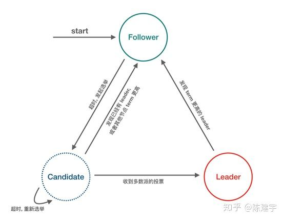
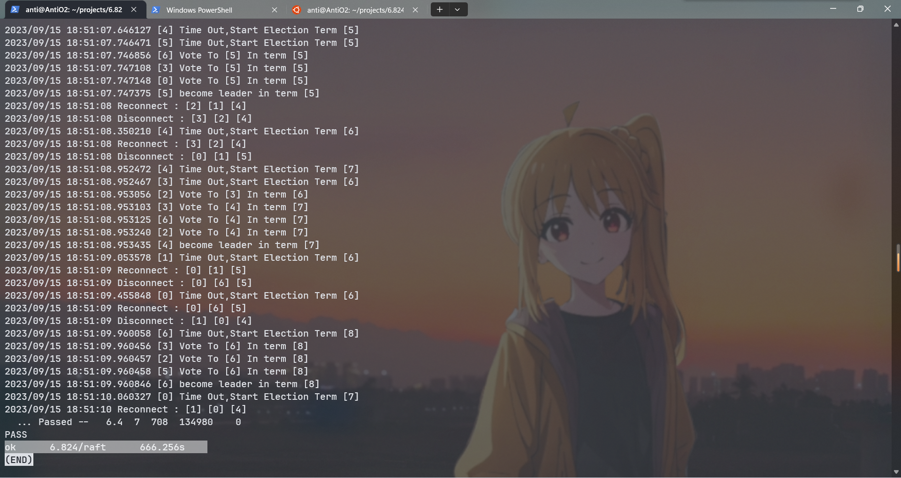

## 0x1 Reading Paper

Raft协议感觉目标很简单：保证分布式系统的一致性和可用性，在阅读时，我联想到之前看的ARIES论文，感觉思维有很多共通之处，比如如何通过非易失性存储来保证持久性。但是ARIES中是单个机器崩溃导致内存内容丢失，通过硬盘上的LOGs来重做数据库，并且ABORT掉未提交的记录并写入CLR。Raft中，可能是多台机器崩溃，这个时候就要考虑在崩溃期间，其他机器增加log的操作了，因为集群不会因为少数几台机器崩溃而整体不可用。

在ARIES中，通过Commit类型的记录标识一个事务的提交，只要该commit log写入，无论是否落盘，就能告诉客户端：我已经将你的操作commit(持久化)了。而在RAFT里面，在当期TERM中，Majority的机器append了这条log,就能算做已经提交了。

### 0x11 一些疑问

但是在阅读时，有几个问题没有理解到：

1. 什么叫做提交？

比如上图从c->e的 状态，term 4被提交是很好理解的，但是2也会被间接commit，客户端怎么知道2被commit了呢？

貌似答案是客户端并不在乎是否提交，或者是可以将Commit的日志发送给client。

一个方式是client可以重传失败的操作，并且给这个操作一个唯一的编号。比如在(e)的情况里面，2是被commit了。在(d)中，2没有commit。客户端在没有收到2被commit的消息超时之后，可以尝试重传2的操作。比如这个操作有一个唯一的序列号：23234，Raft在收到该序列号后，在(e)的情况下，检查到该序列已经被commit了，就不会再做这个操作。

详细的解释其实在guide中有->https://thesquareplanet.com/blog/students-guide-to-raft/#applying-client-operations

> One simple way to solve this problem is to record where in the Raft log the client’s operation appears when you insert it. Once the operation at that index is sent to `apply()`, you can tell whether or not the client’s operation succeeded based on whether the operation that came up for that index is in fact the one you put there. If it isn’t, a failure has happened and an error can be returned to the client.

比如client一开始连的是leader-A, leader-A需要在插入时记录客户端操作在Raft log中的哪里。当这个操作将要被apply的时候，通过判断该索引位置的操作是不是你放的（比如这个时候索引已经变成Leader-B强制Leader-A同步的了），如果操作来源不匹配，返回客户端一个错误。

2. 在选举时，如果有比较高term的follower拒绝投票，candidate是否立马退出选举？

参考了[raft选举策略 - 知乎 (zhihu.com)](https://zhuanlan.zhihu.com/p/306110683)。答案应该是如果candidate或者leader发现了存在term更高的节点，会立即掉入follower状态。



3. 如何保证term不重复？

每当一个server收到的RPC（接收或者回复得到的消息），观察到了一个更新的Term，都会立即进入follower状态并更新状态。即使出现网络分区，也不会出现相同的term，却出现相同Index的Log不同的情况。试想：要出现一个Leader，大多数的s都会进入最新的Term，接下来有两种情况：大多数中的一个当选，此时的currentTerm已经大于Term。

第二种情况，也就是我担心的。


S1在Term2当选Leader,S2已经观察到Term2，S3短暂不能接收RPC。并且S1收到一条Log但还没有来得及传给S2和S3。此时S3 Timeout开始选举，增加自己的Term为2，若S3赢得选举，再收到一条log。

此时问题来了：S1和S3都有Term=2，Index=2的log，但是两条Log却是内容不一样的！违反了安全性。

为了解决这个问题，我认为应该candidateTerm<=currentTerm，都返回false,而不是只有candidateTerm < currentTerm时返回false

### 0x12 一些细节

> Make sure you reset your election timer *exactly* when Figure 2 says you should. Specifically, you should *only* restart your election timer if a) you get an `AppendEntries` RPC from the *current* leader (i.e., if the term in the `AppendEntries` arguments is outdated, you should *not* reset your timer); b) you are starting an election; or c) you *grant* a vote to another peer.

重设超时时间：

1. 从当前leader接受信息
2. 投票给其他candidate
3. 开始选举

> - If you get an `AppendEntries` RPC with a `prevLogIndex` that points beyond the end of your log, you should handle it the same as if you did have that entry but the term did not match (i.e., reply false).

follower需要检查index是否匹配

> - If a leader sends out an `AppendEntries` RPC, and it is rejected, but *not because of log inconsistency* (this can only happen if our term has passed), then you should immediately step down, and *not* update `nextIndex`. If you do, you could race with the resetting of `nextIndex` if you are re-elected immediately.

如果leader被拒绝，立马下台（进入选举状态）

> From experience, we have found that by far the simplest thing to do is to first record the term in the reply (it may be higher than your current term), and then to compare the current term with the term you sent in your original RPC. If the two are different, drop the reply and return. *Only* if the two terms are the same should you continue processing the reply.

如果收到一个不同Term RPC的回复（**注意不是请求**），不要继续处理


## 0x2 阅读代码

还是按照BFS的方式阅读lab中Raft框架的源码

### 0x21 labrpc

labrpc模拟了可能丢包、延迟的网络环境。

> net := MakeNetwork() -- holds network, clients, servers. 创建网络
>
> net.AddServer(servername, server) -- adds a named server to network. 添加一个服务器
> net.DeleteServer(servername) -- eliminate the named server. 删除服务器
> net.Connect(endname, servername) -- connect a client to a server.
> net.Enable(endname, enabled) -- enable/disable a client.
> net.Reliable(bool) -- false means drop/delay messages
>
> end := net.MakeEnd(endname) -- create a client end-point, to talk to one server. 
> end.Call("Raft.AppendEntries", &args, &reply) -- send an RPC, wait for reply.
> the "Raft" is the name of the server struct to be called.

其中，Server和Service是两个概念

> srv := MakeServer()
> srv.AddService(svc) -- a server can have multiple services, e.g. Raft and k/v
> pass srv to net.AddServer()
>
> svc := MakeService(receiverObject) -- obj's methods will handle RPCs
> much like Go's rpcs.Register()
> pass svc to srv.AddService()

感觉Service更多的指一组API接口，而Server类似一台主机，上面可能运行多个service

### 0x22 Raft

> A service calls `Make(peers,me,…)` to create a Raft peer. The peers argument is an array of network identifiers of the Raft peers (including this one), for use with RPC. The `me` argument is the index of this peer in the peers array. 

其中，通过阅读`Persister`代码，其中有序列化和反序列化方法。

## 0x31 Lab2a实现

目标：实现Leader选举。不需要携带log(空append entry)


```go
type RequestVoteArgs struct {
	// Your data here (2A, 2B).
	candidateTerm termT
	candidateId   int
	lastLogEntry  indexT
	lastLogTerm   termT
}

// RequestVoteReply example RequestVote RPC reply structure.
// field names must start with capital letters!
type RequestVoteReply struct {
	// Your data here (2A).
	term termT
	voteGranted bool 
}
```

这里我不确定term和index的数据类型。感觉Index应该用uint（因为有效的index从1开始，可以用0表示无效的index）,但是给的代码中term和index都是int.

> Modify `Make()` to create a background goroutine that will kick off leader election periodically by sending out `RequestVote` RPCs when it hasn't heard from another peer for a while. This way a peer will learn who is the leader, if there is already a leader, or become the leader itself. Implement the `RequestVote()` RPC handler so that servers will vote for one another.

这里首先实现ticker里面的代码。

```C++
func (rf *Raft) ticker() {
    rf.setElectionTime()
    for rf.killed() == false {

       // Your code here to check if a leader election should
       // be started and to randomize sleeping time using
       // time.Sleep().
       time.Sleep(rf.heartBeat)
       rf.mu.Lock()
       if rf.status == leader {
          // 如果是leader状态,发送空包
       }
       if time.Now().After(rf.electionTime) {
          // 如果已经超时， 开始选举
       }
       rf.mu.Unlock()
    }
}
```

然后是实现candidate部分的代码：

参考5.2 Leader election中的描述一步一步做

> To begin an election, a follower increments its current
>
> term and transitions to candidate state.

```go
func (rf *Raft) startElection() {
    rf.setElectionTime()
    rf.status = candidate
    rf.currentTerm++
```

> It then votes for
>
> itself and issues RequestVote RPCs in parallel to each of
>
> the other servers in the cluster. 

```go
rf.votedFor = rf.me
rf.persist()
var convert sync.Once
for i := range rf.peers {
    if i != rf.me {
       var reply RequestVoteReply
       request := RequestVoteArgs{
          candidateTerm: rf.currentTerm,
          candidateId:   rf.me,
          lastLogEntry:  rf.getLastLogIndex(),
          lastLogTerm:   rf.getLastLogTerm(),
       }
       go rf.sendRequestVote(i, &request, &reply, &convert)
    }
}
```

继续往下阅读

> A candidate continues in
>
> this state until one of three things happens: 
>
> - (a) it wins theelection
> - (b) another server establishes itself as leader, or
>
> - (c) a period of time goes by with no winner.

其中，(c) 通过ticker函数解决超时未选举问题

(b) 在接受心跳信息中实现

(a) 在每次收到**有效的**选票后，统计自己是否赢得选举

首先实现a

```go
func (rf *Raft) sendRequestVote(server int, args *RequestVoteArgs, reply *RequestVoteReply, convert *sync.Once, countVote *int) bool {
	ok := rf.peers[server].Call("Raft.RequestVote", args, reply)
	if !ok {
		return ok
	}
	rf.mu.Lock()
	defer rf.mu.Unlock()
	if reply.Term > rf.currentTerm {
		rf.setTerm(reply.Term)
		// rf.setElectionTime()
		rf.status = follower
		return false
	}
	if reply.Term < rf.currentTerm {
		// 过期得rpc
		return false
	}
	if !reply.VoteGranted {
		return false
	}
	*countVote++
	if *countVote > rf.peerNum/2 &&
		rf.status == candidate &&
		rf.currentTerm == args.CandidateTerm {
		// 投票成功，转为leader
		convert.Do(func() {
			log.Printf("[%d] become leader in term [%d]", rf.me, rf.currentTerm)
			/**
			nextIndex for each server, Index of the next log entry to send to that server (initialized to leader last log Index + 1)
			*/
			nextIndex := rf.getLastLogIndex() + 1
			rf.status = leader
			for i := 0; i < rf.votedFor; i++ {
				rf.nextIndex[i] = nextIndex
				rf.matchIndex[i] = 0
				rf.matchIndex[i] = 0
			}
			rf.appendEntries(true)
		})
	}
	return ok
}

```

相对应的，实现投票规则。

- 如果在该term投了票，并且不是该candidateId, 则拒绝该次投票
- 如果term < currentTerm  拒绝投票
- 如果candidate的参数至少和当前follower一样新，则投票

```go
// RequestVote RPC handler.
func (rf *Raft) RequestVote(args *RequestVoteArgs, reply *RequestVoteReply) {
	// Your code here (2A, 2B).
	rf.mu.Lock()
	defer rf.mu.Unlock()
	if args.candidateTerm > rf.currentTerm {
		rf.setTerm(args.candidateTerm)
	}
	reply.term = rf.currentTerm
	if rf.currentTerm > args.candidateTerm {
		reply.voteGranted = false
		return
	}
	lastLogTerm := rf.getLastLogTerm()
	lastLogIndex := rf.getLastLogIndex()
	if (rf.votedFor == -1 || rf.votedFor == args.candidateId) &&
		(lastLogTerm < args.lastLogTerm || lastLogIndex <= args.lastLogEntry) {
		reply.voteGranted = true

		rf.votedFor = args.candidateId
		rf.persist()
		rf.setElectionTime()
	} else {
		reply.voteGranted = false
	}
}
```

接下来，实现发送心跳信息。

首先实现appendEntry需要的数据结构

```go
ype appendEntryArgs struct {
    term         termT  //leader’s term
    leaderId     int    // so follower can redirect clients
    prevLogIndex indexT //index of log entry immediately preceding new ones
    prevLogTerm  termT  // term of prevLogIndex entry
    entries      []Log  // log entries to store (empty for heartbeat; may send more than one for efficiency)
    leaderCommit indexT // leader’s commitIndex
}

type appendEntryReply struct {
    term    termT // currentTerm, for leader to update itself
    success bool  // true if follower contained entry matching prevLogIndex and prevLogTerm
}

func (rf *Raft) AppendEntriesRPC(args appendEntryArgs, reply appendEntryReply) {
    
}
```

实现leader发送心跳信息(在lab2A中，prevLog的参数都还不对)

```go
func (rf *Raft) appendEntries(heartBeat bool) {

	for i := range rf.peers {
		if i != rf.me {
			args := appendEntryArgs{
				Term:         rf.currentTerm,
				LeaderId:     rf.me,
				PrevLogIndex: rf.getLastLogIndex(),
				PrevLogTerm:  rf.getLastLogTerm(),
				Entries:      nil,
				LeaderCommit: rf.commitIndex,
			}
			if heartBeat {
				go func(rf *Raft, args *appendEntryArgs, peerId int) {
					client := rf.peers[peerId]
					var reply appendEntryReply
					client.Call("Raft.AppendEntriesRPC", args, &reply)
					rf.mu.Lock()
					defer rf.mu.Unlock()
					if reply.Term > rf.currentTerm {
						rf.setTerm(reply.Term)
						rf.setElectionTime()
						rf.status = follower
						return
					}
				}(rf, &args, i)
			}
		}
	}
}
```


最后根据Figure2 实现RPC Handler(不包含Log,仅心跳)

> Receiver implementation:
>
> 1. Reply false if term < currentTerm (§5.1)
> 2. Reply false if log doesn’t contain an entry at prevLogIndex
>
> whose term matches prevLogTerm (§5.3)
>
> 3. If an existing entry conflicts with a new one (same index
>
> but different terms), delete the existing entry and all that
>
> follow it (§5.3)
>
> 4. Append any new entries not already in the log
> 5. If leaderCommit > commitIndex, set commitIndex =
>
> min(leaderCommit, index of last new entry)

```go
func (rf *Raft) AppendEntriesRPC(args *appendEntryArgs, reply *appendEntryReply) {
    rf.mu.Lock()
    defer rf.mu.Unlock()
    reply.Success = false
    reply.Term = rf.currentTerm
    if args.Term > rf.currentTerm {
       rf.status = follower
       rf.setElectionTime() // check(AntiO2)
       rf.setTerm(args.Term)
       return
    }
    if args.Term < rf.currentTerm {
       return
    }
    rf.setElectionTime()
    if rf.status == candidate {
       rf.status = follower
    }
    if args.Entries == nil || len(args.Entries) == 0 {
       // do heartBeat
       reply.Success = true
       return
    }
}
```

记得完成GetState()，用于检测状态。

Debug时遇到的坑：

- 无论是收到AppendEntry的RPC时，发现了更高的term，还是RPC回复中的参数发现了更高的term，都要立即转入follower状态。

- > - The tester requires that the leader send heartbeat RPCs no more than ten times per second.

  好像心跳时间一秒不能超过10次。当我一秒发送100次心跳，能维护只有一个Leader，但是每隔100ms就会出现多个Leader的情况。

比如在测试中出现的这种情况：s3在term8断开连接，在之后还自称leader.


再看提示：

> - The paper's Section 5.2 mentions election timeouts in the range of 150 to 300 milliseconds. Such a range only makes sense if the leader sends heartbeats considerably more often than once per 150 milliseconds. Because the tester limits you to 10 heartbeats per second, you will have to use an election timeout larger than the paper's 150 to 300 milliseconds, but not too large, because then you may fail to elect a leader within five seconds.

因为Leader每100ms发送一次超时信息，来不及在Follower进入超时选举状态之前更新，所以要增大超时选举的时间。（要求在超时时间中，发送more often than once） 这里我将超时时间设置成了300~500ms.

再仔细检查，发现忽略了一种情况：就是收到投票请求时，发现了更高的term，忘了转变为follower状态。


- 当我在Windows环境下，使用`-race`测试，会报错。上网看了下Issue好像amd会出现这个问题。
- 发现了没有收到多数票也能赢得选举的问题，然后才检查到判定多数派的选票数应该至少是`(peerNum+2)/2`


在测试时发现一次错误Log如下

```tex
2023/09/15 18:03:20 Disconnect : [2] [5] [3]
2023/09/15 18:03:21 [4] Time Out,Start Election Term [4]
2023/09/15 18:03:21 [3] Time Out,Start Election Term [4]
2023/09/15 18:03:21 [1] Time Out,Start Election Term [4]
2023/09/15 18:03:21 [0] Time Out,Start Election Term [4]
2023/09/15 18:03:21 [6] Vote To [4] In term [4]
2023/09/15 18:03:21 [2] Time Out,Start Election Term [4]
2023/09/15 18:03:21 [4] Time Out,Start Election Term [5]
2023/09/15 18:03:21 [1] Time Out,Start Election Term [5]
2023/09/15 18:03:21 [0] Time Out,Start Election Term [5]
2023/09/15 18:03:21 [6] Vote To [1] In term [5]
2023/09/15 18:03:21 [3] Time Out,Start Election Term [5]
2023/09/15 18:03:21 [2] Time Out,Start Election Term [5]
2023/09/15 18:03:22 [3] Time Out,Start Election Term [6]
2023/09/15 18:03:22 [0] Time Out,Start Election Term [6]
2023/09/15 18:03:22 [4] Time Out,Start Election Term [6]
2023/09/15 18:03:22 [1] Vote To [0] In term [6]
2023/09/15 18:03:22 [6] Vote To [0] In term [6]
2023/09/15 18:03:22 [2] Time Out,Start Election Term [6]
2023/09/15 18:03:22 [4] Time Out,Start Election Term [7]
2023/09/15 18:03:22 [6] Time Out,Start Election Term [7]
2023/09/15 18:03:22 [0] Time Out,Start Election Term [7]
2023/09/15 18:03:22 [1] Vote To [4] In term [7]
2023/09/15 18:03:22 [3] Time Out,Start Election Term [7]
2023/09/15 18:03:22 [2] Time Out,Start Election Term [7]
2023/09/15 18:03:22 [4] Time Out,Start Election Term [8]
2023/09/15 18:03:22 [1] Time Out,Start Election Term [8]
2023/09/15 18:03:22 [6] Vote To [1] In term [8]
2023/09/15 18:03:22 [0] Vote To [1] In term [8]
2023/09/15 18:03:22 [3] Time Out,Start Election Term [8]
2023/09/15 18:03:23 [2] Time Out,Start Election Term [8]
2023/09/15 18:03:23 [4] Time Out,Start Election Term [9]
2023/09/15 18:03:23 [0] Time Out,Start Election Term [9]
2023/09/15 18:03:23 [6] Vote To [0] In term [9]
2023/09/15 18:03:23 [1] Vote To [0] In term [9]
2023/09/15 18:03:23 [3] Time Out,Start Election Term [9]
2023/09/15 18:03:23 [0] Time Out,Start Election Term [10]
2023/09/15 18:03:23 [6] Time Out,Start Election Term [10]
2023/09/15 18:03:23 [2] Time Out,Start Election Term [9]
2023/09/15 18:03:23 [1] Vote To [0] In term [10]
2023/09/15 18:03:23 [4] Vote To [6] In term [10]
2023/09/15 18:03:23 [3] Time Out,Start Election Term [10]
2023/09/15 18:03:24 [0] Time Out,Start Election Term [11]
2023/09/15 18:03:24 [6] Time Out,Start Election Term [11]
2023/09/15 18:03:24 [4] Vote To [0] In term [11]
2023/09/15 18:03:24 [1] Vote To [0] In term [11]
2023/09/15 18:03:24 [2] Time Out,Start Election Term [10]
2023/09/15 18:03:24 [3] Time Out,Start Election Term [11]
2023/09/15 18:03:24 [0] Time Out,Start Election Term [12]
2023/09/15 18:03:24 [1] Time Out,Start Election Term [12]
2023/09/15 18:03:24 [6] Vote To [0] In term [12]
2023/09/15 18:03:24 [4] Vote To [0] In term [12]
2023/09/15 18:03:24 [2] Time Out,Start Election Term [11]
2023/09/15 18:03:24 [3] Time Out,Start Election Term [12]
2023/09/15 18:03:24 [1] Time Out,Start Election Term [13]
2023/09/15 18:03:24 [0] Time Out,Start Election Term [13]
2023/09/15 18:03:24 [6] Vote To [1] In term [13]
2023/09/15 18:03:24 [4] Vote To [1] In term [13]
2023/09/15 18:03:25 [2] Time Out,Start Election Term [12]
2023/09/15 18:03:25 [0] Time Out,Start Election Term [14]
2023/09/15 18:03:25 [3] Time Out,Start Election Term [13]
2023/09/15 18:03:25 [6] Time Out,Start Election Term [14]
2023/09/15 18:03:25 [4] Time Out,Start Election Term [14]
2023/09/15 18:03:25 [1] Vote To [6] In term [14]
2023/09/15 18:03:25 [2] Time Out,Start Election Term [13]
2023/09/15 18:03:25 [1] Time Out,Start Election Term [15]
2023/09/15 18:03:25 [0] Time Out,Start Election Term [15]
2023/09/15 18:03:25 [3] Time Out,Start Election Term [14]
2023/09/15 18:03:25 [6] Vote To [0] In term [15]
2023/09/15 18:03:25 [4] Vote To [1] In term [15]
2023/09/15 18:03:25 [2] Time Out,Start Election Term [14]
--- FAIL: TestManyElections2A (6.33s)
    config.go:398: expected one leader, got none
```

这里好像都成了candidate，然后没有在5s投票出来有效的leader。从Log看的出来，这里2、5、3都下线了，在集群里面只有0,1,4,6服务器在线。也就是说0，1，4，6中，必须有一个服务器得到4票（全票）才能当选。

比如出现了这种情况：

```go
2023/09/15 18:03:21 [1] Time Out,Start Election Term [5]
2023/09/15 18:03:21 [0] Time Out,Start Election Term [5]
2023/09/15 18:03:21 [6] Vote To [1] In term [5]
```

1和0几乎同时开始新的选举。在6投票给1之前，0也开始选举，就会出现分票的情况。

为了看的更清楚，将log的时间格式改为毫秒级别

```tex
2023/09/15 18:15:17 Disconnect : [6] [4] [5]
2023/09/15 18:15:17.497307 [5] Time Out,Start Election Term [8]
2023/09/15 18:15:17.497370 [3] Time Out,Start Election Term [8]
2023/09/15 18:15:17.497607 [1] Time Out,Start Election Term [8]
2023/09/15 18:15:17.498068 [0] Vote To [3] In term [8]
2023/09/15 18:15:17.498081 [2] Vote To [1] In term [8]
2023/09/15 18:15:17.900286 [3] Time Out,Start Election Term [9]
2023/09/15 18:15:17.900529 [5] Time Out,Start Election Term [9]
2023/09/15 18:15:17.900757 [2] Time Out,Start Election Term [9]
2023/09/15 18:15:17.900814 [0] Vote To [3] In term [9]
2023/09/15 18:15:17.900904 [1] Time Out,Start Election Term [9]
2023/09/15 18:15:18.302221 [2] Time Out,Start Election Term [10]
2023/09/15 18:15:18.302400 [0] Time Out,Start Election Term [10]
2023/09/15 18:15:18.302467 [3] Time Out,Start Election Term [10]
2023/09/15 18:15:18.302693 [1] Time Out,Start Election Term [10]
2023/09/15 18:15:18.403276 [5] Time Out,Start Election Term [10]
2023/09/15 18:15:18.703948 [3] Time Out,Start Election Term [11]
2023/09/15 18:15:18.704030 [1] Time Out,Start Election Term [11]
2023/09/15 18:15:18.704036 [0] Time Out,Start Election Term [11]
2023/09/15 18:15:18.704627 [2] Vote To [3] In term [11]
2023/09/15 18:15:18.904608 [5] Time Out,Start Election Term [11]
2023/09/15 18:15:19.206448 [3] Time Out,Start Election Term [12]
2023/09/15 18:15:19.206490 [0] Time Out,Start Election Term [12]
2023/09/15 18:15:19.206784 [2] Time Out,Start Election Term [12]
2023/09/15 18:15:19.207301 [1] Time Out,Start Election Term [12]
2023/09/15 18:15:19.306922 [5] Time Out,Start Election Term [12]
2023/09/15 18:15:19.608320 [0] Time Out,Start Election Term [13]
2023/09/15 18:15:19.608388 [3] Time Out,Start Election Term [13]
2023/09/15 18:15:19.608350 [1] Time Out,Start Election Term [13]
2023/09/15 18:15:19.611556 [2] Vote To [1] In term [13]
2023/09/15 18:15:19.708899 [5] Time Out,Start Election Term [13]
2023/09/15 18:15:20.010722 [0] Time Out,Start Election Term [14]
2023/09/15 18:15:20.011113 [3] Time Out,Start Election Term [14]
2023/09/15 18:15:20.011701 [1] Time Out,Start Election Term [14]
2023/09/15 18:15:20.011758 [2] Vote To [0] In term [14]
2023/09/15 18:15:20.111205 [5] Time Out,Start Election Term [14]
2023/09/15 18:15:20.413353 [1] Time Out,Start Election Term [15]
2023/09/15 18:15:20.413558 [2] Time Out,Start Election Term [15]
2023/09/15 18:15:20.414091 [3] Vote To [1] In term [15]
2023/09/15 18:15:20.414073 [0] Vote To [2] In term [15]
2023/09/15 18:15:20.514419 [5] Time Out,Start Election Term [15]
2023/09/15 18:15:20.816345 [1] Time Out,Start Election Term [16]
2023/09/15 18:15:20.816657 [3] Time Out,Start Election Term [16]
2023/09/15 18:15:20.816823 [0] Time Out,Start Election Term [16]
2023/09/15 18:15:20.819032 [2] Vote To [1] In term [16]
2023/09/15 18:15:21.017935 [5] Time Out,Start Election Term [16]
2023/09/15 18:15:21.218446 [1] Time Out,Start Election Term [17]
2023/09/15 18:15:21.218512 [0] Time Out,Start Election Term [17]
2023/09/15 18:15:21.218845 [2] Time Out,Start Election Term [17]
2023/09/15 18:15:21.219796 [3] Vote To [1] In term [17]
2023/09/15 18:15:21.419438 [5] Time Out,Start Election Term [17]
2023/09/15 18:15:21.620428 [0] Time Out,Start Election Term [18]
2023/09/15 18:15:21.620592 [2] Time Out,Start Election Term [18]
2023/09/15 18:15:21.620687 [3] Time Out,Start Election Term [18]
2023/09/15 18:15:21.622159 [1] Vote To [0] In term [18]
2023/09/15 18:15:21.821781 [5] Time Out,Start Election Term [18]
--- FAIL: TestManyElections2A (8.43s)
    config.go:398: expected one leader, got none
```

这次是0，1，2，3必须投票给同一个Server。

然后发现了一些不对的地方

```tex
2023/09/15 18:15:20.011701 [1] Time Out,Start Election Term [14]
2023/09/15 18:15:20.011758 [2] Vote To [0] In term [14]

2023/09/15 18:15:20.413353 [1] Time Out,Start Election Term [15]
2023/09/15 18:15:20.413558 [2] Time Out,Start Election Term [15]
```

可以看到，1的超时选举时间重设为了401.652ms,2的超时选举时间重设为了401.800ms,两者太相近了。只要这种情况发生，就会出现一直分票的情况。这大概是不够随机的原因，300-500ms的超时间隔太近了。然后我尝试将超时时间在$[300,900]ms$ ，解决了这个问题

最后，使用`go test -run TestManyElections2A -race -count 100 -timeout 1800s `，运行100次测试。




---

**补充说明：** 在Leader当选之后，应当立即增加一条空记录。

比如

```go
rf.logLatch.Lock()
rf.logs = append(rf.logs, Log{
    Term:    rf.currentTerm,
    Index:   nextIndex,
    Command: nil,
})
rf.persist()
// rf.logger.Printf("Leader [%d] \nLog [%v]\n", rf.me, rf.logs)
rf.logLatch.Unlock()
```

但是Lab2B的代码逻辑会检测Index值，第一条Log的Index必须为1而不是2。导致通过不了测试。

## 0x32 Lab2B

### 初步实现

**注意** ： 这一小节的代码还没有debug，是笔记。具体修改后的看下一小节

lab2b通过测试的代码：[[6.824/src/raft/raft.go at 5f1e191a4c18751527122c289e4a0549261f04b6 · AntiO2/6.824 (github.com)](https://github.com/AntiO2/6.824/blob/5f1e191a4c18751527122c289e4a0549261f04b6/src/raft/raft.go)](https://github.com/AntiO2/6.824/commit/d969343dadf3aeb8c167cf36bc600e0b0b1e01ec)


> Start by implementing `Start()`, then write the code to send and receive new log entries via `AppendEntries` RPCs, following Figure 2.

首先实现`Start()`函数

> the service using Raft (e.g. a k/v server) wants to start
> agreement on the next Command to be appended to Raft's log. if this
> server isn't the leader, returns false. otherwise start the
> agreement and return immediately. there is no guarantee that this
> Command will ever be committed to the Raft log, since the leader
> may fail or lose an election. even if the Raft instance has been killed,
> this function should return gracefully.
>
> the first return value is the Index that the Command will appear at
> if it's ever committed. the second return value is the current
> Term. the third return value is true if this server believes it is
> the leader.

如果该server不是leader，直接返回`false`。

```go
index := -1

// Your code here (2B).
term, isLeader := rf.GetState()
if !isLeader {
    return index, term, isLeader
}
```

如果该Server是Leader，直接返回Index。将新的Command作为Log写入logs中。该条log等待下一次心跳统一发送（一次发送多条）

```go
func (rf *Raft) Start(command interface{}) (int, int, bool) {

	var index indexT = -1
	// Your code here (2B).
	term, isLeader := rf.GetState()
	if !isLeader {
		return int(index), term, isLeader
	}
	rf.logger.Printf("Leader [%d] Receive Log [%v]\n", rf.me, command)
	rf.logLatch.Lock()
	if len(rf.logs) == 0 {
		index = 0
	} else {
		index = rf.logs[len(rf.logs)-1].Index
	}
	index++
	rf.logs = append(rf.logs, Log{
		Term:    termT(term),
		Index:   index,
		Command: command,
	})
	rf.persist()
	// rf.logger.Printf("Leader [%d] \nLog [%v]\n", rf.me, rf.logs)
	rf.logLatch.Unlock()
	// rf.appendEntries(false)
	return int(index), term, isLeader
}
```

接下来要做的就是修改AppendEntry的逻辑（实现figure2）

> Receiver implementation:
>
> 1. Reply false if term < currentTerm (§5.1)
> 2. Reply false if log doesn’t contain an entry at prevLogIndex
>
> whose term matches prevLogTerm (§5.3)
>
> 3. If an existing entry conflicts with a new one (same index
>
> but different terms), delete the existing entry and all that
>
> follow it (§5.3)
>
> 4. Append any new entries not already in the log
> 5. If leaderCommit > commitIndex, set commitIndex =
>
> min(leaderCommit, index of last new entry)

其中

1. 选举就已经实现

```go
reply.Success = false
reply.Term = rf.currentTerm
if args.Term < rf.currentTerm {
    return
}
```

2. *Reply false if log doesn’t contain an entry at prevLogIndex whose term matches prevLogTerm (§5.3)*

	注意，要先找到相同Index的位置（这里数组不能越界），并且该位置的Log应该具有相同的term

```go
reply.Success = false
if args.PrevLogIndex > rf.getLastLogIndex() {
    return
}
rf.logLatch.RLock()
if rf.logs[args.PrevLogIndex].Term != args.PrevLogTerm {
    rf.logLatch.RUnlock()
    return
}
```

3. *If an existing entry conflicts with a new one (same index but different terms), delete the existing entry and all that follow it (§5.3)*。

这句话我一开始没理解到，same index but different terms的情况不是在2里面就被return了吗？其实是，当prevLog匹配上了，就可以开始做Log Replication，在这个过程中，可能后面的log存在term冲突的情况，这个时候覆盖就行了。

4. >  Append any new entries not already in the log

实现3和4(这里是错误的想法，具体修改看下一小节)：

```go
rf.logLatch.Lock()
defer rf.logLatch.Unlock()
rf.logs = append(rf.logs[args.PrevLogIndex:], args.Entries...)
reply.Success = true
```

5. If leaderCommit > commitIndex, set commitIndex =min(leaderCommit, index of last new entry)

```go
if args.LeaderCommit > rf.commitIndex {
    rf.commitIndex = min(args.LeaderCommit, rf.getLastLogIndex())
    go rf.apply()
}
```

以上是follower的逻辑。


接下来应当修改Leader发送RPC的逻辑

首先根据`nextIndex`找到prevLOg,获取请求参数。

```go
for i := range rf.peers {
    if i != rf.me && (heartBeat || lastIndex >= rf.nextIndex[i]) {
       prevLog := &rf.logs[rf.nextIndex[i]]
       args := appendEntryArgs{
          Term:         rf.currentTerm,
          LeaderId:     rf.me,
          PrevLogIndex: prevLog.Index,
          PrevLogTerm:  prevLog.Term,
          LeaderCommit: rf.commitIndex,
       }
       copy(args.Entries, rf.logs[rf.nextIndex[i]:])
```

然后发送RPC

```go
go func(rf *Raft, args *appendEntryArgs, peerId int) {
    client := rf.peers[peerId]
    var reply appendEntryReply
    client.Call("Raft.AppendEntriesRPC", args, &reply)
    rf.mu.Lock()
    defer rf.mu.Unlock()
    if reply.Term > rf.currentTerm {
       rf.setTerm(reply.Term)
       rf.setElectionTime()
       rf.status = follower
       return
    }
    if !reply.Success {
       rf.nextIndex[i]--
    } else {
       rf.matchIndex[i] = rf.nextIndex[i]
    }
}(rf, &args, i)
```

接下来，检查是否有新的Log可以转为提交状态

> If there exists an N such that N > commitIndex, a majority
>
> of matchIndex[i] ≥ N, and log[N].term == currentTerm:
>
> set commitIndex = N (§5.3, §5.4).


```go
func (rf *Raft) checkCommit() {
    rf.mu.Lock()
    defer rf.mu.Unlock()
    if rf.status != leader {
       return
    }
    lastIndex := rf.getLastLogIndex()
    rf.logLatch.RLock()
    defer rf.logLatch.RUnlock()
    for i := rf.commitIndex; i <= lastIndex; i++ {
       if rf.logs[i].Term != rf.currentTerm {
          // 5.4.2 Committing entries from previous terms
          continue
       }
       count := 0
       for j := 0; j < rf.peerNum; j++ {
          if j == rf.me {
             count++
          } else {
             if rf.matchIndex[j] >= i {
                count++
             }
          }
       }
       if count > rf.peerNum/2 {
          rf.commitIndex = i
          rf.apply()
       }
    }
}
```


实现Apply。这里有提示：

> Your code may have loops that repeatedly check for certain events. Don't have these loops execute continuously without pausing, since that will slow your implementation enough that it fails tests. Use Go's [condition variables](https://golang.org/pkg/sync/#Cond), or insert a `time.Sleep(10 * time.Millisecond)` in each loop iteration.

使用条件变量。

### debug-lab2a


然后是让人心碎的测试环节。

```sh
go test -run TestBasicAgree2B -race -count 5 
go test -run TestRPCBytes2B -race -count 5
go test -run TestFailAgree2B -race -count 5
go test -run TestFailNoAgree2B -race -count 5
go test -run TestConcurrentStarts2B -race -count 5
go test -run TestRejoin2B -race -count 5
go test -run TestBackup2B -race -count 5
go test -run TestCount2B -race -count 5
```


1. Go语言copy的使用。

在复制切片时，args.entries一直是nil

查找资料才知道，dst必须能够有足够大的容量复制进去

也就是说，要初始化`Entries: make([]Log, lastIndex - rf.nextIndex[i] + 1)`

> ref：[Go语言copy()：切片复制（切片拷贝） (biancheng.net)](http://c.biancheng.net/view/29.html)

2. 发现Follower一直在添加log

原因：忘记在成功时更新NextIndex

```go
rf.nextIndex[i] = rf.nextIndex[i] + indexT(len(args.Entries))
```

3. 发现logs变更错误

```go
rf.logs = append(rf.logs[args.PrevLogIndex:], args.Entries...)
```

这里逻辑有问题，应该是截取从[0,PrevLogIndex+1)

4. 

在之前的Leader挂掉之后，出现一直append 的情况，是因为服务器在变为Leader之后没有更新好matchIndex和nextIndex的原因

5. 无限循环？

之前CheckCommit中

循环是从rf.commitIndex开始的，莫名其妙会卡住

```go
for i := rf.commitIndex; i <= lastIndex; i++ {
```

改成

```go
for i := rf.commitIndex + 1;i <= lastIndex; i++ {
```

就不卡了。

后来检查到，是发生了死锁。

因为我的apply逻辑是：

服务器启动时，启动一个go程doApply()，负责apply command

```go
func (rf *Raft) apply() {
	rf.applySign <- true
}
func (rf *Raft) doApply() {

    for !rf.killed() {
       <-rf.applySign
        rf.mu.Lock()
        ...
```

在CheckCommit中，首先获取了`rf.mu.Lock()`。所以导致了死锁

6. 应该能够支持RPC的并发发送。注意不要把Call都放在临界区里面

7. 注意添加Log时，要保证Index的正确性，之前并发加锁策略出错，在这里错了。

8. 还有一个需要讨论的：就是Leader在添加一条log，需要立即发送RPC吗？

我在之前，是收到一条log就立即发送RPC。但是在测试中，才意识到会发送如下情景的问题：

假如Leader在2ms内收到了100条log，如果采用立即触发的方式，就会导致发送100*follower数量的RPC，分别携带`1~1,1~2,1~3,1~4...1~100`的log。因为leader在发送RPC之后，不会立即收到follower的回复。而follower收到的RPC实际上是很冗余的。比如收到$1\sim 50$ 的logs，下一条收到的$1\sim 100$ 的logs，会重复copy前50条。

9. 之前follower的

```go
rf.logs = append(rf.logs[:args.PrevLogIndex+1], args.Entries...)
```

实际上违反了leader规则4

> Append any new entries not already in the log

接第8条，比如先收到$1\sim 100$的RPC,再收到$1\sim 50$的RPC。 虽然即使这样，Leader会在几个RPC之后进行回退重传，但还是违反了规则，因为都是Term1的Index(注意：相同term并且相同index的log一定相同)，所以后面的RPC即使没有冲突也并不会更新Logs

重写append逻辑，使其符合规则4

```go
	rf.logLatch.Lock()
	if args.Entries != nil && len(args.Entries) != 0 {
		rf.logger.Printf("[%d] append [%d] logs\nprev rf's logs: [%v]\nnew logs: [%v]", rf.me, len(args.Entries), rf.logs, args.Entries)
	}
	for i, entry := range args.Entries {
		if entry.Index <= rf.getLastLogIndexWriteMode() && entry.Term != rf.logs[entry.Index].Term {
			// conflict
			rf.logs = append(rf.logs[:entry.Index], entry)
			rf.persist()
		}
		if entry.Index > rf.getLastLogIndexWriteMode() {
			// Append any new entries not already in the log
			rf.logs = append(rf.logs, args.Entries[i:]...)
			break
		}
	}
	if args.Entries != nil && len(args.Entries) != 0 {
		rf.logger.Printf("[%d] append [%d] logs\nrf's logs: [%v]\nnew logs: [%v]", rf.me, len(args.Entries), rf.logs, args.Entries)
	}
	rf.persist()
	rf.logLatch.Unlock()
```

10. 一个需要注意的点：logs的长度并不等于最后一条log的index！即使我们一开始会观察到是这样（因为我的实现中第0条log永远是一个空log）。因为之后会清除掉不需要的log，所以这条经验不成立。


## 0x33 Lab2C

### 实现Persister

> Your implementation won't use the disk; instead, it will save and restore persistent state from a `Persister` object (see `persister.go`).

就是把Raft服务器的状态通过Persister持久化（而非直接写在磁盘上）。

> Complete the functions `persist()` and `readPersist()` in `raft.go` by adding code to save and restore persistent state. You will need to encode (or "serialize") the state as an array of bytes in order to pass it to the `Persister`. Use the `labgob` encoder; see the comments in `persist()` and `readPersist()`. `labgob` is like Go's `gob` encoder but prints error messages if you try to encode structures with lower-case field names.

说实话，就是将Figure2中指明需要持久化的数据进行序列化和反序列化的操作。


```go
func (rf *Raft) persist() {
    // Your code here (2C).
    // Example:
    w := new(bytes.Buffer)
    e := labgob.NewEncoder(w)
    err := e.Encode(rf.currentTerm)
    if err != nil {
       return
    }
    err = e.Encode(rf.votedFor)
    if err != nil {
       return
    }
    err = e.Encode(rf.logs)
    if err != nil {
       return
    }
    rf.persister.SaveRaftState(w.Bytes())
}

// restore previously persisted state.
func (rf *Raft) readPersist(data []byte) {
    if data == nil || len(data) < 1 { // bootstrap without any state?
       return
    }
    // Your code here (2C).
    // Example:
    r := bytes.NewBuffer(data)
    d := labgob.NewDecoder(r)
    var currentTerm termT
    var votedFor int
    var logs []Log
    if d.Decode(&currentTerm) != nil ||
       d.Decode(&votedFor) != nil ||
       d.Decode(&logs) != nil {
       log.Fatalln("Error Occur When Deserialize Raft State")
    } else {
       rf.currentTerm = currentTerm
       rf.votedFor = votedFor
       rf.logs = logs
    }
}
```

做了这个之后，并且注意在每次需要持久化的状态改变时都使用`rf.persist()`进行持久化，前两个测试点应该就可以通过了。

### Fast Rollback

接下来的目标是对同步进行优化：

因为我目前是每50ms发送一次心跳，假设一个follower落后100条log,每次回退一条nextIndex的话，需要100次心跳才能同步。


S2当选Leader后，发送心跳给S1,prevLogIndex=5,prevLogTerm=6。S1发现了Term冲突，于是XTerm=5(冲突的Term编号)，XIndex=2(该冲突Term的第一个Index)返回给S2,S2快速回退。

这里参考笔记：[7.3 快速恢复（Fast Backup） - 知乎 (zhihu.com)](https://zhuanlan.zhihu.com/p/203483680)

> - XTerm：这个是Follower中与Leader冲突的Log对应的任期号。在之前（7.1）有介绍Leader会在prevLogTerm中带上本地Log记录中，前一条Log的任期号。如果Follower在对应位置的任期号不匹配，它会拒绝Leader的AppendEntries消息，并将自己的任期号放在XTerm中。如果Follower在对应位置没有Log，那么这里会返回 -1。
> - XIndex：这个是Follower中，对应任期号为XTerm的第一条Log条目的槽位号。
> - XLen：如果Follower在对应位置没有Log，那么XTerm会返回-1，XLen表示空白的Log槽位数。

这里我理解的XLen是follower当前的`len(rf.logs)`

那么follower在接收logs信息有如下的状态：

1. pTerm和pIndex匹配：说明不用回退，可以直接增加（或覆盖）logs
2. pIndex > 当前logs的长度。返回XLen = len(rf.logs

```go
if args.PrevLogIndex > lastIndex {
    rf.logger.Printf("[%d] receive beyond conflict logs", rf.me)
    reply.Conflict = true
    reply.XTerm = -1
    reply.XLen = len(rf.logs)
    rf.logLatch.RUnlock()
    return
}
```

3. pTerm不匹配，返回XTerm = follower发生冲突的Term，XIndex = follower上该Term第一条log的Index

```go
	if rf.getIthIndex(args.PrevLogIndex).Term != args.PrevLogTerm {
		rf.logger.Printf("[%d] receive prev term conflict logs", rf.me)
		reply.Conflict = true
		reply.XTerm = rf.getIthIndex(args.PrevLogIndex).Term
		reply.XIndex = rf.getFirstLogIndexInXTerm(reply.XTerm, args.PrevLogIndex)
		rf.logLatch.RUnlock()
		return
	}

...

func (rf *Raft) getFirstLogIndexInXTerm(xTerm termT, prevIndex indexT) indexT {
	// rf.logger.Printf("In Get FirstLogIndexInXTerm\nS[%d]\nlogs: %v", rf.me, rf.logs)
	idx := min(prevIndex, rf.getLastLogIndexLockFreeMode())
	if rf.getIthIndex(idx).Term != xTerm {
		log.Fatalln("Error Use getFirstLogIndexInXTerm") // 初始状态下，logs[idx]一定等于xTerm
	}
	for int(idx)+rf.logOffset > 0 {
		if rf.getIthIndex(idx-1).Term != xTerm {
			break
		}
		idx--
	}
	return idx
}

```


当Leader接收到RPC的Reply时，做以下处理

1. 若Success==true,更新NextIndex

2. 若发生冲突

   - 若XTerm=-1,说明follower的logs比较短，将NextIndex设为XLen

   - 若XTerm!=-1, 这个时候需要找到leader在XTerm中最后一条log

     - 若没有找到该log

     比如这种情况，XTerm=5,需要将nextIndex回退到XIndex(2)的位置

     

     - 若Leader有部分Term=5的log

     

     此时Leader找到自己最后一个在XTerm的位置为3，也就是说，在3之前（index相同并且term相同）的logs都是完全相同的，可以将nextIndex移到4这个位置。

```go
if reply.Conflict {
					if reply.XTerm != -1 {
						lastIndexInXTerm := rf.getLastLogIndexInXTerm(reply.XTerm, int(reply.XIndex))
						rf.logger.Printf("Leader[%d] Logs:[\n%v]\n LastIndex In X Term: %d", rf.me, rf.logs, lastIndexInXTerm)
						rf.logger.Println("Term Conflict")
						if lastIndexInXTerm == -1 {
							rf.nextIndex[peerId] = reply.XIndex
						} else {
							rf.nextIndex[peerId] = indexT(lastIndexInXTerm + 1)
						}
					} else {
						rf.logger.Println("Follower Too Short")
						rf.logger.Printf("Leader[%d] XLen: %d\n", rf.me, reply.XLen)
						rf.nextIndex[peerId] = indexT(reply.XLen)
					}
					rf.logger.Printf("Leader[%d] NextIndex Of [%d] Update To [%d]\n", rf.me, peerId, rf.nextIndex[peerId])
				} else if reply.Success && len(args.Entries) > 0 {
					rf.logger.Println("Success Update")
					rf.matchIndex[peerId] = max(args.PrevLogIndex+indexT(len(args.Entries)), rf.matchIndex[peerId])
					rf.nextIndex[peerId] = max(rf.nextIndex[peerId], rf.matchIndex[peerId]+1)
					rf.logger.Printf("Leader[%d] NextIndex Of [%d] Update To [%d]\n", rf.me, peerId, rf.nextIndex[peerId])
					go rf.checkCommit()
				}

...
// getLastLogIndexInXTerm 返回rf.logs在xTerm中最后一条log的下标
// 如果完全没有xTerm,返回-1
func (rf *Raft) getLastLogIndexInXTerm(xTerm termT, xIndex int) int {
	idx := rf.logOffset + xIndex
	if rf.logs[idx].Term != xTerm {
		return -1
	}
	for idx < len(rf.logs)-1 {
		if rf.logs[idx+1].Term != xTerm {
			return idx
		}
		idx++
	}
	return idx
}

```

## 0x34 Lab2D log compaction

实现快照。其实类似Checkpoint,要求Server持久化已有Log的状态，然后只需要通过snapshot就能恢复，不用一个一个Log再来redo。

Leader并不是通过计算去判断是否发送快照，而是通过判断当前的Next去发送Snapshot。比如一个Leader有了1-10000的Log，然后制作了快照，此时Logs中有10001—20000的Logs。此时一台包含1-5000的服务器启动了，然后收到了Leader的append entry rpc, 然后在之前的逻辑中，follower的logs较短，会回复Xlen=5000,这里需要做点改动，应当发送follower最后包含的Index。Leader接收到RPC回复，发现NextIndex应当回退到Index=5000, 但是，Leader中前1w的Log都被清理掉了，这个时候就需要发送快照安装的RPC。


在Follower接收到相应的快照，进行安装。并且丢弃掉自己的所有Logs。

如果Follower接收到快照，并且在快照之后还有Log，会保留之后的Logs, 我有点没有想通为什么会发生这种情况。按理说根据快速回退，是因为Follower没有之前的Log才会接收到snapshot,但是现在又出现了快照之后的log.

要注意，当CommitIndex > Snapshot.LastIndex，就不能再安装该快照了，因为状态机已经应用了快照之后的Log，如果此时安装快照会发生覆盖。


---

接下来是代码部分，首先实现Snapshot。注意，比如按照一个KV数据库，通过Apply信息，得到了x,0;y,9这两个键值对，而RAFT本身是不需要通过Log构建状态机的信息的。snapshot是service提供的，我们是不需要去生成snapshot的，用就好了。

```go
func (rf *Raft) Snapshot(index int, snapshot []byte) {
	// Your code here (2D).
	idx := indexT(index)
	rf.mu.Lock()
	defer rf.mu.Unlock()
	rf.logLatch.Lock()
	defer rf.logLatch.Unlock()
	if idx <= rf.getLastIncludeIndex() {
		rf.logger.Println("Outdated Snapshot")
		return
	}
	w := new(bytes.Buffer)
	e := labgob.NewEncoder(w)
	for i, l := range rf.logs {
		if l.Index == idx {
			tmpLogs := make([]Log, 1)
			tmpLogs[0] = Log{
				Term:    l.Term,
				Index:   idx,
				Command: nil,
			}
			rf.logs = append(tmpLogs, rf.logs[i+1:]...)
		}
	}

	if e.Encode(rf.currentTerm) != nil ||
		e.Encode(rf.votedFor) != nil ||
		e.Encode(rf.logs) != nil {
		rf.logger.Fatalln("Error When Encode State")
	}
	rf.persister.SaveStateAndSnapshot(w.Bytes(), snapshot)
}
```

---

**RPC部分：**

1. 首先根据Figure13,创建参数

```go
type InstallSnapshotArgs struct {
	Term              termT
	LeaderId          int
	LastIncludedIndex indexT
	LastIncludedTerm  termT
	// offset int
	Data []byte
	// done bool
}
type InstallSnapshotReply struct {
	Term termT
}
```

注意在Lab中进行了简化，一次性发送所有快照。

2. follower接收快照，注意此时还没有安装。因为安装操作是状态机在进行

```go
func (rf *Raft) InstallSnapshot(args *InstallSnapshotArgs, reply *InstallSnapshotReply) {
	if debug {
		rf.logger.Printf("[%d] Receive Snapshot\n", rf.me)
	}
	rf.mu.Lock()
	defer rf.mu.Unlock()
	if args.Term > rf.currentTerm {
		rf.becomeFollower(args.Term)
	}
	reply.Term = rf.currentTerm
	rf.logLatch.RLock()
	if args.Term < rf.currentTerm || args.LastIncludedIndex <= rf.getLastIncludeIndex() {
		rf.logLatch.RUnlock()
		return
	}
	rf.setElectionTime()
	apply := ApplyMsg{
		CommandValid:  false,
		Command:       nil,
		CommandIndex:  -1,
		SnapshotValid: true,
		Snapshot:      args.Data,
		SnapshotTerm:  int(args.LastIncludedTerm),
		SnapshotIndex: int(args.LastIncludedIndex),
	}
	rf.logLatch.RUnlock()
	go func() { rf.applyCh <- apply }()
	go rf.apply()
}

```

等待安装快照完成后，RAFT需要更新信息，此时需要调用CondInstallSnapshot来更新RAFT的信息。


```go
func (rf *Raft) CondInstallSnapshot(lastIncludedTerm int, lastIncludedIndex int, snapshot []byte) bool {

    // Your code here (2D).
    lastIncludedIndex2 := indexT(lastIncludedIndex)
    rf.mu.Lock()
    defer rf.mu.Unlock()
    if lastIncludedIndex2 <= rf.commitIndex {
       return false
    }
    rf.logLatch.Lock()
    defer rf.logLatch.Unlock()
    if lastIncludedIndex2 < rf.getLastLogIndex() && rf.getLastLogTerm() == termT(lastIncludedTerm) {
       //     If existing log entry has same index and term as snapshot’s
       // last included entry, retain log entries following it and reply
       rf.logs = append([]Log(nil), rf.logs[rf.getLogOffset()+lastIncludedTerm:]...)
    } else {
       // Discard the entire log
       rf.logs = append([]Log(nil), Log{
          Term:    termT(lastIncludedTerm),
          Index:   lastIncludedIndex2,
          Command: nil,
       })
    }
    rf.snapshot = snapshot
    rf.commitIndex = lastIncludedIndex2
    rf.applyIndex = lastIncludedIndex2
    rf.saveRaftStateAndSnapshot()
    return true
}
```

3. 接下来是Leader如何调用安装快照的RPC

当`nextIndex[i]<= rf.getLastIncludeIndex()`， 也就是说leader不包含需要发送的Log时，发送快照。

```go
rf.logLatch.RLock()
if rf.nextIndex[i] > lastIndex {
    rf.nextIndex[i] = lastIndex + 1
}
if rf.nextIndex[i] <= rf.getLastIncludeIndex() {
    rf.logLatch.RUnlock()
    // 已经不包含需要的Log了
    go func(rf *Raft, peerId int) {
       // 发送快照
       rf.mu.Lock()
       rf.logLatch.RLock()
       args := InstallSnapshotArgs{
          term:              rf.currentTerm,
          leaderId:          rf.me,
          lastIncludedIndex: rf.getLastIncludeIndex(),
          lastIncludedTerm:  rf.getLastIncludeTerm(),
          data:              rf.snapshot,
       }
       rf.logLatch.RUnlock()
       rf.mu.Unlock()
       var reply InstallSnapshotReply
       rf.peers[peerId].Call("Raft. InstallSnapshot", &args, &reply)
       rf.mu.Lock()
       defer rf.mu.Unlock()
       if reply.term < rf.currentTerm {
          log.Println("Receive Outdated Install Snapshot RPC reply")
          return
       }
       if reply.term > rf.currentTerm {
          rf.becomeFollower(reply.term)
          return
       }
       rf.nextIndex[peerId] = args.lastIncludedIndex + 1
       rf.matchIndex[peerId] = args.lastIncludedIndex
    }(rf, i)

    rf.mu.Unlock()
    continue
}
```

4. 最后就是要进行debug环节了，因为之前的logs下标都等于Index，可能会出现很多混用的情况。比如在之前检查能否commit log中，就使用下标进行了遍历。这里建议在代码中搜索使用了`rf.logs`的地方，或者通过IDE查看用法。又比如说当follower的logs太短时返回的XLen,我认为应该改成返回follower最后的Index号XIndex，然后Leader的Nextindex=XIndex+1

## 0x4 总结

总体来说，只看lecture对raft还是有些认知不到位的，就像我说我的疑问那里，还有很多不清晰的地方。但是一旦上手做了代码，就把细节的部分掰开弄清楚了。加上网上好心人写的博客很多，知乎也有各种细节问题的讨论，最终还是顺利完成了。


最后就是一起测试了。这里的超时选举时间都是$300\sim900ms$

图一是每50ms发送一次心跳，图2是每100ms发送一次心跳。可以看到第一次的总时间较短，但CPU用时高。心跳间隔长的总时间较长，但CPU用短（因为等待时间多）。我认为具体设置就应当看情景取舍了。如果要减少网络流量，可以用较长间隔；如果要减少延迟，可以用较短间隔。

---

源代码可以参考

[6.824/src/raft/raft.go at master · AntiO2/6.824 (github.com)](https://github.com/AntiO2/6.824/blob/master/src/raft/raft.go)