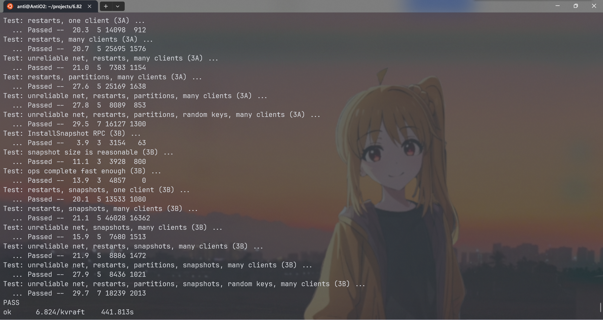

## 目标

通过在Lab2中实现的Raft库，构建一个可容灾的KV数据库。

需要实现的服务有三种操作:

- `Put(key, value)` key和value都是string，put设置指定key的value.
- `Append(key, arg)` 将arg append到key对应的value。上，如果没有该key，相当于put操作。

- `Get(key)` 返回值，如果没有该key，返回空字符串。


**strong consistency**

>  If called one at a time, the Get/Put/Append methods should act as if the system had only one copy of its state, and each call should observe the modifications to the state implied by the preceding sequence of calls. 

需要实现linearizability.


**实验介绍：**

> This lab has two parts. In part A, you will implement the service without worrying that the Raft log can grow without bound. In part B, you will implement snapshots

在A中实现基本功能， B中实现快照。

> We supply you with skeleton code and tests in `src/kvraft`. You will need to modify `kvraft/client.go`, `kvraft/server.go`, and perhaps `kvraft/common.go`.

## Part A: Key/value service without snapshots

> Each of your key/value servers ("kvservers") will have an associated Raft peer. 

每个kv服务器对应一个raft peer。

> Clerks send `Put()`, `Append()`, and `Get()` RPCs to the kvserver whose associated Raft is the leader. 

clerk 将请求发送给raft leader之上的kvserver。然后kvserver将operation的log交给raft leader（通过之前的start）。

>  All of the kvservers execute operations from the Raft log in order, applying the operations to their key/value databases

回想之前的applymsg，kvserver通过raft，获取apply的log，并应用到kv数据库中。

> A `Clerk` sometimes doesn't know which kvserver is the Raft leader. If the `Clerk` sends an RPC to the wrong kvserver, or if it cannot reach the kvserver, the `Clerk` should re-try by sending to a different kvserver. 

Clerk可能判断错误谁是raft的leader，如果发错了rpc，应当充实。

>  If the key/value service commits the operation to its Raft log (and hence applies the operation to the key/value state machine), the leader reports the result to the `Clerk` by responding to its RPC. 

需要commit才能返回clerk的RPC.

>  If the operation failed to commit (for example, if the leader was replaced), the server reports an error, and the `Clerk` retries with a different server.

如果没有commit，应当report error(我认为此处是RPC携带错误信息)。

> Your kvservers should not directly communicate; they should only interact with each other through Raft.

kvserver之前不应当直接交流，而是通过Raft库。（类似于网络分层）。

> You'll need to add RPC-sending code to the Clerk Put/Append/Get methods in `client.go`, and implement` PutAppend()` and `Get()` RPC handlers in `server.go`. These handlers should enter an `Op` in the Raft log using `Start()`;

在`server.go`中实现RPC的handler。

> you should fill in the `Op` struct definition in `server.go` so that it describes a Put/Append/Get operation. Each server should execute `Op` commands as Raft commits them, i.e. as they appear on the `applyCh`. An RPC handler should notice when Raft commits its `Op`, and then reply to the RPC.

当raft提交op时，返回给RPC。


### Client

> You have completed this task when you **reliably** pass the first test in the test suite: "One client".

在没有网络问题的情况下，首先开始实现只有一个客户端的测试了=。

首先看测试用例

```go
func TestBasic3A(t *testing.T) {
	// Test: one client (3A) ...
	GenericTest(t, "3A", 1, 5, false, false, false, -1, false)
}		
```

开启一个客户端，5个服务器，没有RPC fail的情况，服务器不会崩溃，没有网络分区，不需要快照。

在测试里面，通过`Append`，`Get()`,`Put()`函数调用clerk的对应函数，并记录相应的log.

```go
func Get(cfg *config, ck *Clerk, key string, log *OpLog, cli int) string {
    start := time.Now().UnixNano()
    v := ck.Get(key)
    end := time.Now().UnixNano()
    cfg.op()
    if log != nil {
       log.Append(porcupine.Operation{
          Input:    models.KvInput{Op: 0, Key: key},
          Output:   models.KvOutput{Value: v},
          Call:     start,
          Return:   end,
          ClientId: cli,
       })
    }

    return v
}
```


那么首先实现`client.go/Clerk`中的对应接口。

```go
func (ck *Clerk) Get(key string) string {

    // You will have to modify this function.
    commandId := ck.lastAppliedCommandId + 1
    args := GetArgs{
       Key:       key,
       ClientId:  ck.clientId,
       CommandId: commandId,
    }

    serverId := ck.lastFoundLeader
    serverNum := len(ck.servers)
    for ; ; serverId = (serverId + 1) % serverNum {
       var reply GetReply
       ok := ck.servers[serverId].Call("KVServer.Get", &args, &reply)
       if !ok || reply.Err == ErrWrongLeader || reply.Err == ErrTimeout {
          continue
       }
       ck.lastFoundLeader = serverId
       ck.lastAppliedCommandId = commandId
       if reply.Err == ErrNoKey {
          return ""
       }
       return reply.Value
    }
}
```

因为不确定谁是leader，这里采用了循环的方式。如果响应超时，或者不是leader，尝试下一个服务器。

clerk调用了"KVServer.Get",接下来应当实现`KVServer.Get`

### KVServer

```go
type Op struct {
    // Your definitions here.
    // Field names must start with capital letters,
    // otherwise RPC will break.
    OpType    string
    Key       string
    Value     string
    ClientId  int64
    CommandId int
}
```

这里的Op用于交给Raft的log。

```go
type ApplyResult struct {
	ErrMsg Err
	Value  string
	Term   int
}
```

ApplyResult是KV层提交所返回的消息。term用于判断该msg是否有效。

```go
type CommandContext struct {
	CommandId int
	Reply     ApplyResult
}
```

CommandContext中，CommandId指示返回消息的指令序列号。

在KVServer中，先添加了三个字段

```go
type KVServer struct {
    mu sync.Mutex
    me int
    rf *raft.Raft

    applyCh chan raft.ApplyMsg
    dead    int32 // set by Kill()

    maxraftstate int // snapshot if log grows this big

    // Your definitions here.
	clientReply map[int64]CommandContext
	replyChMap  map[int]chan ApplyResult // log的index对应的返回信息。
	lastApplied int
}
```

其中，clientReply存储每个client上一个已经执行完成操作的结果。

replyChMap的key是操作的index，对应一个接受消息的通道。

lastApplied是当前服务器的数据库上最后一次执行命令的index。


这里先判断Get Rpc中的Command是否已经被执行过。

```go
func (kv *KVServer) Get(args *GetArgs, reply *GetReply) {
    
    if clientReply, ok := kv.clientReply[args.ClientId]; ok {
       if args.CommandId == clientReply.CommandId {
          reply.Value = clientReply.Reply.Value
          reply.Err = clientReply.Reply.ErrMsg
          return
       } else if args.CommandId < clientReply.CommandId {
          reply.Err = ErrOutDate // 已经没有了之前执行的记录。
       }
    }
```

然后构造一个op，交给raft

```go
op := Op{
    OpType:    GetOperation,
    Key:       args.Key,
    Value:     "",
    CommandId: args.CommandId,
    ClientId:  args.ClientId,
}
index, term, isLeader := kv.rf.Start(op)
if !isLeader {
    reply.Err = ErrWrongLeader
    return
}
```

接下来思考，raft的start是立即返回的，如何知道该op已经apply呢？这就要使用channel来等待了。可以先创建一个goroutine，用于在kvserver层接收raft层的apply消息，然后通过该apply的index消息，传给在Handler中开启的channel

```go
replyCh := make(chan ApplyMsg)
kv.replyChMap[index] = replyCh
select {
case replyMsg := <-replyCh:
    {
       if term != replyMsg.Term {
          // 已经进入之后的term，leader改变（当前server可能仍然是leader，但是已经是几个term之后了）
          reply.Err = ErrWrongLeader
          return
       } else {
          reply.Value = replyMsg.Value
       }
    }
case <-time.After(KVTimeOut):
    {
       reply.Err = ErrTimeout
       return
    }
}
```

这里解释为什么不能接受`term != replyMsg.Term`

考虑这么一种情况：有三个服务器：A、B、C

首先A在Term1收到GetA请求，并交给RAFT层，index=1。但是此时leader从A变到B，第一个请求可能已经commit了，也可能没有发送给B，B受到另外一个客户端的请求Put(A,1),并且在term2成功提交。此时A的管道接收到index=1的提交信息，但是term改变了。RAFT只能保证term和index都相同时log相同，所以此时发生错误。

接下来考虑：什么时候在handler中创建的管道应当接收到信息呢？应该是在raft发送applyCh的时候。所以我们在KV服务器开始时应当kick out一个协程，专门用于处理applyCh的信息。

```go
func (kv *KVServer) handleApplyMsg() {
    for !kv.killed() {
       applyMsg := <-kv.applyCh
       if applyMsg.CommandValid {
          go kv.applyCommand(applyMsg)
       }
       if applyMsg.SnapshotValid {
          go kv.applySnapshot(applyMsg)
       }
       _, err := DPrintf("Error Apply Msg: [%v]", applyMsg)
       if err != nil {
          return
       }
    }
}
func (kv *KVServer) applyCommand(msg raft.ApplyMsg) {
}

func (kv *KVServer) applySnapshot(msg raft.ApplyMsg) {
}
```

接下来实现applycommand

```go
func (kv *KVServer) applyCommand(msg raft.ApplyMsg) {
    var applyResult ApplyResult
    op := msg.Command.(Op)
    applyResult.Term = msg.CommandTerm
    commandContext, ok := kv.clientReply[op.ClientId]
    if ok && commandContext.CommandId >= op.CommandId {
       // 该指令已经被应用过。
       // applyResult = commandContext.Reply
       return
    }
    switch op.OpType {
    case GetOperation:
       {
          value, ok := kv.kvdb.Get(op.Key)
          if ok {
             applyResult.Value = value
          } else {
             applyResult.Value = ""
             applyResult.ErrMsg = ErrNoKey
          }
       }
    case PutOperation:
       {
          value := kv.kvdb.Put(op.Key, op.Value)
          applyResult.Value = value
       }
    case AppendOperation:
       {
          value := kv.kvdb.Append(op.Key, op.Value)
          applyResult.Value = value
       }
    default:
       DPrintf("Error Op Type %s", op.OpType)
    }
    ch, ok := kv.replyChMap[msg.CommandIndex]
    if ok {
       ch <- applyResult
    }
    kv.clientReply[op.ClientId] = CommandContext{
       CommandId: op.CommandId,
       Reply:     applyResult,
    }
}
```

其中，kvdb就是用map操作实现的kv内存数据库。

### 调试

**关于心跳选择**

在[[MIT6.824\] Spring2021 Lab 2: Raft - AntiO2's Blog](https://blog.antio2.cn/index.php/archives/178/)中，我的RAFT写法是当收到log时不触发心跳，而是在等待固定间隔时发送心跳。这样就会导致`TestSpeed3A`中的操作过慢，因为客户端在上一条操作成功后才会进行下一条，导致但客户端时一条操作的时间必然大于心跳间隔，但是测试中要求一个心跳间隔至少进行3次操作。

所以还是需要在收到log时发送一条信息,但是这样又会导致多个client同时append log时，发送的RPC过多。


于是我想了如下优化：

首先是在TestPersistConcurrent3A测试中，采用每次接收新log都要发送一轮新消息的形式，共发送32104条log

> ... Passed --  21.7  5 32104 1379

在raft的ticker中修改

```go
func (rf *Raft) ticker() {
	rf.mu.Lock()
	rf.setElectionTime()
	rf.mu.Unlock()
	// for append new log
	go func() {
		for rf.killed() == false {
			time.Sleep(rf.heartBeat / 30)
			rf.mu.Lock()
			if rf.status == leader {
				// 如果是leader状态,发送空包
				rf.setElectionTime()
				rf.mu.Unlock()
				rf.appendEntries(false)
				continue
			}
			rf.mu.Unlock()
		}
	}()
	for rf.killed() == false {

		// Your code here to check if a leader election should
		// be started and to randomize sleeping time using
		// time.Sleep().
		time.Sleep(rf.heartBeat)
		rf.mu.Lock()
		if rf.status == leader {
			// 如果是leader状态,发送空包
			rf.setElectionTime()
			rf.mu.Unlock()
			rf.appendEntries(true)
			continue
		}
		if time.Now().After(rf.electionTime) {
			// 如果已经超时， 开始选举
			go rf.startElection()
		}
		rf.mu.Unlock()
	}
}
```

相当于新增加了一个间隔为heartbeat/5的检测，如果有新的log就发送RPC请求，没有就不发送RPC（正常的heartbeat是无论有无新log都要发送）。

再次进行测试，

>     ... Passed --  21.5  5 25873 1623

发送的RPC减少了，而且进行的操作数量也有所提升。（相当于进行了更高频的心跳，但是只有在有新log未同步时，才会触发这种高频心跳）


**关于Data Race**

在多客户端时,因为收到apply msg时,会启动一个apply command的go程,如果多个客户端同时get或put一个key,会导致data race.

解决方法：因为要严格按照log顺序apply，所以应当是直接调用apply command函数，而不是启动go程。

## Part B: Key/value service with snapshots

> The tester passes `maxraftstate` to your `StartKVServer()`. `maxraftstate` indicates the maximum allowed size of your persistent Raft state in bytes (including the log, but not including snapshots). 

maxraftstate指示了Raft最大的logs大小。

> You should compare `maxraftstate` to `persister.RaftStateSize()`. Whenever your key/value server detects that the Raft state size is approaching this threshold, it should save a snapshot using `Snapshot`, which in turn uses `persister.SaveRaftState()`. If `maxraftstate` is -1, you do not have to snapshot. `maxraftstate` applies to the GOB-encoded bytes your Raft passes to `persister.SaveRaftState()`.

当raft的statesize**快要接近**maxraftstate时，使用snapshot制作快照。


首先实现状态机（KV数据库）生成和安装快照

```go
func (kv *KvDataBase) GenSnapshot() []byte {
    w := new(bytes.Buffer)
    encode := gob.NewEncoder(w)
    err := encode.Encode(kv.KvData)
    if err != nil {
       return nil
    }
    return w.Bytes()
}
func (kv *KvDataBase) InstallSnapshot(data []byte) {
    if data == nil || len(data) < 1 { // bootstrap without any state?
       return
    }
    r := bytes.NewBuffer(data)
    encode := gob.NewDecoder(r)
    err := encode.Decode(&kv.KvData)
    if err != nil {
       panic(err.Error())
    }
}
```

在kvserver收到raft层的快照消息后，尝试将快照状态传递给raft,告诉它：我准备应用了。（如果是过期快照就不会应用），然后如果raft应用该快照，就安装。

```go
func (kv *KVServer) applySnapshot(msg raft.ApplyMsg) {
	if kv.rf.CondInstallSnapshot(msg.SnapshotTerm, msg.SnapshotIndex, msg.Snapshot) {
		kv.lastAppliedIndex = msg.SnapshotIndex
		kv.kvdb.InstallSnapshot(msg.Snapshot)
	}
}
```

首先在内存的KV数据库中应用快照，然后告诉raft已经应用了快照。

接下来就要考虑生成快照的时机了。因为append log是并发的，在Start Op时判断是否生成快照感觉不太好，因为此时新的操作还没有被应用到数据库里面。

如果在apply里面生成快照，还能起到阻塞新的操作的作用。感觉是个挺好的选择。

我们还需要维护一个新的`lastApplied int`， 表示制作快照时已经应用的**raft索引**。kvserver在初始化时，应当将lastApplied初始化为snapshot所包含的最后一条索引。

```go
kv.kvdb.Init(persister.ReadSnapshot())
kv.lastAppliedIndex = int(kv.rf.GetLastIncludeIndex())
```

然后在ApplyCommand中，增加制作快照。

```go
kv.lastAppliedIndex = max(kv.lastAppliedIndex, msg.CommandIndex)
if kv.rf.GetRaftStateSize() > kv.maxraftstate {
    kv.rf.Snapshot(msg.CommandIndex, kv.kvdb.GenSnapshot())
}
```

### 调试

**关于生成snapshot的时机**

上面的几行代码已经足够通过3B的前几个测试，但是在TestSnapshotRecoverManyClients3B中出现了问题。

报错`test_test.go:362: logs were not trimmed (56767 > 8*1000)`

在多个客户端时，虽然成功生成了快照，但是出现了这么一种情况：

在apply一个新的操作后，发现raft的size过大，比如是10000，这个时候生成快照，但是新apply的index可能只往前推了几条，比如旧log有167条，其中只有5条被确认apply了，生成快照后还有162条在raft state中。

出现这种情况，可能是apply过慢, 因为snapshot本身要对数据库编码存储，需要耗费比较长的时间，所以不能每次apply都进行一次snapshot操作。

所以应当每隔一段时间进行snapshot操作，而不是每次applycommand都进行。比如目前commit index是100（假设超过了设定的max state），apply index 是0，使用定时器，就可以让kvserver快速apply command。而不是在每次apply之后进行snapshot操作。


**需要修改raft代码**

因为所有的kvserver都能独立生成snapshot,所以可能出现leader尝试发送的log已经不存在于follower的log中的情况，这种时候就需要判断哪些logs是有用的。

```go
if args.PrevLogIndex < lastIncludeIndex {
    // 这里可能出现args.PrevLogIndex < lastIncludeIndex的情况
    // 如果所有的logs都很过时（已经包含在当前快照里面），就都不需要，否则保留新的。

    entryLen := len(args.Entries)

    if args.PrevLogIndex+IndexT(entryLen) <= lastIncludeIndex {
       rf.logger.Printf("[%d] receive outdated logs before snapshot", rf.me)
       reply.Success = true
       reply.Conflict = false
       rf.logLatch.RUnlock()
       return
    }
    trim := lastIncludeIndex - args.PrevLogIndex // 多余的部分
    // args.PrevLogIndex+IndexT(entryLen) > lastIncludeIndex
    //     IndexT(entryLen) > trim
    args.PrevLogIndex = args.Entries[trim-1].Index
    args.PrevLogTerm = args.Entries[trim-1].Term
    args.Entries = args.Entries[trim:]
}
```

因为这个问题在Lab2D中没有出现，所以当时没有发现这个bug。


**snapshot的内容：**

保存对client的历史回复也应当被保存在snapshot的快照中。


**关于重复的Put/Append**

当putappend重复时，也应当返回。这样client才能更新commandid

因为在不可靠网络环境下，可能已经进行了更新操作，但是没有及时返回，clerk再次尝试请求，此时结果已经存放好了。


