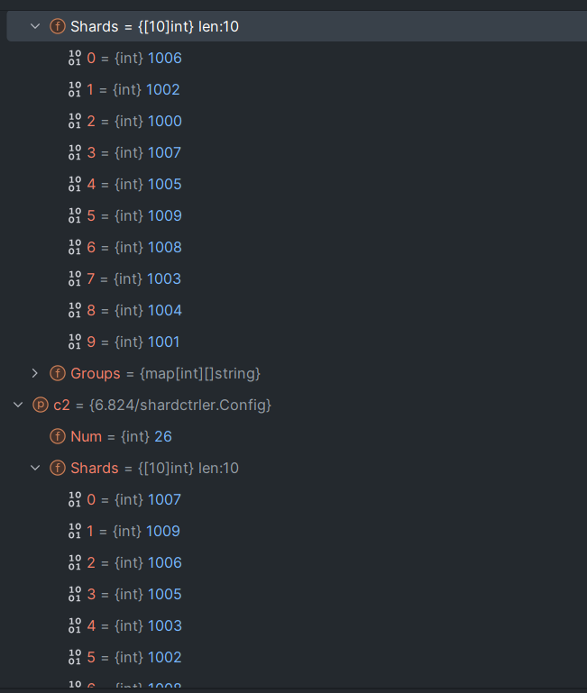
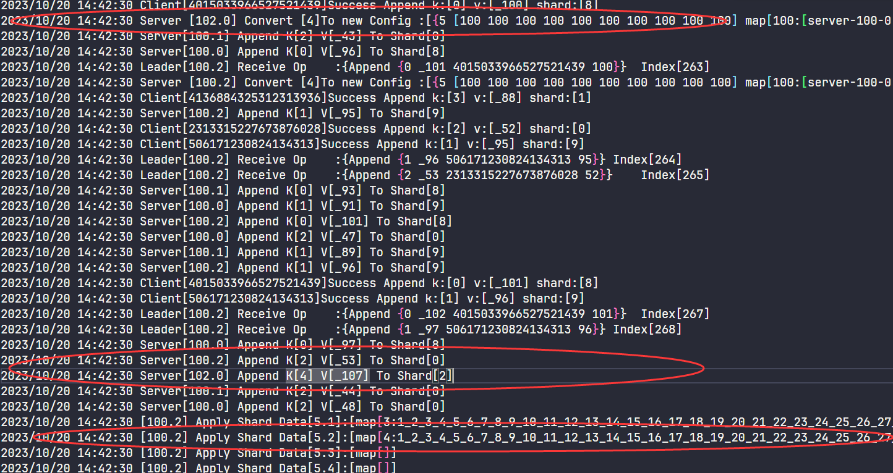
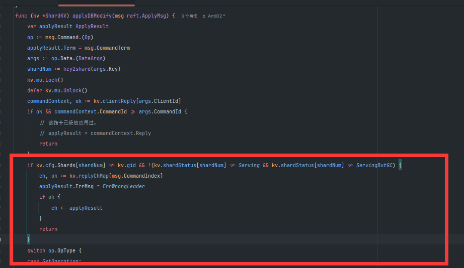
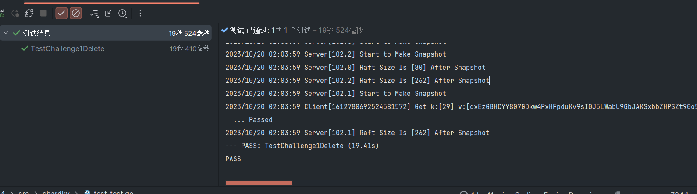

## Part A: The Shard controller

> This lab uses "configuration" to refer to the assignment of shards to replica groups. This is not the same as Raft cluster membership changes. You don't have to implement Raft cluster membership changes.

通过配置，来分配分片给不同的服务器组.一组服务器通过gid(group identifiers )来唯一标识。

```go
type Config struct {
    Num    int              // config number
    Shards [NShards]int     // shard -> gid
    Groups map[int][]string // gid -> servers[]
}
```

Num: 当前的配置编号，初始化为0，随着每次修改配置递增。

`Shards [NShards]` 存储每个shard被分配给哪组服务器工作。

`Groups map[int][]string` 存储gid对应的服务器列表。

### 复用代码

通过Lab3中类似的代码开始。

设置常量：这里其实可以用int，但是为了调试方便，使用字符串

```go
type OpTypeT string

const (
	OpJoin  OpTypeT = "OP_JOIN"
	OpLeave         = "OP_LEAVE"
	OpMove          = "OP_MOVE"
	OpQuery         = "OP_QUERY"
)

```

操作的结构体，发送给RAFT

```go
type Op struct {
    // Your data here.
    OpType    OpTypeT
    OpArgs    interface{}
    CommandId int
    ClientId  int64
}
```

服务器的applymsg根据回复内容不同进行改变

```go
type ApplyResult struct {
	WrongLeader bool
	Err         Err
	Cfg         Config
	Term        int
}
type CommandContext struct {
	CommandId int
	Reply     ApplyResult
}

type ShardCtrler struct {
	mu      sync.Mutex
	me      int
	rf      *raft.Raft
	applyCh chan raft.ApplyMsg

	// Your data here.
	configs     []Config // indexed by config num
	clientReply map[int64]CommandContext
	replyChMap  map[int]chan ApplyResult // log的index对应的返回信息。
	ConfigIdNow int
	freeGid     []int // 空闲的gid
}
```

随后开始初始化服务器。

```go
func StartServer(servers []*labrpc.ClientEnd, me int, persister *raft.Persister) *ShardCtrler {
	sc := new(ShardCtrler)
	sc.me = me

	sc.configs = make([]Config, 1)
	sc.configs[0].Groups = map[int][]string{}

	labgob.Register(Op{})
	labgob.Register(QueryArgs{})
	labgob.Register(LeaveArgs{})
	labgob.Register(JoinArgs{})
	labgob.Register(MoveArgs{})
	sc.applyCh = make(chan raft.ApplyMsg)
	sc.rf = raft.Make(servers, me, persister, sc.applyCh)

	// Your code here.
	sc.clientReply = make(map[int64]CommandContext)
	sc.replyChMap = make(map[int]chan ApplyResult)
	sc.freeGid = make([]int, 1)
	sc.freeGid[0] = 1
	go sc.handleApplyMsg()
	return sc
}

func (sc *ShardCtrler) handleApplyMsg() {

}
```

因为query要根据之前的index进行指定config的查询，所以不用进行快照压缩。

apply msg也只需要处理命令就好了

```go
func (sc *ShardCtrler) handleApplyMsg() {
    for !sc.Killed() {
       applymsg := <-sc.applyCh
       if applymsg.CommandValid {
          sc.applyCommand(applymsg)
       }
       panic("Invalid Apply Msg")
    }
}

func (sc *ShardCtrler) Killed() bool {
    return false
}

func (sc *ShardCtrler) applyCommand(applymsg raft.ApplyMsg) {
	var applyResult ApplyResult
	op := applymsg.Command.(Op)
	applyResult.Term = applymsg.CommandTerm
	switch op.OpType {
	case OpJoin:
		{
			args := op.OpArgs.(JoinArgs)
			sc.applyJoin(&args, &applyResult)
		}
	case OpLeave:
		{
			args := op.OpArgs.(LeaveArgs)
			sc.applyLeave(&args, &applyResult)
		}
	case OpMove:
		{
			args := op.OpArgs.(MoveArgs)
			sc.applyMove(&args, &applyResult)
		}
	case OpQuery:
		{
			args := op.OpArgs.(QueryArgs)
			sc.applyQuery(&args, &applyResult)
		}
	default:
		DPrintf("Error Op Type %v", op.OpType)
	}
	ch, ok := sc.replyChMap[applymsg.CommandIndex]
	if ok {
		ch <- applyResult
	}
	sc.clientReply[op.ClientId] = CommandContext{
		CommandId: op.CommandId,
		Reply:     applyResult,
	}
}
```

具体不同的操作在下面实现。

### Join

join操作添加**一组** 服务器组，

```go
type JoinArgs struct {
    Servers map[int][]string // new GID -> servers mappings
}

type JoinReply struct {
    WrongLeader bool
    Err         Err
}
```

尝试将该GID加入到配置中。并且重新平衡分片。

> The new configuration should divide the shards as evenly as possible among the full set of groups, and should move as few shards as possible to achieve that goal. 

shards应当尽可能平衡分给不同的服务器组，并且这个目标应当尽可能少的移动分片。

比如之前有6个分片，分配给两个服务器组，分别得到分片`1 2 3` 和`4 5 6`， 现在加入一组新的服务器，最少移动的分片数量是2。

> The shardctrler should allow re-use of a GID if it's not part of the current configuration (i.e. a GID should be allowed to Join, then Leave, then Join again).

GID应当被复用，比如之前有GID:`1 2 3`,然后2离开，此时再加入一组新的服务器，可以分配GID为2或者4。（我的理解是通过一个队列，存储可能分配的gid），比如当2离开，就将2加入该队列。如果该队列为空，就将一个更大的gid加入，比如，已有groups的id为`3 1 2`, 下一个可能的GID是4.


Join RPC结构和之前的KV Server一致

```go
func (sc *ShardCtrler) Join(args *JoinArgs, reply *JoinReply) {
	// Your code here.
	sc.mu.Lock()
	if clientReply, ok := sc.clientReply[args.ClientId]; ok {
		if clientReply.CommandId == args.CommandId {
			reply.WrongLeader = clientReply.Reply.WrongLeader
			reply.Err = clientReply.Reply.Err
			sc.mu.Unlock()
			return
		} else if args.CommandId < clientReply.CommandId {
			reply.Err = ErrOutDate // 已经没有了之前执行的记录。
			sc.mu.Unlock()
			return
		}
	}
	sc.mu.Unlock()
	op := Op{
		OpType:    OpJoin,
		OpArgs:    *args,
		ClientId:  args.ClientId, // 这里冗余信息
		CommandId: args.CommandId,
	}
	index, term, isLeader := sc.rf.Start(op)
	if !isLeader {
		reply.WrongLeader = true
		return
	}
	DPrintf("Leader[%d] Receive Op\t:%v\tIndex[%d]", sc.me, op, index)
	replyCh := make(chan ApplyResult, 1)
	sc.mu.Lock()
	sc.replyChMap[index] = replyCh
	sc.mu.Unlock()
	select {
	case replyMsg := <-replyCh:
		{
			if term != replyMsg.Term {
				reply.WrongLeader = true
			} else {
				reply.Err = replyMsg.Err
				reply.WrongLeader = false
			}
		}
	case <-time.After(scTimeOut):
		{
			reply.WrongLeader = true
		}
	}
	go sc.CloseIndexCh(index)
}
```

为了应用join操作带来的改变，创建一个新的Config，并对该Config进行操作

```go
func (sc *ShardCtrler) applyJoin(args *JoinArgs, result *ApplyResult) {
	sc.mu.Lock()
	defer sc.mu.Unlock()
	newConfig := Config{}
	newConfig.Num = sc.ConfigIdNow + 1
	newConfig.Groups = make(map[int][]string)
	prevConfig := sc.configs[sc.ConfigIdNow]
	for key, value := range prevConfig.Groups {
		// copy map
		newConfig.Groups[key] = value
	}
	for i, gid := range prevConfig.Shards {
		// copy shard
		newConfig.Shards[i] = gid
	}
	for gid, servers := range args.Servers {
		newConfig.Groups[gid] = servers
	}
	sc.reBalanceShard(&newConfig)
	sc.ConfigIdNow = newConfig.Num
	sc.configs = append(sc.configs, newConfig)
	result.WrongLeader = false
	result.Err = ""
}
```

接下来考虑如何重新分配Shard。

1. 假如目前没有任何Group，并加入了一个新的Group，直接将所有的shard分配给它。

```go
	groupsNum := len(config.Groups)-1 // 有效的group数量
	if groupsNum ==0 {
		return
	}
	if groupsNum==1 {
		// 将所有的分片分配给该group
		for key,_:=range config.Groups {
			if key!=0 {
				for i:=0; i <10;i++ {
					config.Shards[i] = key
				}
			}
			return
		}
	}
```

2. 如果已有group，就需要进行分片移动操作。这里为了移动次数最少，首先要计算分片完全分配后，最少要多少shard，最多不能超过多少。比如10个分片，之前有两个groups,各分配5个分片，之后再加入一个新的Group进行平衡

   - 首先10/3 = 3 ，最少承担3个分片。大于等于3个分片的不会再得到新的分片。

   - 但是还有余数，有的group需要承担额外1个分片，也即`sMax = 4`
   - 也就是说，首先我们要将分配分片数大于sMax的group中的一些分片移动给不到sMin的group
   - 如果大于sMax的用完了，比如10个分片之前是`5 5 0`分配，按照sMax为上限分配为`4 4 2`, 此时就要从等于sMax中拿出shard分配。
   - 所以group的数量有如下状态
     - 无效： 当gid=0, 或者group leave导致shard分配给了无效的gid
     - shard不足：当shard< smin。需要记录
     - shard刚好：当shard=smin 需要记录记录
     - shard太多：当shard > smax。优先剥夺这种group的。需要记录
     - shard有点小多，备用：当shard=smax,当上一种状态的group没有了
   - 重新分配：
     - 承担shard不足的group将获得额外的shard直到sMin
     - 优先级 无效gid->过多的shard->备用的shard

moveShard目前只更改`config.Shards`的分配，之后应该要移动分区。

在重新平衡的函数中，还要考虑特殊情况。

如果ShardNum < GroupNum。也就是分区数量小于服务器组数。这种情况sMin = 0, sMax = 1。也就是说所有服务器都满足了最低要求，不会进入重新分配环节。

但是比如12个分片分给6组服务器，此时去掉一个服务器组，此时`sMin=12/5=2`,所有服务器都满足最低要求，但是还有两个分片是无效的未分配状态。所以，我们在满足了最低要求后（通常是新服务器JOIN请求导致的），还要将无效的分片分配给刚好到达SMin的服务器组（通常在Leave时产生）

```go
/*
*
reBalanceShard 重新分配Shard给不同的GID
*/
func (sc *ShardCtrler) reBalanceShard(config *Config) {
	groupsNum := len(config.Groups) // 有效的group数量
	if groupsNum == 0 {
		return
	}
	if groupsNum == 1 {
		// 将所有的分片分配给该group
		for key, _ := range config.Groups {
			if key != 0 {
				for i := 0; i < 10; i++ {
					config.Shards[i] = key
				}
			}
			return
		}
	}
	sMin := NShards / groupsNum // 每个group最少的shard数量
	sMax := sMin                // 最多的shard数量，比如10个shard分配给3个group, 可以分配为 3 3 4
	if NShards%groupsNum > 0 {
		sMax++
	}
	type groupShard struct {
		gid      int
		shardNum int
	}
	assignShards := make(map[int][]int)   // 记录每个group初始有哪些shard
	invalidQueue := make([]groupShard, 0) // 即将leave的shard
	lowerQueue := make([]groupShard, 0)   // 记录过少的group
	upperQueue := make([]groupShard, 0)   // 记录过多的group
	maxBackupQueue := make([]int, 0)      // 记录刚好到达smax,备用的gid
	minBackupQueue := make([]int, 0)      // 记录刚好到达smin,备用的gid
	for key, _ := range config.Groups {
		if key != 0 {
			// 初始化有效的gid所含有的shard统计数组
			assignShards[key] = make([]int, 0)
		}
	}
	for shard, gid := range config.Shards {
		shardsList, ok := assignShards[gid]
		if ok {
			assignShards[gid] = append(shardsList, shard) // 统计该gid分配的shards
		} else {
			// 该gid无效（已经leave了）
			invalidQueue = append(invalidQueue, groupShard{
				gid:      gid,
				shardNum: shard,
			})
		}
	}
	for gid, shards := range assignShards {

		l := len(shards)
		if l > sMax {
			upperQueue = append(upperQueue, groupShard{
				gid:      gid,
				shardNum: l,
			})
		}
		if l == sMax {
			maxBackupQueue = append(maxBackupQueue, gid)
		}
		if l == sMin {
			minBackupQueue = append(minBackupQueue, gid)
		}
		if l < sMin {
			lowerQueue = append(lowerQueue, groupShard{
				gid:      gid,
				shardNum: l,
			})
		}
	}
	for i, groupInfo := range lowerQueue {
		// 先保证满足smin(join情况)
		for lowerQueue[i].shardNum < sMin {
			if len(invalidQueue) > 0 {
				sc.moveShard(invalidQueue[0].gid, groupInfo.gid, invalidQueue[0].shardNum, config)
				invalidQueue = invalidQueue[1:]
				lowerQueue[i].shardNum++
				continue
			}
			if len(upperQueue) > 0 {
				sc.moveShard(upperQueue[0].gid, groupInfo.gid, assignShards[upperQueue[0].gid][0], config)
				assignShards[upperQueue[0].gid] = assignShards[upperQueue[0].gid][1:]
				upperQueue[0].shardNum--
				if upperQueue[0].shardNum == sMax {
					maxBackupQueue = append(maxBackupQueue, upperQueue[0].gid)
					upperQueue = upperQueue[1:]
				}
				lowerQueue[i].shardNum++
				continue
			}
			if len(maxBackupQueue) > 0 {
				// 从backup里面填
				sc.moveShard(maxBackupQueue[0], groupInfo.gid, assignShards[maxBackupQueue[0]][0], config)
				assignShards[maxBackupQueue[0]] = assignShards[maxBackupQueue[0]][1:]
				maxBackupQueue = maxBackupQueue[1:]
				lowerQueue[i].shardNum++
				continue
			}
			DPrintf("Cant Equally ReBalance")
			return
		}
		if lowerQueue[i].shardNum == sMin {
			minBackupQueue = append(minBackupQueue, groupInfo.gid)
		}
	}
	for _, invalidShard := range invalidQueue {
		if len(minBackupQueue) > 0 {
			sc.moveShard(invalidShard.gid, minBackupQueue[0], invalidShard.shardNum, config)
			minBackupQueue = minBackupQueue[1:]
		}
		log.Println("Can't assign invalidShard")
	}

}

/*
*
将shard从一个gid移动到另外一个gid
*/
func (sc *ShardCtrler) moveShard(gidBefore int, gidAfter int, shardNum int, config *Config) {
    config.Shards[shardNum] = gidAfter
}
```

### Leave

> The `Leave` RPC's argument is a list of GIDs of previously joined groups. The shardctrler should create a new configuration that does not include those groups, and that assigns those groups' shards to the remaining groups. The new configuration should divide the shards as evenly as possible among the groups, and should move as few shards as possible to achieve that goal.

去掉某个gid的group，并重新分配

和applyJoin比较像，但是将添加服务器的操作，变为删除服务器组的操作。

```go
func (sc *ShardCtrler) applyLeave(args *LeaveArgs, result *ApplyResult) {
	sc.mu.Lock()
	defer sc.mu.Unlock()
	newConfig := Config{}
	newConfig.Num = sc.ConfigIdNow + 1
	newConfig.Groups = make(map[int][]string)
	prevConfig := sc.configs[sc.ConfigIdNow]
	for key, value := range prevConfig.Groups {
		// copy map
		newConfig.Groups[key] = value
	}
	for i, gid := range prevConfig.Shards {
		// copy shard
		newConfig.Shards[i] = gid
	}
	for _, gid := range args.GIDs {
		delete(newConfig.Groups, gid)
	}
	sc.reBalanceShard(&newConfig)
	sc.ConfigIdNow = newConfig.Num
	sc.configs = append(sc.configs, newConfig)
	result.WrongLeader = false
	result.Err = ""
}

```

### Move

> The `Move` RPC's arguments are a shard number and a GID. The shardctrler should create a new configuration in which the shard is assigned to the group. The purpose of `Move` is to allow us to test your software. A `Join` or `Leave` following a `Move` will likely un-do the `Move`, since `Join` and `Leave` re-balance.

move操作是不需要我们自己去重新平衡的。相当于 **测试**故意去移动分片，然后通过Join或者Leave来重新平衡。

还是大同小异的代码

```go
func (sc *ShardCtrler) applyMove(args *MoveArgs, result *ApplyResult) {
	sc.mu.Lock()
	defer sc.mu.Unlock()
	newConfig := Config{}
	newConfig.Num = sc.ConfigIdNow + 1
	newConfig.Groups = make(map[int][]string)
	prevConfig := sc.configs[sc.ConfigIdNow]
	for key, value := range prevConfig.Groups {
		// copy map
		newConfig.Groups[key] = value
	}
	for i, gid := range prevConfig.Shards {
		// copy shard
		newConfig.Shards[i] = gid
	}
	sc.moveShard(prevConfig.Shards[args.Shard], args.GID, args.Shard, &newConfig)
	sc.ConfigIdNow = newConfig.Num
	sc.configs = append(sc.configs, newConfig)
	result.WrongLeader = false
	result.Err = ""
}

```

### Query

query相当于一个get操作，直接返回对应的config就好了

```go
func (sc *ShardCtrler) applyQuery(args *QueryArgs, result *ApplyResult) {
	sc.mu.Lock()
	defer sc.mu.Unlock()
	queryNum := args.Num
	if queryNum == -1 || queryNum > sc.ConfigIdNow {
		queryNum = sc.ConfigIdNow
	}
	result.Cfg = sc.configs[queryNum]
	result.WrongLeader = false
	result.Err = ""
}
```

### Clerk

和kvraft的clerk逻辑相似。

```go
func (ck *Clerk) Query(num int) Config {
    commandId := ck.lastAppliedCommandId + 1
    args := &QueryArgs{}
    // Your code here.
    args.Num = num
    args.ClientId = ck.clientId
    args.CommandId = commandId
    serverId := ck.lastFoundLeader
    serverNum := len(ck.servers)
    for ; ; serverId = (serverId + 1) % serverNum {
       // try each known server.
       DPrintf("Client Send [%v] Query Op:[%v]", serverId, args)
       var reply QueryReply
       ok := ck.servers[serverId].Call("ShardCtrler.Query", args, &reply)
       if ok && reply.WrongLeader == false {
          DPrintf("Client[%d] Success Query:[%v] ValueL[%v]", ck.clientId, args.Num, reply.Config)
          ck.lastFoundLeader = serverId
          ck.lastAppliedCommandId = commandId
          return reply.Config
       }
       time.Sleep(100 * time.Millisecond)
    }
}

func (ck *Clerk) Join(servers map[int][]string) {

    args := &JoinArgs{}
    // Your code here.
    args.Servers = servers
    commandId := ck.lastAppliedCommandId + 1
    args.ClientId = ck.clientId
    args.CommandId = commandId
    serverId := ck.lastFoundLeader
    serverNum := len(ck.servers)
    for ; ; serverId = (serverId + 1) % serverNum {
       // try each known server.
       DPrintf("Client Send [%v] Join Op:[%v]", serverId, args)
       var reply JoinReply
       ok := ck.servers[serverId].Call("ShardCtrler.Join", args, &reply)
       if ok && reply.WrongLeader == false {
          DPrintf("Client[%d] Success Join:[%v][%v]", ck.clientId, args.Servers)
          ck.lastFoundLeader = serverId
          ck.lastAppliedCommandId = commandId
          return
       }
       time.Sleep(100 * time.Millisecond)
    }
}

func (ck *Clerk) Leave(gids []int) {
    args := &LeaveArgs{}
    // Your code here.
    args.GIDs = gids
    commandId := ck.lastAppliedCommandId + 1
    args.ClientId = ck.clientId
    args.CommandId = commandId
    serverId := ck.lastFoundLeader
    serverNum := len(ck.servers)
    for ; ; serverId = (serverId + 1) % serverNum {
          DPrintf("Client Send [%v] Leave Op:[%v]", serverId, args)
          var reply LeaveReply
          ok :=ck.servers[serverId].Call("ShardCtrler.Leave", args, &reply)
          if ok && reply.WrongLeader == false {
             DPrintf("Client[%d] Success Leave:[%v]", ck.clientId, args.GIDs)
             ck.lastFoundLeader = serverId
             ck.lastAppliedCommandId = commandId
             return
          }
       }
       time.Sleep(100 * time.Millisecond)
    }
}

func (ck *Clerk) Move(shard int, gid int) {
    args := &MoveArgs{}
    // Your code here.
    args.Shard = shard
    args.GID = gid

    commandId := ck.lastAppliedCommandId + 1
    args.ClientId = ck.clientId
    args.CommandId = commandId
    serverId := ck.lastFoundLeader
    serverNum := len(ck.servers)

    for ; ; serverId = (serverId + 1) % serverNum {
       // try each known server.
       DPrintf("Client Send [%v] Join Move: GID[%v] SHARD[%v]", serverId, args.GID, args.Shard)
       var reply MoveReply
       ok := ck.servers[serverId].Call("ShardCtrler.Move", args, &reply)
       if ok && reply.WrongLeader == false {
          DPrintf("Client[%d] Success Move GID[%v] SHARD[%v]", ck.clientId,  args.GID, args.Shard)
          ck.lastFoundLeader = serverId
          ck.lastAppliedCommandId = commandId
          return
       }
       time.Sleep(100 * time.Millisecond)
    }
}
```

### 调试

注意：测试的时候shard顺序必须是确定的。

也就是说

> - The code in your state machine that performs the shard rebalancing needs to be deterministic. In Go, map iteration order is [not deterministic](https://blog.golang.org/maps#TOC_7.).

一开始没有理解这个提示什么意思。但是测试出错：



查询的两个服务器的Config 分片不同。这不是因为log同步问题。问题在于log确实同步了，但是log是逻辑log而不是物理log。

就是说服务器A收到了Join的请求并Commit，服务器也Apply该Join，相同的Join因为Go map迭代顺序不一致而操作的结果不同。

一段log如下

```go
2023/10/11 23:07:48 [0] Join Config:[{1 [1 1 1 1 1 2 2 2 2 2] map[1:[x y z] 2:[a b c]]}]
2023/10/11 23:07:48 [2] Join Config:[{1 [2 2 2 2 2 1 1 1 1 1] map[1:[x y z] 2:[a b c]]}]
2023/10/11 23:07:48 [1] Join Config:[{1 [1 1 1 1 1 2 2 2 2 2] map[1:[x y z] 2:[a b c]]}]
```


解决方法参考[Go maps in action - The Go Programming Language](https://go.dev/blog/maps#TOC_7.)的最下面

> ## Iteration order
>
> When iterating over a map with a range loop, the iteration order is not specified and is not guaranteed to be the same from one iteration to the next. If you require a stable iteration order you must maintain a separate data structure that specifies that order. This example uses a separate sorted slice of keys to print a `map[int]string` in key order:
>
> ```go
> import "sort"
> 
> var m map[int]string
> var keys []int
> for k := range m {
>  keys = append(keys, k)
> }
> sort.Ints(keys)
> for _, k := range keys {
>  fmt.Println("Key:", k, "Value:", m[k])
> }
> ```

我们在rebalance中，需要先排序key，再进行操作。因为我使用了多个queue, 要保证queue中数据相同，只要保证遍历计数器map时的顺序相同就行了。

```go
assignGids := make([]int, 0)
for gid := range assignShards {
    assignGids = append(assignGids, gid)
}
sort.Ints(assignGids)
for _, gid := range assignGids {
    shards := assignShards[gid]
    l := len(shards)
    if l > sMax {
       upperQueue = append(upperQueue, groupShard{
          gid:      gid,
          shardNum: l,
       })
    }
    if l == sMax {
       maxBackupQueue = append(maxBackupQueue, gid)
    }
    if l == sMin {
       minBackupQueue = append(minBackupQueue, gid)
    }
    if l < sMin {
       lowerQueue = append(lowerQueue, groupShard{
          gid:      gid,
          shardNum: l,
       })
    }
}
```

## Part B: Sharded Key/Value Server

构建一个shardkv system.

使用提供的这个函数（类似于哈希）来决定某个key分配给哪个分片中。

```go
func key2shard(key string) int {
    shard := 0
    if len(key) > 0 {
       shard = int(key[0])
    }
    shard %= shardctrler.NShards
    return shard
}
```


`shardctrler` 负责将分片分配给服务器（gid），当分配发生变化，分片在不同的组之间移动。

实现应当提供线性一致性（在lab3中，这一特性通过raft提交get请求实现）。

> A shardkv server is a member of only a single replica group. The set of servers in a given replica group will never change.

一个shardkv **只能属于一个**replica group, 也就是说一个服务器不能同时属于多个group。第二句话意思是：一个服务器组中有哪些服务器是不会变的。

> We supply you with `client.go` code that sends each RPC to the replica group responsible for the RPC's key. It re-tries if the replica group says it is not responsible for the key; in that case, the client code asks the shard controller for the latest configuration and tries again. You'll have to modify client.go as part of your support for dealing with duplicate client RPCs, much as in the kvraft lab.

在client中，代码尝试将RPC发送给client **认为**负责任的group。如果该group实际上不负责这个key，那么就使用Lab4A里面的`Query(-1)`获取到该shard属于哪个gid的最新消息。


### Basic

#### Client

初步设计clerk如下

```go
type Clerk struct {
	sm       *shardctrler.Clerk
	config   shardctrler.Config
	make_end func(string) *labrpc.ClientEnd // 通过服务器名 （比如server1_a） 获得对应的client end
	// You will have to modify this struct.
	lastAppliedCommandId int         // 最后一次command的id
	groupLeader          map[int]int // 缓存上次看到的某个gid对应的leader是谁。
	clientId             int64       // 可以考虑复用sm clerk的id?
}

// the tester calls MakeClerk.
//
// ctrlers[] is needed to call shardctrler.MakeClerk().
//
// makeEnd(servername) turns a server name from a
// Config.Groups[gid][i] into a labrpc.ClientEnd on which you can
// send RPCs.
func MakeClerk(ctrlers []*labrpc.ClientEnd, make_end func(string) *labrpc.ClientEnd) *Clerk {
	ck := new(Clerk)
	ck.sm = shardctrler.MakeClerk(ctrlers)
	ck.make_end = make_end
	// You'll have to add code here.
	ck.lastAppliedCommandId = 0
	ck.clientId = nrand()
	ck.config = shardctrler.Config{
		Num:    0,
		Shards: [10]int{},
		Groups: nil,
	}
	ck.groupLeader = make(map[int]int)
	return ck
}
```

其中，config用于缓存上次看到的Config。ck.groupLeader用于缓存某个group对应的leader。


然后和之前一样，在请求参数中添加clientid和commandId用于去除重复的RPC。

```go
ClientId  int64
CommandId int
```

客户端的`PutAppend(key string, value string, op string) `和`Get(key string)`在已提供代码上增加clientId和commandId，以及优化一下leader查找就好。

```go
func (ck *Clerk) Get(key string) string {

	commandId := ck.lastAppliedCommandId + 1
	args := GetArgs{
		Key:       key,
		CommandId: commandId,
		ClientId:  ck.clientId,
	}
	for {
		shard := key2shard(key)
		gid := ck.config.Shards[shard]
		if servers, ok := ck.config.Groups[gid]; ok {
			// try each server for the shard.
			si := ck.groupLeader[gid] // 小优化： 使用上次发现的group leader
			sn := len(servers)
			for ; ; si = (si + 1) % sn {
				srv := ck.make_end(servers[si])
				var reply GetReply
				ok := srv.Call("ShardKV.Get", &args, &reply)
				if ok && (reply.Err == OK || reply.Err == ErrNoKey) {
					ck.lastAppliedCommandId = commandId
					ck.groupLeader[gid] = si
					DPrintf("Client[%v] Get k:[%v] v:[%v]", ck.clientId, key, reply.Value)
					return reply.Value
				}
				if ok && (reply.Err == ErrWrongGroup) {
					break
				}
				// ... not ok, or ErrWrongLeader
			}
		}
		time.Sleep(100 * time.Millisecond)
		// ask controler for the latest configuration.
		ck.config = ck.sm.Query(-1)
	}
	return ""
}

// shared by Put and Append.
// You will have to modify this function.
func (ck *Clerk) PutAppend(key string, value string, op string) {
    commandId := ck.lastAppliedCommandId + 1
    args := PutAppendArgs{
       Key:       key,
       Value:     value,
       Op:        op,
       ClientId:  ck.clientId,
       CommandId: commandId,
    }

    for {
       shard := key2shard(key)
       gid := ck.config.Shards[shard]
       if servers, ok := ck.config.Groups[gid]; ok {
          si := ck.groupLeader[gid] // 小优化： 使用上次发现的group leader
          sn := len(servers)
          for ; ; si = (si + 1) % sn {
             srv := ck.make_end(servers[si])
             var reply PutAppendReply
             ok := srv.Call("ShardKV.PutAppend", &args, &reply)
             if ok && reply.Err == OK {
                ck.lastAppliedCommandId = commandId
                ck.groupLeader[gid] = si
                return
             }
             if ok && reply.Err == ErrWrongGroup {
                break
             }
             // ... not ok, or ErrWrongLeader
          }
       }
       time.Sleep(100 * time.Millisecond)
       // ask controler for the latest configuration.
       ck.config = ck.sm.Query(-1)
    }
}
```

### Server

首先把Lab3中的KVserver复制过来。接下来要考虑：服务器如何知道当前是否对某个shard负责？

> Your server will need to periodically poll the shardctrler to learn about new configurations. The tests expect that your code polls roughly every 100 milliseconds; more often is OK, but much less often may cause problems.

启动一个协程，周期性地询问配置，如果观察到发生了改变，进行move shard操作。

在Server的Get和PutAppend操作前面，加上判断是否有该Shard的操作：

```go
shard := key2shard(args.Key)
if kv.cfg.Shards[shard] != kv.gid {
    reply.Err = ErrWrongGroup
    return
}
```

#### 发现新Config

如果观察到配置改变怎么办呢？

首先，肯定不能一观察到分区移动就立刻进行移动操作。

考虑这么一种情况：

- 客户端已经发送5个put请求并得到返回。
- 一旦put请求得到返回，说明已经被apply了。
- 如果有已经commit但是还没有apply的log，并且这些log包含将要被移动的分区。那么如果在此时发送数据给新负责的服务器组，是不包含这些commit的数据的。但是在之后这些log又会被apply，导致丢失数据。

另一种情景：

- 假如group一开始不负责key=1。在某个时刻修改配置。
- 此时map中没有key=1的键值对
- 一个新请求到达，请求get key=1
- 返回出错，因为其他group可能还没有来得及发送key=1的键值对给该group。


另一个问题：group中的follower需要观察config变化吗？

应该是不需要的。leader观察，然后通过log的方式同步就行了。


```go
func (kv *ShardKV) fetchNewConfig() {
	newCfg := kv.mck.Query(-1)
	kv.mu.RLock()

	if newCfg.Num > kv.cfg.Num {
		kv.mu.RUnlock()
		// 配置发生了变化，检查自己不负责哪些shard了。
		op := Op{
			OpType: NewConfig,
			Data:   newCfg,
		}
		kv.mu.Lock()
		if _, isLeader := kv.rf.GetState(); isLeader {
			kv.rf.Start(op)
		}
		kv.mu.Unlock()
		return
	}
	kv.mu.RUnlock()
}

```


#### 改变分片存储方式

那么分片移动时，应当包含哪些数据呢？

考虑一个情景：

- 存在Group1,Group2。Group1一开始负责分片1.
- Client发送Append给G1，G1成功将这个键值对应用到KVDB中，但是回复给Client的信息丢包了。
- 分片1从G1转移到G2。
- Client再次尝试Put，G1回复ERR_GROUP。于是Client更新配置。并且发送Append操作给G2。
- 如果不改进我们的Server的话，就出现重复Append的问题了。
- 所以分片数据也应当包含对客户端的回复。

```go
type ShardData struct {
    ShardNum    int                      // shard的编号
    KvDB        KvDataBase               // 数据库
    ClientReply map[int64]CommandContext // 该shard中，缓存回复client的内容。
}
```

所以当分片移动时，不仅仅是键值对，保存的回复也应当移动到新的group。

#### 分片迁移

这里我们只先考虑： Group A的某个分片（这里叫作s1）需要迁移到Group B。并且Group A不会清理s1。

书接**apply 新config **, 此时，不再属于A的分片已经对外不可用了。如果B发现了自己应该应用该分片，也暂时不能再提供该分片，直到A发送S1给B。

此时我们有两种思路：

1. `A.leader`启动一个daemon，发现了应当发送的S1，并**push**给B
2. `B.leader`的daemon发现自己缺少S1，向A发送**pull**请求。

感觉这两种其实差不多的。第一种，如果一开始没找到B的leader，会发送多个包含数据的RPC。第二种，如果一开始没Pull到A的leader，再次发送的RPC包只包含请求的shard编号信息和config编号。所以我感觉pull的方式可能要好些。


这里先设计了几个状态。

|                       | Server目前负责shard | Server目前不负责该shard        |
| --------------------- | ------------------- | ------------------------------ |
| Server目前拥有shard   | 正常服务。          | config改变，该server等待被pull |
| Server目前没有该shard | 尝试Pull其他Server  | 与我无关                       |

目前还没有引入垃圾回收，所以Server暂时不需要清理已经被Pull的分片。

```go
type ShardStatus string

const (
	Invalid      ShardStatus = "Invalid"
	Serving      ShardStatus = "Serving"
	Pulling      ShardStatus = "Pulling"
	WaitPull     ShardStatus = "WaitPull"
	ServingButGC ShardStatus = "ServingButGC"
)
```


然后Pull Data协程定时查看目前还有哪些分片没有，向对应的GID发起Pull请求。注意，Pull到之后也应该将Data通过Log的形式发送给Raft。Raft Apply这个包含分区的log之后，就可以将状态从Pulling转移到Serving了。注意这里分区发送使用深拷贝。

```go
func (srcData *ShardData) clone() ShardData  {
    copyData:= ShardData{}
    copyData.clientReply = make(map[int64]CommandContext)
    copyData.ShardNum = srcData.ShardNum
    copyData.KvDB = srcData.KvDB.Clone()
    for clinetId,msg:=range srcData.clientReply {
       copyData.clientReply[clinetId] = msg
    }
    return copyData
}
```

但是之前拥有这个Shard的Server如何处理WaitPull状态呢。首先，WaitPull的shard被其他服务器Pull后，因为可能丢包，不能直接从WaitPull状态转移到Invalid状态。而是应当等到Group B(发起pull的Server)确认已经应用新分片，然后就能彻底清理这个分片。

在此期间，Group B是处于`ServingButGC`状态， 表示虽然目前可以用这个分片了，但是还没有通知A ：“我已经收到了”。所以Group B还要定时检查这个状态的。

现在A收到了清理请求，并在RAFT中Apply了，问题来了，如何告诉Group B已经清理掉了呢？单纯回复是不靠谱的。因为可能丢包，A也可能重复垃圾清理。应当使用类似于对Clerk去重的机制。**保存对其他Group的清理请求**。

在写的时候想到了一个新问题：被Pull Data的leader是直接返回数据，还是将Pull Data的请求放进RAFT，并通过一个通道等待呢？我的看法是：如果满足条件可以直接返回。放进RAFT是为了保证线性性，但是当应用新配置后，所有发生改变的分区都被锁住了。


```go
// 守护进程，负责获取新config的分区
func (kv *ShardKV) pullData() {
	wg := sync.WaitGroup{}
	kv.mu.RLock()
	pullingShards := kv.getTargetGidAndShardsByStatus(Pulling)
	for gid, shards := range pullingShards {
		wg.Add(1)
		go func(config shardctrler.Config, gid int, shards []int, configNum int) {
			defer wg.Done()
			servers := config.Groups[gid]
			args := PullDataArgs{
				PulledShard: shards,
				ConfigNum:   config.Num + 1,
				Gid:         kv.me,
			}
			for _, server := range servers {
				var reply PullDataReply
				if ok := kv.makeEnd(server).Call("ShardKV.PullData", &args, &reply); ok && reply.ErrMsg == OK {
					kv.rf.Start(Op{
						OpType: PullNewData,
						Data:   reply,
					})
				}
			}
		}(kv.prevCfg, gid, shards, kv.cfg.Num)
	}
	kv.mu.RUnlock()
	wg.Wait()
}

type PullDataArgs struct {
    PulledShard []int // 需要拉取的shards
    ConfigNum   int   // 请求group的版本号。
    Gid         int   // 请求group的id
}
type PullDataReply struct {
    Data      []ShardData
    ConfigNum int // 请求group的版本号。
    ErrMsg    Err
}

func (kv *ShardKV) PullData(args *PullDataArgs, reply *PullDataReply) {
	kv.mu.RLock()
	defer kv.mu.RUnlock() // todo 这里能否优化为细粒度锁?
	if _, isleader := kv.rf.GetState(); !isleader {
		reply.ErrMsg = ErrWrongLeader
		return
	}
	if args.ConfigNum > kv.cfg.Num {
		reply.ErrMsg = ErrNotReady
		return
	}
	if args.ConfigNum < kv.cfg.Num {
		// 不太可能发生这种情况，因为如果shard没有完全同步，不会切换为下一个config
		panic(ErrOutDate)
	}
	for _, shard := range args.PulledShard {
		reply.Data = append(reply.Data, kv.shardData[shard].clone())
	}
	reply.ErrMsg = OK
	reply.ConfigNum = kv.cfg.Num
	return
}
```

在获取了分片数据后，将分片数据放到RAFT中。等待applier执行。

注意这里有一个小设计：pull data中传config需要传前一个。因为server leave后，我的设计是config中会删除相关信息。所以新的config可能找不到要pull的server，需要从前一个config寻找。


这里一定要保证进入wait pull状态后，该GROUP就不能服务新的Key了。



我在调试时就发现了这样的一个场景：

假如Group102 在某个时刻pull了一个新config，并放入raft,之后在apply config之前又放入了一个新的Put Append Log, group会认为自己对该key负责（但实际上在新config中已经不负责了）。然后在config之后，该putappend之前，又发送了该shard给新的group，再在102中进行putAppend操作并返回给客户端，导致miss掉这个操作。这是因为在放入log之后，apply之前，group状态可能改变，这个过程并不是一直hold锁导致的。

通过在读写操作时，再次判断能否服务该shard，解决了问题。



#### 垃圾回收

目前Group B 从Group A拉取到了分片并且apply, 更新了新分片的状态为`ServingButGC`,表示还没有垃圾回收。此时需要一个协程循环检查`ServingButGC`的分片，并且尝试通知Group A删除分片（其实也不用真的删除，Group A将分片状态更新为`Invalid`就行）

注意分片状态都是状态机的一部分，所有状态的更改都要通过apply log来进行。

```go
// 守护进程，负责通知需要garbage collect分区的服务器组。
func (kv *ShardKV) garbageCollector() {
	wg := sync.WaitGroup{}
	kv.mu.RLock()
	gcShards := kv.getTargetGidAndShardsByStatus(ServingButGC)
	for gid, shards := range gcShards {
		wg.Add(1)
		go func(config shardctrler.Config, gid int, shards []int, cfgNum int) {
			defer wg.Done()
			servers := config.Groups[gid]
			args := GCArgs{
				GCShard:   shards,
				ConfigNum: cfgNum,
				Gid:       kv.me,
			}
			for _, server := range servers {
				var reply GCReply
				if ok := kv.makeEnd(server).Call("ShardKV.GCHandler", &args, &reply); ok && reply.ErrMsg == OK {
					kv.rf.Start(Op{
						OpType: ConfirmGC,
						Data:   args,
					})
					return
				}
			}
		}(kv.prevCfg, gid, shards, kv.cfg.Num)
	}
	kv.mu.RUnlock()
	wg.Wait()
}

type GCArgs struct {
    GCShard   []int // 需要gc的shards
    ConfigNum int   // 请求group的版本号。
    Gid       int   // 请求group的id
}
type GCReply struct {
    ConfigNum int // 请求group的版本号。
    ErrMsg    Err
}

func (kv *ShardKV) GCHandler(args *GCArgs, reply *GCReply) {
	kv.mu.Lock()
	if prevReply, ok := kv.gcReplyMap[args.Gid]; ok && (prevReply.ErrMsg == OK) && (prevReply.ConfigNum == args.ConfigNum) {
		reply.ErrMsg = OK
		reply.ConfigNum = args.ConfigNum
		kv.mu.Unlock()
		return
	}
	if _, isleader := kv.rf.GetState(); !isleader {
		reply.ErrMsg = ErrWrongLeader
		kv.mu.Unlock()
		return
	}
	if args.ConfigNum > kv.cfg.Num {
		reply.ErrMsg = ErrNotReady
		kv.mu.Unlock()
		return
	}
	if args.ConfigNum < kv.cfg.Num {
		// 不太可能发生这种情况，因为如果shard group没有完全同步，不会切换为下一个config
		// 可能出现在重启的情况中？
		reply.ErrMsg = ErrOutDate
		kv.mu.Unlock()
		return
	}
	index, currentTerm, isleader := kv.rf.Start(Op{
		OpType: ConfirmPull,
		Data:   *args,
	})
	if !isleader {
		reply.ErrMsg = ErrWrongLeader
		kv.mu.Unlock()
		return
	}
	applyCh := make(chan ApplyResult, 1)
	kv.replyChMap[index] = applyCh
	kv.mu.Unlock()

	select {
	case replyMsg := <-applyCh:
		{
			if currentTerm != replyMsg.Term {
				// 已经进入之后的term，leader改变（当前server可能仍然是leader，但是已经是几个term之后了）
				// 说明执行的结果不是同一个log的
				reply.ErrMsg = ErrWrongLeader
				return
			} else {
				reply.ConfigNum = args.ConfigNum
				reply.ErrMsg = OK
			}
		}
	case <-time.After(500 * time.Millisecond):
		{
			reply.ErrMsg = ErrWrongLeader
		}
	}
	go kv.CloseIndexCh(index)
}
func (kv *ShardKV) applyConfirmGC(msg raft.ApplyMsg) {
	kv.mu.Lock()
	defer kv.mu.Unlock()
	op := msg.Command.(Op)
	args := op.Data.(GCArgs)
	if args.ConfigNum == args.ConfigNum {
		for _, shard := range args.GCShard {
			kv.shardStatus[shard] = Serving
		}
		DPrintf("[%d.%d] ConfirmGC Config: [%d], Status:[%v]", kv.gid, kv.me, args.ConfigNum, kv.shardStatus)
		return
	}
	DPrintf("Try To Apply OutDated Config [%d]", args.ConfigNum)
	return
}

/*
*
shard 从wait pull状态到invalid
*/
func (kv *ShardKV) applyConfirmPull(msg raft.ApplyMsg) {
	kv.mu.Lock()
	defer kv.mu.Unlock()

	args := msg.Command.(Op).Data.(GCArgs)
	if kv.gcReplyMap[args.Gid].ConfigNum >= args.ConfigNum {
		DPrintf("Try Apply OutDated Confirm Pull")
		return
	}
	for _, shard := range args.GCShard {
		kv.shardStatus[shard] = Invalid
	}
	result := ApplyResult{
		ErrMsg: OK,
		Value:  "",
		Term:   msg.CommandTerm,
	}
	if ch, ok := kv.replyChMap[msg.CommandIndex]; ok {
		ch <- result
	}
	kv.lastAppliedIndex = msg.CommandIndex
	kv.gcReplyMap[args.Gid] = GCReply{
		ConfigNum: args.ConfigNum,
		ErrMsg:    OK,
	}
	DPrintf("[%d.%d] Confirm Pull: [%d], Status:[%v]", kv.gid, kv.me, args.ConfigNum, kv.shardStatus)
}

```

现在完成了前两个测试。


### Snapshot

首先，从KVServer迁移过来原始的Snapshot实现。

接下来要考虑：什么状态需要放在Snapshot中呢？所有通过Raft Log改变的状态，需要进行快照。

包括：

- ShardData
- Config
- PrevConfig
- ShardStatus
- 垃圾回收的回复。

然后我在这里发现了之前的一个错误：如果Group A从config1转换到config2,但是Group B此时又观察到了新的变化，从config1时获取到了config3,就会发生错误，因为可能Group A和Group B在不同的Config中对同一个shard负责。

我的解决方法是每次获取新Config应该尝试获取当前配置的下一个，而不是直接`Query(-1)`

然后是创建快照的代码。

```go
func (kv *ShardKV) makeSnapshot() {
    for !kv.killed() {
       time.Sleep(time.Millisecond * 100)
       kv.mu.Lock()
       sizeNow := kv.rf.GetRaftStateSize()
       // DPrintf("Server[%d] Raft Size Is [%d] LastIncludeIndex [%d]", kv.me, sizeNow, kv.rf.GetLastIncludeIndex())
       if sizeNow > kv.maxraftstate && kv.maxraftstate != -1 {
          DPrintf("Server[%d.%d] Start to Make Snapshot", kv.gid, kv.me)
          kv.rf.Snapshot(kv.lastAppliedIndex, kv.GenSnapshot())
          DPrintf("Server[%d.%d] Raft Size Is [%d] After Snapshot", kv.gid, kv.me, kv.rf.GetRaftStateSize())
       }
       kv.mu.Unlock()
    }
}

func (kv *ShardKV) GenSnapshot() []byte {
    w := new(bytes.Buffer)
    encode := gob.NewEncoder(w)
    if encode.Encode(kv.cfg) != nil ||
       encode.Encode(kv.prevCfg) != nil ||
       encode.Encode(kv.shardStatus) != nil ||
       encode.Encode(kv.gcReplyMap) != nil {
       panic("Can't Generate Snapshot")
       return nil
    }
    for _, data := range kv.shardData {
       if encode.Encode(data.clone()) != nil {
          panic("Can't Generate Snapshot")
          return nil
       }
    }
    return w.Bytes()
}
func (kv *ShardKV) ReadSnapshot(snapshot []byte) {
    if snapshot == nil || len(snapshot) < 1 { // bootstrap without any state?
       return
    }
    r := bytes.NewBuffer(snapshot)
    decode := gob.NewDecoder(r)
    if decode.Decode(&kv.cfg) != nil ||
       decode.Decode(&kv.prevCfg) != nil ||
       decode.Decode(&kv.shardStatus) != nil ||
       decode.Decode(&kv.gcReplyMap) != nil {
       panic("Can't Read Snapshot")
    }
    for i, _ := range kv.shardData {
       if decode.Decode(&kv.shardData[i]) != nil {
          panic("Can't Read Snapshot")
       }
    }
}

func (kv *ShardKV) applySnapshot(msg raft.ApplyMsg) {
    kv.mu.Lock()
    defer kv.mu.Unlock()
    if kv.rf.CondInstallSnapshot(msg.SnapshotTerm, msg.SnapshotIndex, msg.Snapshot) {
       kv.lastAppliedIndex = msg.SnapshotIndex
       kv.ReadSnapshot(msg.Snapshot)
    }
}
```

这里在调试的时候发现的问题：因为快照会阻塞住apply。如果apply的速度慢的话，会导致makesnapshot的速度赶不上增长log的速度。就出现了一个情景：logs中全都是已经commit,但还没有apply的new config log。导致一直不能压缩日志。

解决方法：如果fetchNewConfig发现了新的配置，就暂停一会（我设置的1s）,防止Log暴涨。


## Challenge

### 1:Garbage collection of state

因为我们一开始就设计了：如果Group失去了shard的拥有权，不会立即删除，而是转到Wait Pull状态，并且确认了数据被Pull到，再转入Invalid状态。数据删除就可以放到Invalid状态的同时做。

但是我在测试时总会超过预期字节一点。这里一开始没想到有什么问题。后来调试才看到。

（这里假定分区对应key）因为不同的分片数据中存放回复客户端的信息。可能出现这种情况：Client1 在command1时，请求分片1，分片1存储回复在分片数剧中，然后在command2时，请求分片2。此时两个分片都存储了回复信息，但是实际上第一个已经没用了。

解决方法：

1. 每次存储新回复时，检查其他分片。
2. 回复不分片，放在一个大map里面。

这里选用第二种。注意要修改Pull Data和Apply Pull Data、Snapshot等的内容。

总之核心就是不要保存过期的客户端信息。



### 2.Client requests during configuration changes

因为一开始设计就是分片处理的，所以没修改就过了。

## 一点建议

1. 在最开始，先不要考虑太多。比如一开始就想网络分区会怎么办，延迟会怎么办，重启会怎么办？同时思考会导致思路挺乱。不要怕代码重构。
2. 每完成一点代码，可能之前测试通过的功能会出现bug，先保证之前的正确。
3. 仔细思考程序的执行顺序。想一下什么操作是原子的，什么不是？
4. 代码：[MIT6.824/src/shardkv at master · AntiO2/MIT6.824 (github.com)](https://github.com/AntiO2/MIT6.824/tree/master/src/shardkv)