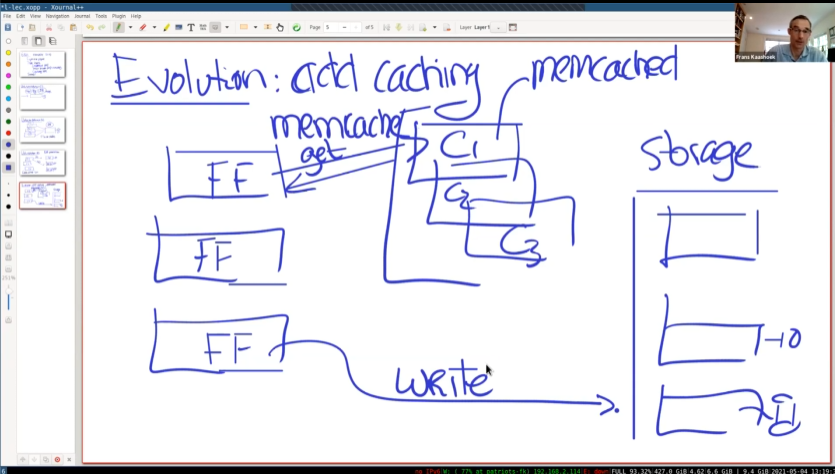

目标

- 性能
- 一致性和性能之间的关系。这篇论文没有追求强一致性
- 一致性度量

## 性能

为了获取更高的性能，可以为不同分片的数据库添加缓存.

写数据直接写到数据库,而读操作会进行缓存.

键值服务器本身是KV服务器，多个服务器运行memcached daemon,形成一个集群。

挑战：

- 如何保证DB和Cache的缓存一致性？
- 如何保证数据库不超载？当缓存宕机，前端将数据访问都转到DB上，如何避免这种情况。

## 最终一致性

- 写入是有序的，都是通过database进行的。

- read到过期的数据是可以接受的。
  - 但是客户端应该可以读取到自己更新的数据。
  - 比如你修改了QQ头像，你自己能立即见到，但是你的好友可能隔一分钟才观察到更新。

**缓存失效方案**

比如使用MySQL为DB。通过squeal观察LOG,哪些键被修改了.如果键k被修改，就向缓存集群发送信息：delete k.这样在客户端下次读取时，就会出现缓存不命中，然后重新缓存。

如果用户在发出修改请求后，下一次请求前，将缓存失效，就可以实现“客户端应该可以立即读取到自己更新的数据”。

### **为什么不直接更新缓存，而是将就缓存失效呢？**

保证缓存不会一直是旧数据，而不能更新。

## 优化

这里使用两个数据中心，主从模式。

所有的写都需要写到西海岸（Primary）,然后通过同步机制给backup数据库。在东海岸（backup）的数据中心观察到改变，将缓存失效的信息发送给自己数据中心的memcached。这样，东海岸的用户在读操作时，可以先访问所在区域的memcached。

### 为什么不通过前端发送缓存失效，而是squeal发送？

### 缓存结构的选择

1. 分区。将key分到更多区里面
2. 复制。解决了Hotkey问题

可以将不太热门的键单独放在一个pool中。

## 保护数据库

### 新集群

如果一个新集群加入，所有的读都要经过数据库（因为没有缓存）。解决方法是从旧集群的缓存复制过来。

### 惊群

假如删除了一个hotkey,然后在同一时间，很多个前端访问该hot key并且发现缓存不命中，就会同时向数据库发送很多个get hotkey的请求。

解决方法： 使用租约, 当第一个客户端发现缓存不命中，它会去负责更新缓存，而其他的客户端发现已经有了租约，就会等待，并且重试访问缓存。

  

### memcached失效

如果只是少数几个 server 因为网络原因失联，则依赖于一种自动恢复机制，通常恢复需要几分钟时间，但几分钟就有可能将 DB 和后台服务击垮。为此， FB 团队专门用少量的机器配置一个小的 memcache 集群，称为 Gutter。当集群内部少量的 server 发生故障时，memcached client 会将请求先转发到 Gutter 中。

gutter也就是后备的，短时间服务器集群。