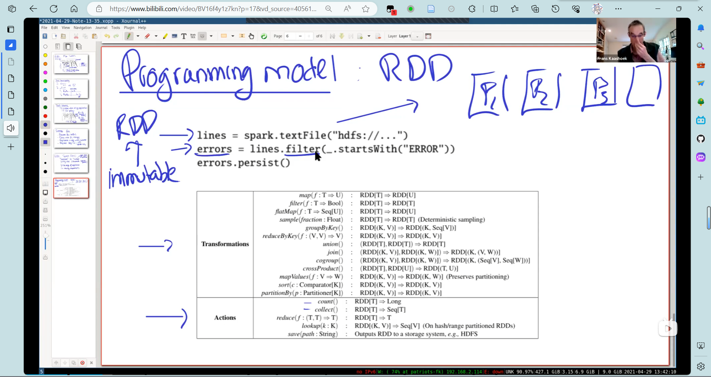
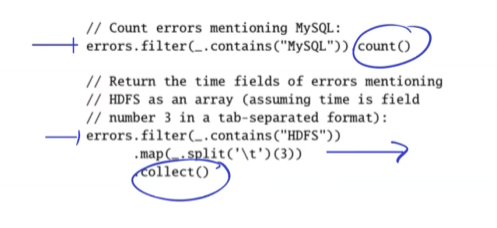
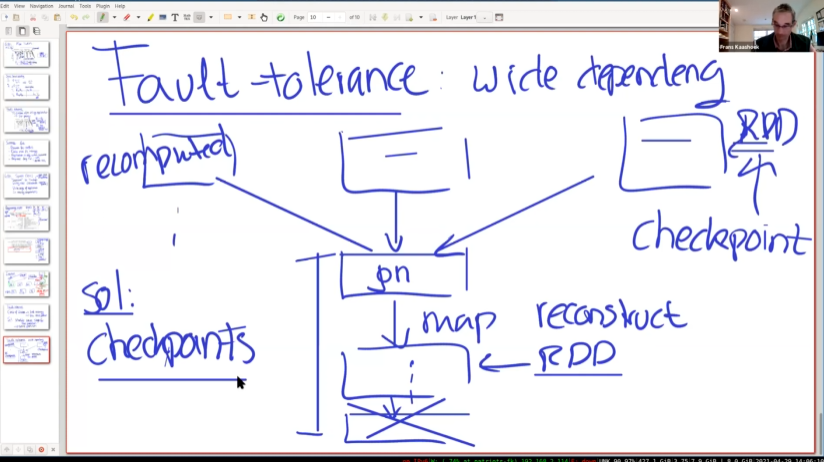
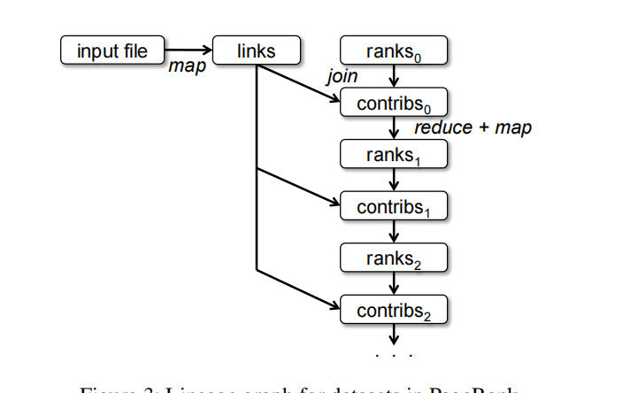

## RDD

弹性分布式数据集:*resilient distributed datasets (RDDs)* 



- spark.textFile创建一个RDD(弹性分布式数据集)

RDD有两类API:

- Transformation: 因为RDD是只读的，这类操作生成一个新的RDD,比如第二排生成一个error的RDD
- Action: 在该RDD上进行一些计算。

可以看出来，RDD的API可以完成**map**(通过transformation)**reduce**(action)操作

这些操作是流水线的。（类似于DB中的火山模型）

`errors.persist()`允许记录在内存中。


这里有两种依赖：宽依赖和窄依赖：



窄依赖只依赖一个父分区，否则就是宽依赖。

这里我的理解就是：类似于执行因子，`sort()`必须子执行因为完了才能执行出正确结果（好像术语叫阻塞）

而`filter(predict)`这种可以来一个就执行一个，不会阻塞住流水线。

## 容错

Crash of Worker:

- 丢失分区

scheduler重做stage(以宽依赖为界)。

宽依赖容错：

 



如果一个宽依赖的计算失败了，会要求多个父分区重新计算。

为了解决这个问题，使用checkpoint，将整个RDD写入HDFS。(和单纯放入内存中不同)

## 迭代计算：PageRank



```scala
val links = spark.textFile(...).map(...).persist()
var ranks = // RDD of (URL, rank) pairs
for (i <- 1 to ITERATIONS) {
// Build an RDD of (targetURL, float) pairs
// with the contributions sent by each page
val contribs = links.join(ranks).flatMap {
(url, (links, rank)) =>
links.map(dest => (dest, rank/links.size))
}
// Sum contributions by URL and get new ranks
ranks = contribs.reduceByKey((x,y) => x+y)
.mapValues(sum => a/N + (1-a)*sum)
}
```

 

links每次迭代和ranks进行join操作，然后生成一个(dest,rank/links.size)的map，就是第一次迭代dest收到的权重。

优化：每个contribs都要进行join操作。可以使用hash对links和ranks分组。（类似于hash join的第一次分区），然后再进行一次join（只对相同哈希的分区），这样就优化成了窄依赖。


​	