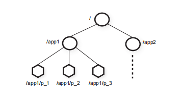
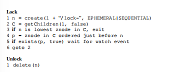
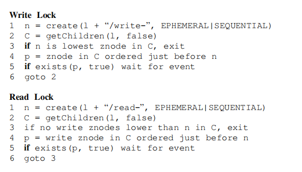

## 概览

ZooKeeper是实现分布式协调的服务。

我首先通过[ZooKeeper 详解 - 知乎 (zhihu.com)](https://zhuanlan.zhihu.com/p/72902467)了解了以下Zookeeper是什么，该如何使用，这样就对接下来底层实现要干什么有了一定的了解。

## **The ZooKeeper service**

zookeeper使用分层结点的形式提供数据结点。这些结点就是客户端通过API进行操作的数据对象。

Znode有两种类型：

> **Regular:** Clients manipulate regular znodes by creating
>
> and deleting them explicitly;
>
> **Ephemeral:** Clients create such znodes, and they ei
>
> ther delete them explicitly, or let the system remove
>
> them automatically when the session that creates
>
> them terminates (deliberately or due to a failure).

有普通或暂时的两种结点。

>Additionally, when creating a new znode, a client can
>
>set a *sequential* flag. Nodes created with the sequen
>
>tial flag set have the value of a monotonically(单调的) increas
>
>ing counter appended to its name. If *n* is the new znode
>
>and *p* is the parent znode, then the sequence value of *n*
>
>is never smaller than the value in the name of any other
>
>sequential znode ever created under p.

这就是说，客户端可以给创建结点一个顺序。比如有父结点P，然后有一个单调递增的计数器，比如P下有结点Z1,Z3,Z5,下一个创建的顺序结点编号一定大于5。（我认为这里不一定是连续的计数器，可能有临时结点获取计数器，然后在会话结束时消失）。

> ZooKeeper implements watches to allow clients to
>
> receive timely notifications of changes without requir
>
> ing polling.

客户端在使用watch标识进行操作时（get）,如果得到的值在之后被改变，客户端会被通知，但是不会知道修改后的值。就是说，服务器告诉客户端：“你之前查找的值被修改了，但是修改成多少我不说”。

> Watches are one-time triggers associated with a session; 

watches只会被触发一次（通过一次更改触发），并且是关联当前会话的，如果会话被关闭了，watch也应该被注销。

> Session events, such as connection loss events, are also sent
>
> to watch callbacks so that clients know that watch events
>
> may be delayed.

有点没理解到这个`so that clients know that watch events may be delayed.` 的delayed指什么意思

### **ZooKeeper guarantees**

- **Linearizable writes:** 保证写操作线性化
- **FIFO client order:** 同一个客户端发送的请求保证先到先服务。

这里的线性性是*A-linearizability* (asynchronous linearizabil

ity。异步线性化。允许一个客户端在同一时刻，拥有多个未完成的操作。满足异步线性化的系统也具有线性化的特点。

### 分布式锁

- Simple Lock

> The simplest lock implementation uses “lock files”.
>
> The lock is represented by a znode. To acquire a lock,
>
> a client tries to create the designated znode with the
>
> EPHEMERAL flag. If the create succeeds, the client
>
> holds the lock. Otherwise, the client can read the zn
>
> ode with the watch flag set to be notified if the current
>
> leader dies. A client releases the lock when it dies or ex
>
> plicitly deletes the znode. Other clients that are waiting
>
> for a lock try again to acquire a lock once they observe
>
> the znode being deleted.

就是不同的client去尝试创建一个特定的临时结点（当成锁）。如果创建成功，就获取到了锁。此时其他结点就不能创建这个结点了。但是当这个锁结点被主动删除或者随客户端会话结束而消失（临时结点的特性），watch会通知正在监视的所有客户端，然后客户端再去争抢创建这个锁。

缺点就是有惊群效应：假如有五个client在等待锁，并且被watch通知，这个时候就都会去尝试获取锁。

- **Simple Locks without Herd Effect**

简单来说，就是在一个指定结点下形成了加锁的队列。按照队列加锁。一个client想要获取锁，只watch自己前面的请求，当前面的请求消失，再被唤醒。

感觉这里就是一个条件变量。类似于之前在数据库中实现的锁表。

- **Read/Write Locks**

通过队列实现RW锁。

## ZooKeeper实现

> The replicated database is an *in-memory* database con
>
> taining the entire data tree. Each znode in the tree stores a
>
> maximum of 1MB of data by default, but this maximum
>
> value is a configuration parameter that can be changed in
>
> specific cases. For recoverability, we efficiently log up
>
> dates to disk, and we force writes to be on the disk media
>
> before they are applied to the in-memory database.In
>
> fact, as Chubby [8], we keep a replay log (a write-ahead
>
> log, in our case) of committed operations and generate
>
> periodic snapshots of the in-memory database.

使用WAL记录。并且保留了REDO日志。以及有生成快照的功能。

写请求被转发到Leader，其余的都可以在follower上处理。

ZooKeeper使用Zab传播消息。这里我的理解是:ZooKeeper构建在一种类似于RAFT的分布式日志系统上，可以通过WAL保证事务的持久性和一致性。

- ZXID：[Zookeeper的zxid - 简书 (jianshu.com)](https://www.jianshu.com/p/68b45694026c) ZXID由两部分组成：term和事务编号

客户端在W时，会获取一个ZXID，比如写put(a,value)，获得一个zxid=1133（确保该写操作已经被commit），下一次在get时，会携带该zxid，已确保访问的服务器至少有新的数据。

 