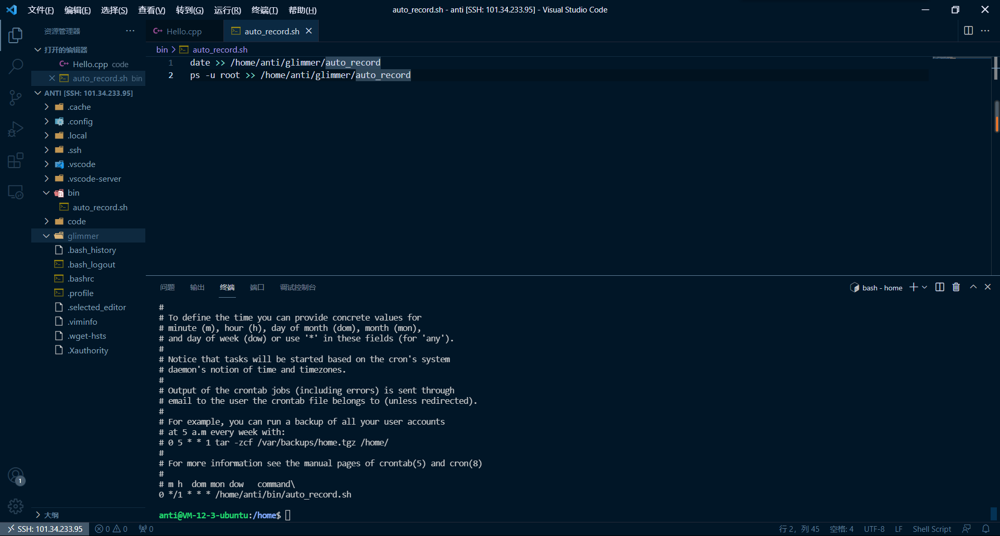

## Step1
使用vscode+SSH remote连接云服务器 

## Step2

...

## Step3

用脚本`ps -u root >> /home/anti/glimmer/auto_record`重定向输出到指定文件  

通过`crontab`配置  `0 */1 * * * /home/anti/bin/auto_record.sh`实现一个小时记录一次 

 
挂了一个下午之后

## Step4  
- 安装Nginx
- 配置文件
  
```
server {
    listen 10086;
    server_name  101.34.233.95;
    location /{
        root /www/html;
        index glimmer.html;   
    }
    
}
```
- 访问指定端口`10086`

  
（注意云服务器防火墙要先开指定端口，= =还以为配置错了）

- 安装`docker`，`pull` `nginx`和`nextcloud`镜像
- 配置`nginx`对应配置(我这里用了10001)


- `nextcloud`安装`registration`应用，配置邮件服务器。实现注册、